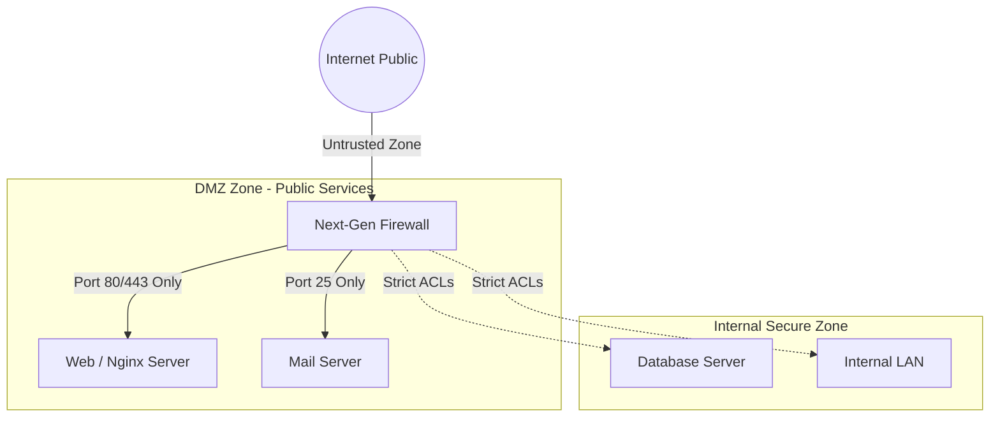

# 🌐 Tường Lửa Firewalls, Phân Vùng DMZ & Kiến Trúc Zero-Trust - Chuyên Sâu Mạng Máy Tính Cho DevOps

> 💡 **Bản chất 1 câu**: Chuyên sâu các loại Firewall (Stateless, Stateful, NGFW), phân vùng an ninh (DMZ, Internal, External), Jumpbox, VPNs và kiến trúc Zero-Trust Architecture.  
> 🎯 **Trọng tâm thực chiến DevOps**: Phân biệt Stateless vs Stateful Inspection vs Next-Gen Firewall (NGFW), vùng DMZ, Jumpbox / Bastion Host, Zero-Trust (Never Trust, Always Verify).

---

## 1. 🧠 Hình Hình Dung Nhanh (Intuitive Mindset)

Zero-Trust Architecture như đại sứ quán tối cao: Không tin tưởng bất kỳ ai kể cả nhân viên đã ở bên trong tòa nhà. Mỗi khi muốn đi qua bất kỳ cánh cửa phòng nào, bạn đều phải xuất trình căn cước và xác thực sinh trắc học lại từ đầu.

---

## 2. 📚 Lý Thuyết Chuyên Sâu & Bản Chất Mạng (Under The Hood Architecture)

### 2.1 Phân Loại Tường Lửa & Phân Vùng An Ninh (Firewalls & DMZ)



1. **Phân Loại Tường Lửa (Firewall Types)**:
   - **Stateless Firewall**: Lọc gói tin tĩnh dựa vào IP/Port nguồn và đích (dùng ACLs). Không lưu trạng thái kết nối.
   - **Stateful Firewall**: Theo dõi và lưu giữ trạng thái kết nối trong **Connection Tracking Table**. Tự động cho phép gói tin phản hồi hợp lệ đi qua.
   - **NGFW (Next-Generation Firewall)**: Tích hợp Deep Packet Inspection (DPI), phát hiện xâm nhập IPS, nhận diện ứng dụng (App-ID) và quét Malware ở Layer 7.
2. **Vùng Đệm An Ninh DMZ (Demilitarized Zone)**:
   - Vùng mạng nằm giữa Internet và Nội bộ LAN. Đặt các máy chủ công khai (Web, Mail, DNS).
   - Quy tắc vàng: Nếu máy chủ trong DMZ bị Hacker chiếm quyền, Hacker KHÔNG THỂ tự do truy cập vào Internal LAN/Database phía sau.
3. **Kiến Trúc Zero-Trust (Zero-Trust Architecture - ZTA)**:
   - Nguyên tắc cốt lõi: **"Never Trust, Always Verify"** (Không bao giờ tin tưởng, luôn luôn xác thực).
   - Loại bỏ khái niệm "Mạng nội bộ an toàn". Mọi kết nối (kể cả từ máy tính ngồi tại văn phòng) đều phải qua xác thực IAM, kiểm tra thiết bị và mã hóa End-to-End.


---

## 3. ⚡ Bảng Tra Cứu Câu Lệnh & Khái Niệm Thực Hành (Reference Table)

| Công cụ / Lệnh / Khái niệm | Tham số / Flag / Protocol | Giải thích ý nghĩa chi tiết | Ứng dụng thực tế trong DevOps / Network |
| :--- | :--- | :--- | :--- |
| **`Stateful Firewall`** | `L3-L4` | Theo dõi bảng kết nối Connection Tracking Table | `Tường lửa doanh nghiệp` |
| **`NGFW`** | `L3-L7` | Next-Gen Firewall tích hợp DPI, IPS, App-ID | `Palo Alto, Fortinet, Checkpoint` |
| **`DMZ Zone`** | `Network Zone` | Vùng đệm chứa các Server công khai (Web/Mail) | `Cách ly Server công cộng khỏi LAN nội bộ` |
| **`Bastion Host / Jumpbox`** | `Security Node` | Máy chủ nhảy trung gian quản lý SSH/RDP vào Private Zone | `Quản trị an toàn Server Cloud private` |
| **`Zero-Trust`** | `Security Model` | Nguyên tắc Không tin tưởng bất kỳ ai, luôn luôn xác thực | `Kiến trúc an ninh mạng hiện đại` |


---

## 4. 🛠 Thao Tác Thực Chiến & Kịch Bản DevOps (Real-World Scenarios)

### 🛠 Các lệnh thực hành gõ là ăn ngay:
```bash
# Cấu hình DMZ cách ly bằng UFW trên Ubuntu:
sudo ufw default deny incoming
sudo ufw default allow outgoing
# Mở Port 80, 443 cho DMZ Web Server:
sudo ufw allow 80/tcp
sudo ufw allow 443/tcp
sudo ufw enable
```

### 🚀 Kịch bản xử lý sự cố thực tế khi đi làm:
Thiết lập Jumpbox / Bastion Host truy cập AWS Private VPC:
# Chỉ cho phép SSH Port 22 duy nhất vào Bastion Host. Từ Bastion Host mới SSH tiếp vào các Private DB instances.

---

## 5. 🚀 Bộ Câu Hỏi Phỏng Vấn DevOps & Network Thực Tế (Interview Q&A)

> **Q: Sự khác biệt cốt lõi giữa Stateful Firewall và Stateless Firewall là gì?**  
> **A**: Stateless chỉ lọc gói tin tĩnh dựa trên IP/Port. Stateful ghi nhớ trạng thái kết nối trong bảng Connection Tracking, tự động cho phép traffic phản hồi hợp lệ đi qua.

> **Q: Triết lý cốt lõi của kiến trúc Zero-Trust Architecture là gì?**  
> **A**: Triết lý **'Never Trust, Always Verify'** (Không bao giờ tin tưởng bất kỳ kết nối nào kể cả từ mạng nội bộ, luôn luôn xác thực và cấp quyền tối thiểu).


---

## 6. 📝 Cheat Sheet & Ghi Nhớ Nhanh (Summary)

- [x] Stateful FW: Nhớ bảng trạng thái kết nối
- [x] NGFW: Lọc Layer 7 + DPI + IPS
- [x] DMZ Zone: Đặt Web/Mail Server công khai cách ly LAN
- [x] Bastion Host: Máy chủ nhảy quản trị SSH an toàn
- [x] Zero-Trust: Never Trust, Always Verify

