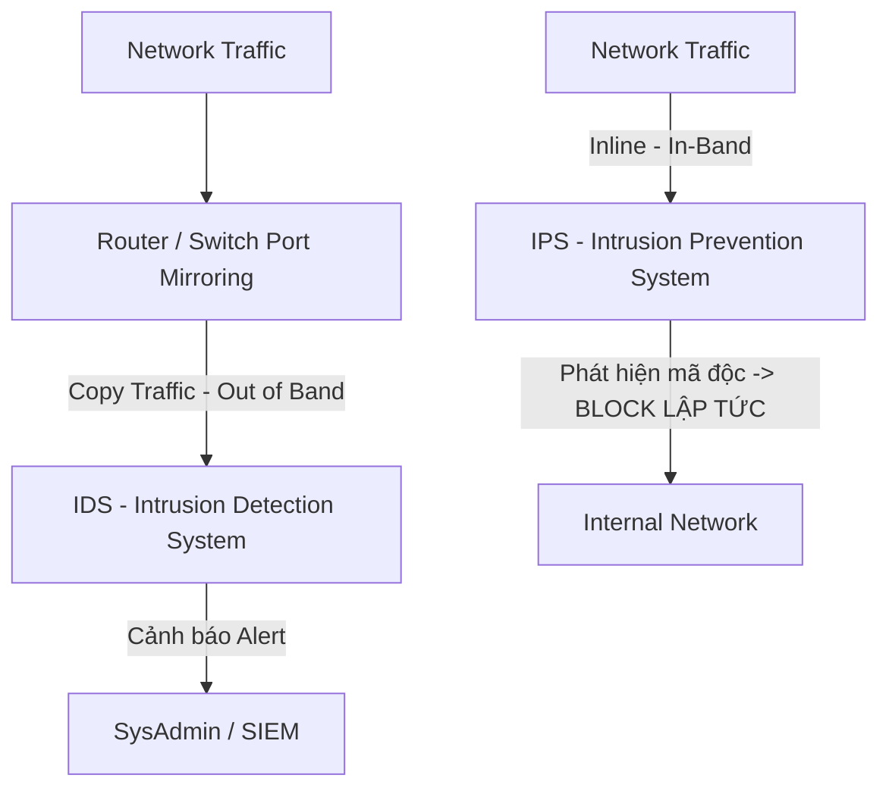

# 🌐 Giám Sát Mạng, SNMP, NetFlow & Hệ Thống SIEM - Chuyên Sâu Mạng Máy Tính Cho DevOps

> 💡 **Bản chất 1 câu**: Hệ thống giám sát an ninh mạng: Phân biệt IDS vs IPS, giao thức SNMP (v1/v2c/v3), Packet Captures (PCAP), NetFlow/sFlow, Syslog và hệ thống SIEM.  
> 🎯 **Trọng tâm thực chiến DevOps**: Phân biệt IDS (Phát hiện) vs IPS (Ngăn chặn), SNMP v3 (Mã hóa), Syslog Severity levels, NetFlow vs PCAP và SIEM (Splunk, Elastic SIEM, Wazuh).

---

## 1. 🧠 Hình Hình Dung Nhanh (Intuitive Mindset)

IDS như chuông báo động chống trộm: Phát hiện kẻ gian đột nhập thì hú còi báo động cho bảo vệ. IPS như vệ sĩ chủ động: Thấy kẻ gian thò tay vào cửa là vung tay khóa tay trói kẻ gian lập tức.

---

## 2. 📚 Lý Thuyết Chuyên Sâu & Bản Chất Mạng (Under The Hood Architecture)

### 2.1 Phân Biệt IDS (Intrusion Detection) vs IPS (Intrusion Prevention)



1. **IDS (Intrusion Detection System)**:
   - Hoạt động dạng **Out-of-Band** (Nhận bản sao traffic từ Port Mirroring / SPAN Port).
   - Chỉ phân tích và **phát cảnh báo (Alert)** khi thấy dấu hiệu tấn công, KHÔNG can thiệp trực tiếp làm chậm traffic.
2. **IPS (Intrusion Prevention System)**:
   - Hoạt động dạng **Inline** (Nằm trực tiếp trên đường truyền dữ liệu).
   - Khi phát hiện signature tấn công, IPS **chủ động DROP gói tin** ngắt kết nối lập tức.
3. **Giao Thức Giám Sát Thiết Bị SNMP (Simple Network Management Protocol)**:
   - **SNMP v1 / v2c**: Gửi Community String dạng rõ không mã hóa (Rất dễ bị nghe lén!).
   - **SNMP v3** (Khuyên dùng): Hỗ trợ mã hóa (Privacy - AES) và xác thực (Authentication - SHA/MD5).
   - **MIB (Management Information Base)**: Cơ sở dữ liệu cây chứa các tham số thiết bị đại diện bởi mã **OID**.
4. **Hệ Thống SIEM (Security Information and Event Management)**:
   - Tập trung thu thập, chuẩn hóa và tương quan hóa (Correlation) toàn bộ Log/Event từ Firewalls, Servers, Switches, Routers.
   - Ví dụ: Splunk, Elastic SIEM, Wazuh, IBM QRadar.


---

## 3. ⚡ Bảng Tra Cứu Câu Lệnh & Khái Niệm Thực Hành (Reference Table)

| Công cụ / Lệnh / Khái niệm | Tham số / Flag / Protocol | Giải thích ý nghĩa chi tiết | Ứng dụng thực tế trong DevOps / Network |
| :--- | :--- | :--- | :--- |
| **`IDS`** | `Out-of-Band` | Hệ thống phát hiện xâm nhập (Chỉ cảnh báo Alert) | `Suricata / Snort ở chế độ promiscuous` |
| **`IPS`** | `Inline` | Hệ thống ngăn chặn xâm nhập (Chủ động Drop traffic) | `Suricata / Snort ở chế độ Inline` |
| **`SNMP v3`** | `UDP 161/162` | Giao thức giám sát CPU/RAM/Traffic thiết bị có mã hóa | `Giám sát Switch/Router qua Zabbix/Nagios` |
| **`NetFlow / sFlow`** | `Traffic Flow` | Thu thập thống kê Metadata luồng dữ liệu (Src/Dst IP, Bytes) | `Phân tích Top Talkers tiêu tốn băng thông` |
| **`SIEM`** | `Log Aggregation` | Hệ thống quản lý và tương quan sự kiện an ninh mạng | `Wazuh, Elastic SIEM, Splunk` |


---

## 4. 🛠 Thao Tác Thực Chiến & Kịch Bản DevOps (Real-World Scenarios)

### 🛠 Các lệnh thực hành gõ là ăn ngay:
```bash
# 1. Thu thập gói tin mạng live bằng tcpdump ghi ra file pcap:
sudo tcpdump -i eth0 -w capture.pcap

# 2. Đọc file pcap phân tích bằng tshark (Wireshark CLI):
tshark -r capture.pcap -q -z conv,ip
```

### 🚀 Kịch bản xử lý sự cố thực tế khi đi làm:
Sự cố hệ thống bị tấn công tràn ngập băng thông không rõ nguyên nhân:
# Phân tích luồng dữ liệu NetFlow/sFlow trên SIEM để tìm ra Top IP nào đang xả traffic nhiều nhất.

---

## 5. 🚀 Bộ Câu Hỏi Phỏng Vấn DevOps & Network Thực Tế (Interview Q&A)

> **Q: Sự khác biệt cốt lõi về vị trí hoạt động giữa IDS và IPS là gì?**  
> **A**: IDS hoạt động **Out-of-Band** (chỉ nhận bản sao traffic để phát cảnh báo Alert). IPS hoạt động **Inline** (nằm trực tiếp trên đường truyền để chủ động Drop traffic độc hại).

> **Q: Tại sao bắt buộc phải dùng SNMP v3 thay vì SNMP v1/v2c trong mạng doanh nghiệp?**  
> **A**: Vì SNMP v1/v2c truyền chuỗi Community String dưới dạng văn bản rõ (Plaintext) dễ bị nghe lén. SNMP v3 hỗ trợ mã hóa mã hóa và xác thực bảo mật tuyệt đối.


---

## 6. 📝 Cheat Sheet & Ghi Nhớ Nhanh (Summary)

- [x] IDS: Phát hiện xâm nhập Out-of-Band (Cảnh báo)
- [x] IPS: Ngăn chặn xâm nhập Inline (Chặn đứng)
- [x] SNMP v3: Giám sát thiết bị có mã hóa
- [x] NetFlow: Thống kê metadata luồng traffic
- [x] SIEM: Thu thập & tương quan log tập trung

