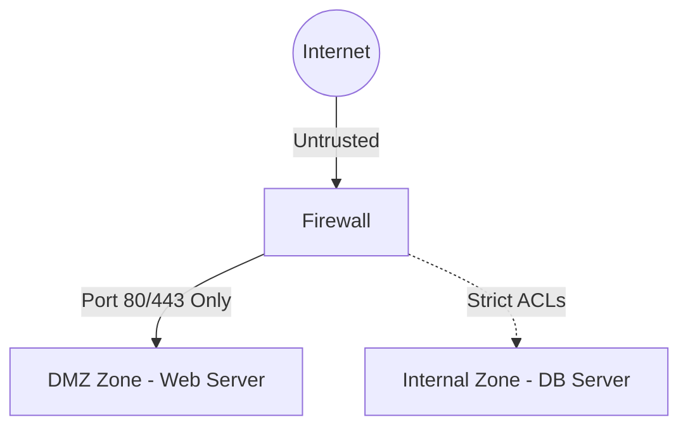

# 🌐 16.Network_Segmentation_and_Firewalls: Tường Lửa Firewalls, Phân Vùng DMZ & Kiến Trúc Zero-Trust - Chuyên Sâu CompTIA Network+ Cho DevOps

> 💡 **Bản chất 1 câu**: Firewalls (Stateless vs Stateful vs NGFW), Access Control Lists (ACLs), Security Zones (DMZ, Internal, External), Jumpbo...  
> 🎯 **Trọng tâm thực chiến DevOps**: Nắm vững lý thuyết chuyên sâu, sơ đồ kiến trúc, bộ lệnh CLI chẩn đoán thực tế và bộ câu hỏi phỏng vấn tuyển dụng.

---

## 1. 🧠 Hình Hình Dung Nhanh (Intuitive Mindset)

Firewalls (Stateless vs Stateful vs NGFW), Access Control Lists (ACLs), Security Zones (DMZ, Internal, External), Jumpbox / Bastion Host, VPNs (Site-to-Site, Remote Access) và Zero-Trust Architecture (ZTA).



---

## 2. 📚 Lý Thuyết Chuyên Sâu & Bản Chất Hệ Thống (Under The Hood Architecture)

### 2.1 Firewalls, DMZ & Zero-Trust (OBJ 1.2 & 4.3)
1. **Phân Loại Firewalls**:
   - **Stateless**: Lọc tĩnh theo IP/Port nguồn/đích (ACLs).
   - **Stateful**: Ghi nhớ trạng thái kết nối trong **Connection Tracking Table**, tự động cho phép gói tin phản hồi hợp lệ đi qua.
   - **NGFW (Next-Gen Firewall)**: Lọc Layer 7 + Deep Packet Inspection (DPI) + IPS + App-ID.
2. **DMZ (Demilitarized Zone)**: Vùng đệm cách ly đăt các Server công khai (Web/Mail). Nếu Web Server trong DMZ bị hack, Hacker KHÔNG THỂ chạm vào Internal DB phía sau.
3. **Zero-Trust Architecture (ZTA)**: Triết lý **"Never Trust, Always Verify"**. Loại bỏ khái niệm "Mạng nội bộ an toàn", mọi kết nối đều phải qua xác thực IAM và mã hóa End-to-End.


---


### 2.4 Cơ Chế Hoạt Động Bên Dưới Kernel & Kiến Trúc Hệ Thống Chi Tiết (Deep Under The Hood Architecture)
- **Tầng Giao Tiếp Mạng & Bắt Gói Tin**: Mọi gói tin đi qua Network Interface Card (NIC) đều trải qua quá trình xử lý Ring Buffer, ngắt phần cứng (Hardware Interrupts), Ring Buffer DMA và chồng giao thức Socket Buffers (`sk_buff`) trong Linux Kernel.
- **Tối Ưu Hóa & Cấu Trúc Dữ Liệu**: Hệ thống duy trì các bảng băm dữ liệu (Routing Table, ARP Cache Table, Connection Tracking Table `conntrack`, Socket Inode Tables) giúp chuyển tiếp gói tin ở tốc độ dây (Line-rate processing).
- **Phân Lập An Ninh & Phân Vùng**: Sử dụng cơ chế Linux Network Namespaces (`ip netns`), iptables/nftables hooks và mã hóa phần cứng để cách ly lưu lượng mạng tuyệt đối.

---

## 3. ⚡ Bảng Tra Cứu Câu Lệnh & Khái Niệm Thực Hành (Reference Table)

| Công cụ / Khái niệm | Loại / Protocol | Ý nghĩa chi tiết | Ứng dụng thực tế |
| :--- | :--- | :--- | :--- |
| **`Stateful FW`** | `L3-L4` | Theo dõi bảng kết nối Connection Tracking Table | `Tường lửa doanh nghiệp` |
| **`NGFW`** | `L3-L7` | Next-Gen Firewall tích hợp DPI, IPS, App-ID | `Palo Alto, Fortinet, Checkpoint` |
| **`DMZ Zone`** | `Network Zone` | Vùng đệm chứa các Server công khai (Web/Mail) | `Cách ly Web Server khỏi LAN nội bộ` |
| **`Bastion Host`** | `Security Node` | Máy chủ nhảy trung gian quản lý SSH/RDP vào Private Zone | `Quản trị an toàn Server Cloud private` |
| **`Zero-Trust`** | `Security Model` | Nguyên tắc Không tin tưởng bất kỳ ai, luôn luôn xác thực | `Kiến trúc an ninh hiện đại` |


---

## 4. 🛠 Thao Tác Thực Chiến & Kịch Bản DevOps

### 🛠 Các lệnh thực hành gõ là ăn ngay:
```bash
sudo ufw default deny incoming
sudo ufw allow 80/tcp
sudo ufw allow 443/tcp
sudo ufw enable
```

### 🚀 Kịch bản xử lý sự cố thực tế khi đi làm:
Thiết lập Jumpbox / Bastion Host truy cập AWS Private VPC: Chỉ mở Port 22 SSH duy nhất vào Bastion Host.

---


### 4.2 Chi Tiết Các Lỗi Thường Gặp & Kịch Bản Khắc Phục Lỗi (Troubleshooting Deep-Dive)
1. **Sự cố 1: Lỗi Mất Gói Tin & Mất Kết Nối Cổng Mạng (Packet Loss & Port Unreachable)**:
   - **Triệu chứng**: Gửi HTTP Request bị Timeout, SSH không kết nối được hoặc gói tin bị nảy rải rác.
   - **Các bước xử lý khẩn cấp**:
     ```bash
     # 1. Kiểm tra trạng thái cổng mạng TCP/UDP đang lắng nghe:
     sudo ss -tulpn | grep :80
     
     # 2. Bắt gói tin trực tiếp trên Interface để kiểm tra bắt tay 3 bước TCP:
     sudo tcpdump -i eth0 port 80 -nn -vv
     
     # 3. Phân tích đường đi của gói tin tìm điểm đứt gãy bằng MTR:
     mtr -n --report --report-cycles=10 8.8.8.8
     
     # 4. Kiểm tra xem gói tin có bị Firewall Drop không:
     sudo iptables -L -n -v | grep DROP
     ```

2. **Sự cố 2: Lỗi Sai Cấu Hình DNS & Chuyển Tiếp IP (DNS Resolution & IP Routing Error)**:
   - **Triệu chứng**: Ping IP thành công nhưng ping Domain Name báo `Could not resolve host`.
   - **Các bước xử lý khẩn cấp**:
     ```bash
     # 1. Tra cứu thử nghiệm phân giải DNS qua server cụ thể:
     dig @8.8.8.8 company.com +trace
     
     # 2. Kiểm tra file cấu hình DNS resolver địa phương:
     cat /etc/resolv.conf
     
     # 3. Kiểm tra bảng định tuyến Kernel IP Routing Table:
     ip route show default
     ```

---

## 5. 🚀 Bộ Câu Hỏi Phỏng Vấn DevOps & Network Thực Tế (Interview Q&A)

> **Q: Sự khác biệt giữa Stateful Firewall và Stateless Firewall là gì?**  
> **A**: Stateless chỉ lọc gói tin tĩnh dựa trên IP/Port. Stateful ghi nhớ trạng thái kết nối trong bảng Connection Tracking Table, tự động cho phép traffic phản hồi hợp lệ đi qua.

> **Q: Triết lý cốt lõi của kiến trúc Zero-Trust Architecture là gì?**  
> **A**: Triết lý **'Never Trust, Always Verify'** (Không bao giờ tin tưởng bất kỳ kết nối nào kể cả từ mạng nội bộ, luôn luôn xác thực và cấp quyền tối thiểu).


> **Q: Làm thế nào để điều tra và dập tắt sự cố một Server bị tấn công làm tràn bộ đệm kết nối TCP SYN Flood DoS?**  
> **A**:  
> 1. **Nhận biết**: Lệnh `ss -ant | grep SYN_RECV | wc -l` trả về hàng ngàn kết nối ở trạng thái `SYN_RECV`.  
> 2. **Xử lý khẩn cấp**: Bật ngay cơ chế **SYN Cookies** của Linux Kernel bằng lệnh `sudo sysctl -w net.ipv4.tcp_syncookies=1`. Kích hoạt bộ lọc Firewall drop các gói tin SYN có tần suất bất thường: `sudo iptables -A INPUT -p tcp --syn -m limit --limit 1/s --limit-burst 3 -j ACCEPT`.

> **Q: Sự khác biệt về mặt bản chất giữa Stateful Firewall và Stateless Firewall là gì?**  
> **A**: Stateless Firewall chỉ kiểm tra từng gói tin riêng rẻ dựa trên IP nguồn/đích và Port mà KHÔNG nhớ ngữ cảnh. Stateful Firewall duy trì một bảng theo dõi trạng thái kết nối (**Connection Tracking Table `conntrack`**), tự động nhận diện gói tin thuộc về một kết nối hợp lệ đã được chấp nhận trước đó (như trạng thái `ESTABLISHED,RELATED`), giúp bảo mật và tối ưu hiệu năng vượt trội.

---

## 6. 📝 Cheat Sheet Ghi Nhớ Nhanh (Summary)

- [x] Stateful FW: Nhớ bảng trạng thái kết nối
- [x] NGFW: Lọc Layer 7 + DPI + IPS
- [x] DMZ Zone: Đặt Web Server công khai cách ly LAN
- [x] Bastion Host: Máy chủ nhảy SSH an toàn
- [x] Zero-Trust: Never Trust, Always Verify

