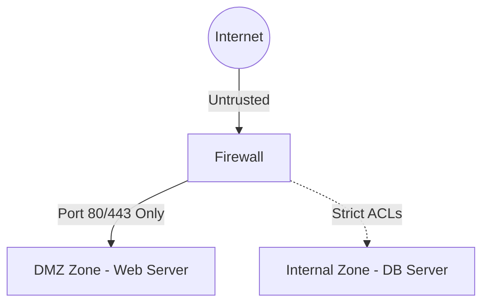

# 🌐 16.Network_Segmentation_and_Firewalls: Tường Lửa Firewalls, Phân Vùng DMZ & Kiến Trúc Zero-Trust - Chuyên Sâu CompTIA Network+ Cho DevOps

> 💡 **Bản chất 1 câu**: Firewalls (Stateless vs Stateful vs NGFW), Access Control Lists (ACLs), Security Zones (DMZ, Internal, External), Jumpbo...  
> 🎯 **Trọng tâm thực chiến DevOps**: Nắm vững lý thuyết chuyên sâu, sơ đồ kiến trúc, bộ lệnh CLI chẩn đoán thực tế và bộ câu hỏi phỏng vấn tuyển dụng.

---

## 1. 🧠 Hình Hình Dung Nhanh (Intuitive Mindset)

Firewalls (Stateless vs Stateful vs NGFW), Access Control Lists (ACLs), Security Zones (DMZ, Internal, External), Jumpbox / Bastion Host, VPNs (Site-to-Site, Remote Access) và Zero-Trust Architecture (ZTA).



---

## 2. 📚 Lý Thuyết Chuyên Sâu & Bản Chất Hệ Thống (Under The Hood Architecture)

### 2.1 Firewalls, DMZ & Zero-Trust (OBJ 1.2 & 4.3)
1. **Phân Loại Firewalls**:
   - **Stateless**: Lọc tĩnh theo IP/Port nguồn/đích (ACLs).
   - **Stateful**: Ghi nhớ trạng thái kết nối trong **Connection Tracking Table**, tự động cho phép gói tin phản hồi hợp lệ đi qua.
   - **NGFW (Next-Gen Firewall)**: Lọc Layer 7 + Deep Packet Inspection (DPI) + IPS + App-ID.
2. **DMZ (Demilitarized Zone)**: Vùng đệm cách ly đăt các Server công khai (Web/Mail). Nếu Web Server trong DMZ bị hack, Hacker KHÔNG THỂ chạm vào Internal DB phía sau.
3. **Zero-Trust Architecture (ZTA)**: Triết lý **"Never Trust, Always Verify"**. Loại bỏ khái niệm "Mạng nội bộ an toàn", mọi kết nối đều phải qua xác thực IAM và mã hóa End-to-End.


---

## 3. ⚡ Bảng Tra Cứu Câu Lệnh & Khái Niệm Thực Hành (Reference Table)

| Công cụ / Khái niệm | Loại / Protocol | Ý nghĩa chi tiết | Ứng dụng thực tế |
| :--- | :--- | :--- | :--- |
| **`Stateful FW`** | `L3-L4` | Theo dõi bảng kết nối Connection Tracking Table | `Tường lửa doanh nghiệp` |
| **`NGFW`** | `L3-L7` | Next-Gen Firewall tích hợp DPI, IPS, App-ID | `Palo Alto, Fortinet, Checkpoint` |
| **`DMZ Zone`** | `Network Zone` | Vùng đệm chứa các Server công khai (Web/Mail) | `Cách ly Web Server khỏi LAN nội bộ` |
| **`Bastion Host`** | `Security Node` | Máy chủ nhảy trung gian quản lý SSH/RDP vào Private Zone | `Quản trị an toàn Server Cloud private` |
| **`Zero-Trust`** | `Security Model` | Nguyên tắc Không tin tưởng bất kỳ ai, luôn luôn xác thực | `Kiến trúc an ninh hiện đại` |


---

## 4. 🛠 Thao Tác Thực Chiến & Kịch Bản DevOps

### 🛠 Các lệnh thực hành gõ là ăn ngay:
```bash
sudo ufw default deny incoming
sudo ufw allow 80/tcp
sudo ufw allow 443/tcp
sudo ufw enable
```

### 🚀 Kịch bản xử lý sự cố thực tế khi đi làm:
Thiết lập Jumpbox / Bastion Host truy cập AWS Private VPC: Chỉ mở Port 22 SSH duy nhất vào Bastion Host.

---

## 5. 🚀 Bộ Câu Hỏi Phỏng Vấn DevOps & Network Thực Tế (Interview Q&A)

> **Q: Sự khác biệt giữa Stateful Firewall và Stateless Firewall là gì?**  
> **A**: Stateless chỉ lọc gói tin tĩnh dựa trên IP/Port. Stateful ghi nhớ trạng thái kết nối trong bảng Connection Tracking Table, tự động cho phép traffic phản hồi hợp lệ đi qua.

> **Q: Triết lý cốt lõi của kiến trúc Zero-Trust Architecture là gì?**  
> **A**: Triết lý **'Never Trust, Always Verify'** (Không bao giờ tin tưởng bất kỳ kết nối nào kể cả từ mạng nội bộ, luôn luôn xác thực và cấp quyền tối thiểu).


---

## 6. 📝 Cheat Sheet Ghi Nhớ Nhanh (Summary)

- [x] Stateful FW: Nhớ bảng trạng thái kết nối
- [x] NGFW: Lọc Layer 7 + DPI + IPS
- [x] DMZ Zone: Đặt Web Server công khai cách ly LAN
- [x] Bastion Host: Máy chủ nhảy SSH an toàn
- [x] Zero-Trust: Never Trust, Always Verify

