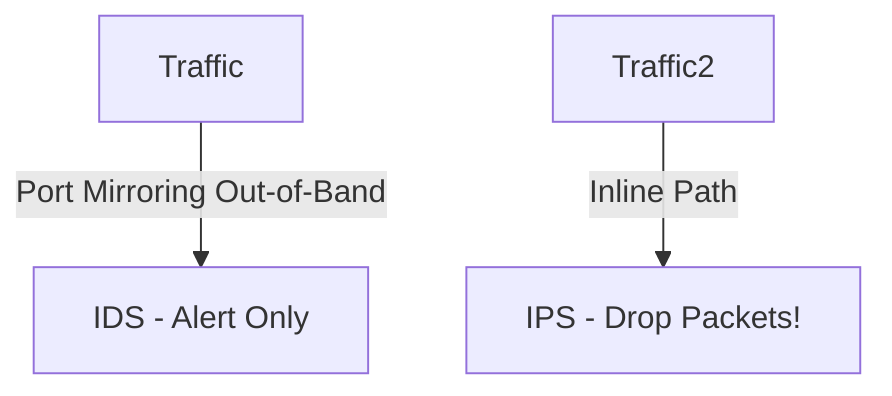

# 🌐 17.Network_Monitoring_and_SIEM: Giám Sát Mạng, SNMP, NetFlow & Hệ Thống SIEM - Chuyên Sâu CompTIA Network+ Cho DevOps

> 💡 **Bản chất 1 câu**: IDS (Out-of-Band) vs IPS (Inline), SNMP v1/v2c/v3 (UDP 161/162, MIB, OID), Packet Captures (PCAP), NetFlow/sFlow Metadat...  
> 🎯 **Trọng tâm thực chiến DevOps**: Nắm vững lý thuyết chuyên sâu, sơ đồ kiến trúc, bộ lệnh CLI chẩn đoán thực tế và bộ câu hỏi phỏng vấn tuyển dụng.

---

## 1. 🧠 Hình Hình Dung Nhanh (Intuitive Mindset)

IDS (Out-of-Band) vs IPS (Inline), SNMP v1/v2c/v3 (UDP 161/162, MIB, OID), Packet Captures (PCAP), NetFlow/sFlow Metadata, Syslog Severity levels và hệ thống SIEM (Wazuh, Elastic SIEM, Splunk).



---

## 2. 📚 Lý Thuyết Chuyên Sâu & Bản Chất Hệ Thống (Under The Hood Architecture)

### 2.1 IDS vs IPS & SNMP / SIEM (OBJ 1.2 & 3.2)
1. **IDS (Intrusion Detection)**: Hoạt động **Out-of-Band** (qua Port Mirroring). Chỉ phân tích và **phát cảnh báo Alert**, không làm chậm traffic.
2. **IPS (Intrusion Prevention)**: Hoạt động **Inline** (nằm trực tiếp trên đường truyền). Chủ động **DROP gói tin độc hại** lập tức.
3. **SNMP v3 (UDP 161/162)**: Giao thức giám sát thiết bị mạng hỗ trợ mã hóa (AES) và xác thực (SHA). Tra cứu dữ liệu MIB qua mã **OID**.
4. **NetFlow / sFlow**: Thu thập metadata luồng traffic (Source/Dst IP, Ports, Bytes) để phân tích Top Talkers tiêu tốn băng thông.
5. **SIEM**: Thu thập, chuẩn hóa và tương quan log tập trung (Splunk, Elastic SIEM, Wazuh).


---

## 3. ⚡ Bảng Tra Cứu Câu Lệnh & Khái Niệm Thực Hành (Reference Table)

| Công cụ / Khái niệm | Loại / Protocol | Ý nghĩa chi tiết | Ứng dụng thực tế |
| :--- | :--- | :--- | :--- |
| **`IDS`** | `Out-of-Band` | Hệ thống phát hiện xâm nhập (Chỉ phát cảnh báo Alert) | `Suricata / Snort promiscuous` |
| **`IPS`** | `Inline` | Hệ thống ngăn chặn xâm nhập (Chủ động Drop traffic) | `Suricata / Snort Inline` |
| **`SNMP v3`** | `UDP 161/162` | Giám sát CPU/RAM/Traffic thiết bị mạng có mã hóa | `Zabbix / Nagios monitoring` |
| **`NetFlow`** | `Traffic Flow` | Thống kê Metadata luồng dữ liệu (Src/Dst IP, Bytes) | `Phân tích Top Talkers băng thông` |
| **`SIEM`** | `Log Aggregation` | Thu thập và tương quan log an ninh mạng tập trung | `Wazuh, Elastic SIEM, Splunk` |


---

## 4. 🛠 Thao Tác Thực Chiến & Kịch Bản DevOps

### 🛠 Các lệnh thực hành gõ là ăn ngay:
```bash
sudo tcpdump -i eth0 -w capture.pcap
tshark -r capture.pcap -q -z conv,ip
```

### 🚀 Kịch bản xử lý sự cố thực tế khi đi làm:
Sự cố đường truyền WAN bị quá tải 100% băng thông -> Dùng NetFlow phân tích tìm ra 1 máy IP nội bộ đang kéo Torrent trái phép.

---

## 5. 🚀 Bộ Câu Hỏi Phỏng Vấn DevOps & Network Thực Tế (Interview Q&A)

> **Q: Sự khác biệt cốt lõi về vị trí hoạt động giữa IDS và IPS là gì?**  
> **A**: IDS hoạt động **Out-of-Band** (chỉ nhận bản sao traffic để phát cảnh báo Alert). IPS hoạt động **Inline** (nằm trực tiếp trên đường truyền để chủ động Drop traffic độc hại).

> **Q: Tại sao bắt buộc dùng SNMP v3 trong doanh nghiệp?**  
> **A**: Vì SNMP v1/v2c truyền chuỗi Community String dưới dạng văn bản rõ (Plaintext) dễ bị nghe lén. SNMP v3 hỗ trợ mã hóa và xác thực bảo mật tuyệt đối.


---

## 6. 📝 Cheat Sheet Ghi Nhớ Nhanh (Summary)

- [x] IDS: Out-of-Band cảnh báo Alert
- [x] IPS: Inline chặn đứng gói tin độc hại
- [x] SNMP v3: Giám sát thiết bị có mã hóa
- [x] NetFlow: Metadata luồng traffic
- [x] SIEM: Thu thập log tập trung

