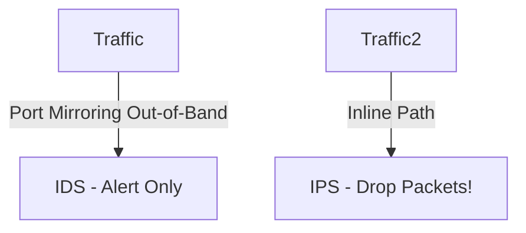

# 🌐 17.Network_Monitoring_and_SIEM: Giám Sát Mạng, SNMP, NetFlow & Hệ Thống SIEM - Chuyên Sâu CompTIA Network+ Cho DevOps

> 💡 **Bản chất 1 câu**: IDS (Out-of-Band) vs IPS (Inline), SNMP v1/v2c/v3 (UDP 161/162, MIB, OID), Packet Captures (PCAP), NetFlow/sFlow Metadat...  
> 🎯 **Trọng tâm thực chiến DevOps**: Nắm vững lý thuyết chuyên sâu, sơ đồ kiến trúc, bộ lệnh CLI chẩn đoán thực tế và bộ câu hỏi phỏng vấn tuyển dụng.

---

## 1. 🧠 Hình Hình Dung Nhanh (Intuitive Mindset)

IDS (Out-of-Band) vs IPS (Inline), SNMP v1/v2c/v3 (UDP 161/162, MIB, OID), Packet Captures (PCAP), NetFlow/sFlow Metadata, Syslog Severity levels và hệ thống SIEM (Wazuh, Elastic SIEM, Splunk).



---

## 2. 📚 Lý Thuyết Chuyên Sâu & Bản Chất Hệ Thống (Under The Hood Architecture)

### 2.1 IDS vs IPS & SNMP / SIEM (OBJ 1.2 & 3.2)
1. **IDS (Intrusion Detection)**: Hoạt động **Out-of-Band** (qua Port Mirroring). Chỉ phân tích và **phát cảnh báo Alert**, không làm chậm traffic.
2. **IPS (Intrusion Prevention)**: Hoạt động **Inline** (nằm trực tiếp trên đường truyền). Chủ động **DROP gói tin độc hại** lập tức.
3. **SNMP v3 (UDP 161/162)**: Giao thức giám sát thiết bị mạng hỗ trợ mã hóa (AES) và xác thực (SHA). Tra cứu dữ liệu MIB qua mã **OID**.
4. **NetFlow / sFlow**: Thu thập metadata luồng traffic (Source/Dst IP, Ports, Bytes) để phân tích Top Talkers tiêu tốn băng thông.
5. **SIEM**: Thu thập, chuẩn hóa và tương quan log tập trung (Splunk, Elastic SIEM, Wazuh).


---


### 2.4 Cơ Chế Hoạt Động Bên Dưới Kernel & Kiến Trúc Hệ Thống Chi Tiết (Deep Under The Hood Architecture)
- **Tầng Giao Tiếp Mạng & Bắt Gói Tin**: Mọi gói tin đi qua Network Interface Card (NIC) đều trải qua quá trình xử lý Ring Buffer, ngắt phần cứng (Hardware Interrupts), Ring Buffer DMA và chồng giao thức Socket Buffers (`sk_buff`) trong Linux Kernel.
- **Tối Ưu Hóa & Cấu Trúc Dữ Liệu**: Hệ thống duy trì các bảng băm dữ liệu (Routing Table, ARP Cache Table, Connection Tracking Table `conntrack`, Socket Inode Tables) giúp chuyển tiếp gói tin ở tốc độ dây (Line-rate processing).
- **Phân Lập An Ninh & Phân Vùng**: Sử dụng cơ chế Linux Network Namespaces (`ip netns`), iptables/nftables hooks và mã hóa phần cứng để cách ly lưu lượng mạng tuyệt đối.

---

## 3. ⚡ Bảng Tra Cứu Câu Lệnh & Khái Niệm Thực Hành (Reference Table)

| Công cụ / Khái niệm | Loại / Protocol | Ý nghĩa chi tiết | Ứng dụng thực tế |
| :--- | :--- | :--- | :--- |
| **`IDS`** | `Out-of-Band` | Hệ thống phát hiện xâm nhập (Chỉ phát cảnh báo Alert) | `Suricata / Snort promiscuous` |
| **`IPS`** | `Inline` | Hệ thống ngăn chặn xâm nhập (Chủ động Drop traffic) | `Suricata / Snort Inline` |
| **`SNMP v3`** | `UDP 161/162` | Giám sát CPU/RAM/Traffic thiết bị mạng có mã hóa | `Zabbix / Nagios monitoring` |
| **`NetFlow`** | `Traffic Flow` | Thống kê Metadata luồng dữ liệu (Src/Dst IP, Bytes) | `Phân tích Top Talkers băng thông` |
| **`SIEM`** | `Log Aggregation` | Thu thập và tương quan log an ninh mạng tập trung | `Wazuh, Elastic SIEM, Splunk` |


---

## 4. 🛠 Thao Tác Thực Chiến & Kịch Bản DevOps

### 🛠 Các lệnh thực hành gõ là ăn ngay:
```bash
sudo tcpdump -i eth0 -w capture.pcap
tshark -r capture.pcap -q -z conv,ip
```

### 🚀 Kịch bản xử lý sự cố thực tế khi đi làm:
Sự cố đường truyền WAN bị quá tải 100% băng thông -> Dùng NetFlow phân tích tìm ra 1 máy IP nội bộ đang kéo Torrent trái phép.

---


### 4.2 Chi Tiết Các Lỗi Thường Gặp & Kịch Bản Khắc Phục Lỗi (Troubleshooting Deep-Dive)
1. **Sự cố 1: Lỗi Mất Gói Tin & Mất Kết Nối Cổng Mạng (Packet Loss & Port Unreachable)**:
   - **Triệu chứng**: Gửi HTTP Request bị Timeout, SSH không kết nối được hoặc gói tin bị nảy rải rác.
   - **Các bước xử lý khẩn cấp**:
     ```bash
     # 1. Kiểm tra trạng thái cổng mạng TCP/UDP đang lắng nghe:
     sudo ss -tulpn | grep :80
     
     # 2. Bắt gói tin trực tiếp trên Interface để kiểm tra bắt tay 3 bước TCP:
     sudo tcpdump -i eth0 port 80 -nn -vv
     
     # 3. Phân tích đường đi của gói tin tìm điểm đứt gãy bằng MTR:
     mtr -n --report --report-cycles=10 8.8.8.8
     
     # 4. Kiểm tra xem gói tin có bị Firewall Drop không:
     sudo iptables -L -n -v | grep DROP
     ```

2. **Sự cố 2: Lỗi Sai Cấu Hình DNS & Chuyển Tiếp IP (DNS Resolution & IP Routing Error)**:
   - **Triệu chứng**: Ping IP thành công nhưng ping Domain Name báo `Could not resolve host`.
   - **Các bước xử lý khẩn cấp**:
     ```bash
     # 1. Tra cứu thử nghiệm phân giải DNS qua server cụ thể:
     dig @8.8.8.8 company.com +trace
     
     # 2. Kiểm tra file cấu hình DNS resolver địa phương:
     cat /etc/resolv.conf
     
     # 3. Kiểm tra bảng định tuyến Kernel IP Routing Table:
     ip route show default
     ```

---

## 5. 🚀 Bộ Câu Hỏi Phỏng Vấn DevOps & Network Thực Tế (Interview Q&A)

> **Q: Sự khác biệt cốt lõi về vị trí hoạt động giữa IDS và IPS là gì?**  
> **A**: IDS hoạt động **Out-of-Band** (chỉ nhận bản sao traffic để phát cảnh báo Alert). IPS hoạt động **Inline** (nằm trực tiếp trên đường truyền để chủ động Drop traffic độc hại).

> **Q: Tại sao bắt buộc dùng SNMP v3 trong doanh nghiệp?**  
> **A**: Vì SNMP v1/v2c truyền chuỗi Community String dưới dạng văn bản rõ (Plaintext) dễ bị nghe lén. SNMP v3 hỗ trợ mã hóa và xác thực bảo mật tuyệt đối.


> **Q: Làm thế nào để điều tra và dập tắt sự cố một Server bị tấn công làm tràn bộ đệm kết nối TCP SYN Flood DoS?**  
> **A**:  
> 1. **Nhận biết**: Lệnh `ss -ant | grep SYN_RECV | wc -l` trả về hàng ngàn kết nối ở trạng thái `SYN_RECV`.  
> 2. **Xử lý khẩn cấp**: Bật ngay cơ chế **SYN Cookies** của Linux Kernel bằng lệnh `sudo sysctl -w net.ipv4.tcp_syncookies=1`. Kích hoạt bộ lọc Firewall drop các gói tin SYN có tần suất bất thường: `sudo iptables -A INPUT -p tcp --syn -m limit --limit 1/s --limit-burst 3 -j ACCEPT`.

> **Q: Sự khác biệt về mặt bản chất giữa Stateful Firewall và Stateless Firewall là gì?**  
> **A**: Stateless Firewall chỉ kiểm tra từng gói tin riêng rẻ dựa trên IP nguồn/đích và Port mà KHÔNG nhớ ngữ cảnh. Stateful Firewall duy trì một bảng theo dõi trạng thái kết nối (**Connection Tracking Table `conntrack`**), tự động nhận diện gói tin thuộc về một kết nối hợp lệ đã được chấp nhận trước đó (như trạng thái `ESTABLISHED,RELATED`), giúp bảo mật và tối ưu hiệu năng vượt trội.

---

## 6. 📝 Cheat Sheet Ghi Nhớ Nhanh (Summary)

- [x] IDS: Out-of-Band cảnh báo Alert
- [x] IPS: Inline chặn đứng gói tin độc hại
- [x] SNMP v3: Giám sát thiết bị có mã hóa
- [x] NetFlow: Metadata luồng traffic
- [x] SIEM: Thu thập log tập trung

