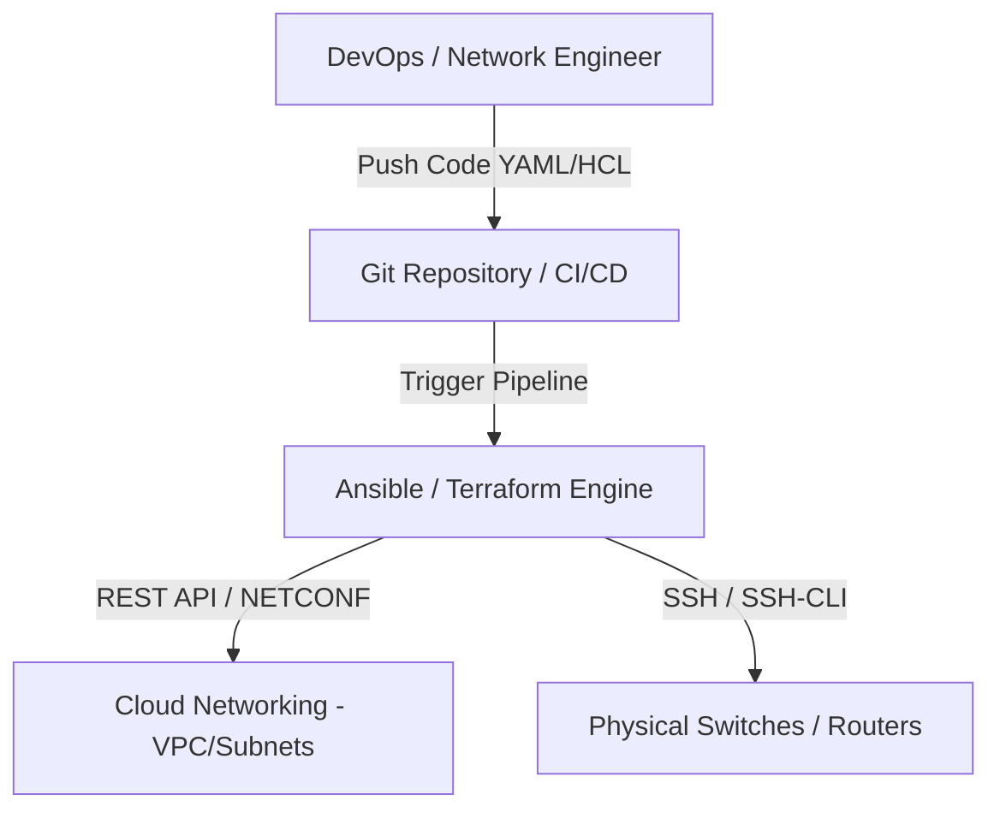

# 🌐 Tự Động Hóa Mạng, Infrastructure as Code (IaC) & APIs - Chuyên Sâu Mạng Máy Tính Cho DevOps

> 💡 **Bản chất 1 câu**: Xu hướng Tự động hóa mạng (Network Automation), Infrastructure as Code (IaC - Ansible/Terraform), REST APIs, NETCONF/RESTCONF và Git CI/CD.  
> 🎯 **Trọng tâm thực chiến DevOps**: Nắm vững IaC, Ansible Playbooks cho Router/Switch, Terraform cho Cloud Networking, REST APIs (JSON/YAML), NETCONF (XML/YANG) vs RESTCONF và Git version control.

---

## 1. 🧠 Hình Hình Dung Nhanh (Intuitive Mindset)

Network Automation như dây chuyền sản xuất tự động trong nhà máy: Thay vì 10 kỹ sư ngồi gõ tay từng dòng lệnh CLI trên 500 Switch (dễ nhầm lẫn), bạn viết 1 file cấu hình Ansible/Terraform rồi nhấn nút cho Robot tự động triển khai trong 10 giây.

---

## 2. 📚 Lý Thuyết Chuyên Sâu & Bản Chất Mạng (Under The Hood Architecture)

### 2.1 Cấu Trúc Tự Động Hóa Mạng (Network Automation Architecture)



1. **Infrastructure as Code (IaC)**:
   - Định nghĩa hạ tầng mạng dưới dạng các tệp tin mã nguồn có thể quản lý phiên bản (Version Control) bằng Git.
   - **Terraform (Declarative)**: Khai báo trạng thái mong muốn (Desired State), thường dùng khởi tạo VPC, Subnet, Route Tables trên Cloud (AWS/GCP).
   - **Ansible (Agentless)**: Sử dụng Playbooks YAML đẩy cấu hình qua SSH/REST API xuống các thiết bị mạng.
2. **Các Chuẩn Giao Tiếp API Mạng Thế Hệ Mới**:
   - **Legacy CLI**: Gõ lệnh SSH qua `expect` / `paramiko` (Dễ hỏng script khi thay đổi định dạng output).
   - **NETCONF (RFC 6241)**: Chuẩn quản lý thiết bị mạng sử dụng định dạng **XML** truyền qua SSH Port 830, mô hình dữ liệu **YANG**.
   - **RESTCONF (RFC 8040)**: Biến thể của NETCONF sử dụng HTTP RESTful APIs (JSON/XML) qua Port 443.


---

## 3. ⚡ Bảng Tra Cứu Câu Lệnh & Khái Niệm Thực Hành (Reference Table)

| Công cụ / Lệnh / Khái niệm | Tham số / Flag / Protocol | Giải thích ý nghĩa chi tiết | Ứng dụng thực tế trong DevOps / Network |
| :--- | :--- | :--- | :--- |
| **`Ansible`** | `Automation Engine` | Công cụ tự động hóa agentless đẩy cấu hình bằng YAML Playbook | `Cấu hình hàng loạt 100 Switches` |
| **`Terraform`** | `IaC Tool` | Khởi tạo và quản lý hạ tầng mạng Cloud bằng mã HCL | `Tự động tạo AWS VPC, Subnets, Internet Gateway` |
| **`NETCONF`** | `Network API` | Chuẩn quản lý cấu hình thiết bị mạng bằng XML qua SSH 830 | `Gửi cấu hình cấu trúc xuống Router` |
| **`RESTCONF`** | `Network API` | Chuẩn quản lý cấu hình bằng REST API JSON/XML qua HTTPS 443 | `Tương tác với Router qua HTTP REST API` |


---

## 4. 🛠 Thao Tác Thực Chiến & Kịch Bản DevOps (Real-World Scenarios)

### 🛠 Các lệnh thực hành gõ là ăn ngay:
```bash
# Chạy Ansible Playbook đẩy cấu hình VLAN hàng loạt xuống các Switch:
ansible-playbook -i inventory.ini configure_vlans.yml
```

### 🚀 Kịch bản xử lý sự cố thực tế khi đi làm:
Tự động hóa khởi tạo VPC và Subnet trên AWS bằng Terraform:
# main.tf
resource "aws_vpc" "main" {
  cidr_block = "10.0.0.0/16"
}
resource "aws_subnet" "public" {
  vpc_id     = aws_vpc.main.id
  cidr_block = "10.0.1.0/24"
}

---

## 5. 🚀 Bộ Câu Hỏi Phỏng Vấn DevOps & Network Thực Tế (Interview Q&A)

> **Q: Sự khác biệt cốt lõi giữa NETCONF và RESTCONF là gì?**  
> **A**: NETCONF sử dụng giao thức SSH (Port 830) truyền dữ liệu dạng XML. RESTCONF sử dụng giao thức HTTP RESTful API (Port 443) hỗ trợ cả dạng dữ liệu JSON và XML.

> **Q: Lợi ích lớn nhất của việc áp dụng Git và CI/CD vào quản trị mạng (NetOps / GitOps) là gì?**  
> **A**: Cho phép kiểm duyệt mã cấu hình (Code Review), chạy test tự động trước khi deploy, lưu vết lịch sử thay đổi và cho phép Rollback khôi phục cấu hình cũ tức thì khi có sự cố.


---

## 6. 📝 Cheat Sheet & Ghi Nhớ Nhanh (Summary)

- [x] IaC: Quản lý hạ tầng mạng bằng Code (Git)
- [x] Terraform: Khai báo trạng thái hạ tầng Cloud (HCL)
- [x] Ansible: Đẩy cấu hình tự động agentless (YAML)
- [x] NETCONF/RESTCONF: API chuẩn hóa dữ liệu mô hình YANG

