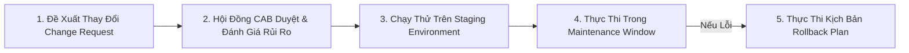

# 🌐 Tài Liệu Mạng, Quản Lý Địa Chỉ IP (IPAM) & Quy Trình Change Management - Chuyên Sâu Mạng Máy Tính Cho DevOps

> 💡 **Bản chất 1 câu**: Chuẩn hóa quy trình quản trị: Sơ đồ mạng (Diagrams), Quản lý tài sản (Asset Inventory), Quản lý địa chỉ IP (IPAM), Thỏa thuận dịch vụ (SLA) và Quy trình Quản lý thay đổi (Change Management).  
> 🎯 **Trọng tâm thực chiến DevOps**: Hiểu rõ Physical vs Logical Network Diagrams, IPAM (NetBox, phpIPAM), SLA/SLO/SLI, Vòng đời sản phẩm (EOL/EOS) và Quy trình Change Advisory Board (CAB).

---

## 1. 🧠 Hình Hình Dung Nhanh (Intuitive Mindset)

Quy trình Change Management như lịch mổ của bệnh viện: Trước khi dao mổ (thay đổi cấu hình Router chính), bác sĩ phải họp hội chẩn (Hội đồng CAB), duyệt kịch bản mổ và chuẩn bị sẵn phương án cấp cứu (Rollback Plan) nếu có biến cố.

---

## 2. 📚 Lý Thuyết Chuyên Sâu & Bản Chất Mạng (Under The Hood Architecture)

### 2.1 Các Tài Liệu & Quy Trình Quản Trị Mạng Cốt Lõi



1. **Sơ Đồ Mạng (Network Diagrams)**:
   - **Physical Diagram**: Mô tả chính xác vị trí rack, cổng cắm cáp vật lý, mã thiết bị.
   - **Logical Diagram**: Mô tả dải IP, Subnet, VLANs, đường đi Routing, Firewalls.
2. **Quản Lý Địa Chỉ IP (IPAM - IP Address Management)**:
   - Quản lý tập trung không gian địa chỉ IP, tránh cấp phát trùng lặp IP trong doanh nghiệp.
   - Công cụ chuyên dụng: **NetBox** (chuẩn DevOps / Single Source of Truth), phpIPAM.
3. **Thỏa Thuận Mức Độ Dịch Vụ (SLA - Service Level Agreement)**:
   - Cam kết chỉ số sẵn sàng Uptime với khách hàng. Ví dụ "4 số 9" (99.99% Uptime = Tổng thời gian sập tối đa chỉ **52.6 phút/năm**!).
4. **Quy Trình Quản Lý Thay Đổi (Change Management Process)**:
   - Mọi thay đổi trên Production BẮT BUỘC phải tạo **Change Request (CR)**, trình hội đồng **CAB (Change Advisory Board)** duyệt, chỉ thực thi trong khung giờ bảo trì (**Maintenance Window**) và BẮT BUỘC có **Rollback Plan** chi tiết.


---

## 3. ⚡ Bảng Tra Cứu Câu Lệnh & Khái Niệm Thực Hành (Reference Table)

| Công cụ / Lệnh / Khái niệm | Tham số / Flag / Protocol | Giải thích ý nghĩa chi tiết | Ứng dụng thực tế trong DevOps / Network |
| :--- | :--- | :--- | :--- |
| **`IPAM`** | `NetBox / phpIPAM` | Hệ thống quản lý địa chỉ IP và sơ đồ thiết bị tập trung | `Single Source of Truth cho Network Automation` |
| **`SLA 99.99%`** | `Service Agreement` | Cam kết thời gian hoạt động Uptime 99.99% (Downtime < 52p/năm) | `Cam kết chất lượng đường truyền dịch vụ Cloud` |
| **`Change Request`** | `Process` | Đơn đề xuất thay đổi cấu hình hạ tầng có đánh giá rủi ro | `Quy trình bắt buộc trước khi sửa Router Production` |
| **`Rollback Plan`** | `Emergency Plan` | Kịch bản chi tiết đảo ngược về trạng thái cũ khi deploy lỗi | `Đảm bảo an toàn khi bảo trì hệ thống` |


---

## 4. 🛠 Thao Tác Thực Chiến & Kịch Bản DevOps (Real-World Scenarios)

### 🛠 Các lệnh thực hành gõ là ăn ngay:
```bash
# Sử dụng NetBox REST API tra cứu IP khả dụng tiếp theo trong Subnet:
curl -X GET -H "Authorization: Token YOUR_TOKEN" https://netbox.local/api/ipam/ip-addresses/
```

### 🚀 Kịch bản xử lý sự cố thực tế khi đi làm:
Quy trình bảo trì nâng cấp Core Switch doanh nghiệp:
# 1. Tạo Change Request (CR-1024) đính kèm sơ đồ và Rollback Plan.
# 2. Được hội đồng CAB phê duyệt.
# 3. Thực thi vào khung giờ bảo trì 2h00 - 4h00 sáng Chủ Nhật.

---

## 5. 🚀 Bộ Câu Hỏi Phỏng Vấn DevOps & Network Thực Tế (Interview Q&A)

> **Q: Sự khác biệt giữa Sơ đồ mạng Vật lý (Physical Diagram) và Sơ đồ mạng Logic (Logical Diagram) là gì?**  
> **A**: Physical Diagram thể hiện vị trí thiết bị, tủ Rack và cáp cắm thật. Logical Diagram thể hiện kiến trúc luồng dữ liệu, dải IP, Subnet, VLANs và Routing.

> **Q: Tại sao mọi Change Request (CR) khi bảo trì hạ tầng đều BẮT BUỘC phải có Rollback Plan?**  
> **A**: Để trong trường hợp thao tác bị sự cố không như dự kiến, kỹ sư có kịch bản khôi phục lại hệ thống nguyên trạng nhanh nhất, giảm thiểu tối đa thời gian Downtime.


---

## 6. 📝 Cheat Sheet & Ghi Nhớ Nhanh (Summary)

- [x] Logical Diagram: Hiện IP/VLAN/Routing
- [x] Physical Diagram: Hiện Tủ Rack/Cáp cắm thật
- [x] NetBox: Công cụ IPAM tiêu chuẩn cho DevOps
- [x] SLA 99.99%: Downtime max 52 phút/năm
- [x] Change Management: Bắt buộc có Rollback Plan

