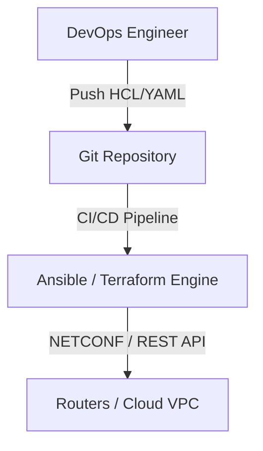

# 🌐 18.Orchestration_and_Automation: Tự Động Hóa Mạng, Infrastructure as Code (IaC) & APIs - Chuyên Sâu CompTIA Network+ Cho DevOps

> 💡 **Bản chất 1 câu**: Tự động hóa mạng (Network Automation), Infrastructure as Code (Ansible, Terraform), REST APIs (JSON/YAML), NETCONF (XML/...  
> 🎯 **Trọng tâm thực chiến DevOps**: Nắm vững lý thuyết chuyên sâu, sơ đồ kiến trúc, bộ lệnh CLI chẩn đoán thực tế và bộ câu hỏi phỏng vấn tuyển dụng.

---

## 1. 🧠 Hình Hình Dung Nhanh (Intuitive Mindset)

Tự động hóa mạng (Network Automation), Infrastructure as Code (Ansible, Terraform), REST APIs (JSON/YAML), NETCONF (XML/SSH Port 830, YANG models), RESTCONF (JSON/HTTP Port 443) và Git CI/CD (GitOps).



---

## 2. 📚 Lý Thuyết Chuyên Sâu & Bản Chất Hệ Thống (Under The Hood Architecture)

### 2.1 Infrastructure as Code & Network APIs (OBJ 1.8)
1. **Infrastructure as Code (IaC)**:
   - **Terraform (Declarative - HCL)**: Khởi tạo và quản lý hạ tầng mạng Cloud (AWS VPC, Subnets, Gateways).
   - **Ansible (Agentless - YAML)**: Đẩy cấu hình tự động qua SSH/API xuống hàng trăm thiết bị mạng.
2. **Các Chuẩn Network APIs**:
   - **NETCONF (RFC 6241)**: Quản lý thiết bị mạng sử dụng định dạng **XML** qua SSH Port 830, mô hình dữ liệu **YANG**.
   - **RESTCONF (RFC 8040)**: Biến thể HTTP RESTful API (JSON/XML) qua HTTPS Port 443.


---


### 2.4 Cơ Chế Hoạt Động Bên Dưới Kernel & Kiến Trúc Hệ Thống Chi Tiết (Deep Under The Hood Architecture)
- **Tầng Giao Tiếp Mạng & Bắt Gói Tin**: Mọi gói tin đi qua Network Interface Card (NIC) đều trải qua quá trình xử lý Ring Buffer, ngắt phần cứng (Hardware Interrupts), Ring Buffer DMA và chồng giao thức Socket Buffers (`sk_buff`) trong Linux Kernel.
- **Tối Ưu Hóa & Cấu Trúc Dữ Liệu**: Hệ thống duy trì các bảng băm dữ liệu (Routing Table, ARP Cache Table, Connection Tracking Table `conntrack`, Socket Inode Tables) giúp chuyển tiếp gói tin ở tốc độ dây (Line-rate processing).
- **Phân Lập An Ninh & Phân Vùng**: Sử dụng cơ chế Linux Network Namespaces (`ip netns`), iptables/nftables hooks và mã hóa phần cứng để cách ly lưu lượng mạng tuyệt đối.

---

## 3. ⚡ Bảng Tra Cứu Câu Lệnh & Khái Niệm Thực Hành (Reference Table)

| Công cụ / Khái niệm | Loại / Protocol | Ý nghĩa chi tiết | Ứng dụng thực tế |
| :--- | :--- | :--- | :--- |
| **`Ansible`** | `Automation Engine` | Tự động hóa agentless đẩy cấu hình bằng YAML Playbook | `Cấu hình hàng loạt 100 Switches` |
| **`Terraform`** | `IaC Tool` | Khởi tạo hạ tầng mạng Cloud bằng mã HCL | `Tự động tạo AWS VPC, Subnets` |
| **`NETCONF`** | `Network API` | Chuẩn quản lý cấu hình bằng XML qua SSH 830 (YANG model) | `Gửi cấu hình cấu trúc xuống Router` |
| **`RESTCONF`** | `Network API` | Chuẩn quản lý cấu hình bằng REST API JSON/XML qua HTTPS 443 | `Tương tác với Router qua REST API` |


---

## 4. 🛠 Thao Tác Thực Chiến & Kịch Bản DevOps

### 🛠 Các lệnh thực hành gõ là ăn ngay:
```bash
ansible-playbook -i inventory.ini configure_vlans.yml
terraform apply
```

### 🚀 Kịch bản xử lý sự cố thực tế khi đi làm:
Triển khai GitOps cho Network: Mỗi khi Kỹ sư tạo Pull Request sửa file YAML VLAN, CI/CD tự động kiểm tra cú pháp và chạy Ansible deploy xuống Switch.

---


### 4.2 Chi Tiết Các Lỗi Thường Gặp & Kịch Bản Khắc Phục Lỗi (Troubleshooting Deep-Dive)
1. **Sự cố 1: Lỗi Mất Gói Tin & Mất Kết Nối Cổng Mạng (Packet Loss & Port Unreachable)**:
   - **Triệu chứng**: Gửi HTTP Request bị Timeout, SSH không kết nối được hoặc gói tin bị nảy rải rác.
   - **Các bước xử lý khẩn cấp**:
     ```bash
     # 1. Kiểm tra trạng thái cổng mạng TCP/UDP đang lắng nghe:
     sudo ss -tulpn | grep :80
     
     # 2. Bắt gói tin trực tiếp trên Interface để kiểm tra bắt tay 3 bước TCP:
     sudo tcpdump -i eth0 port 80 -nn -vv
     
     # 3. Phân tích đường đi của gói tin tìm điểm đứt gãy bằng MTR:
     mtr -n --report --report-cycles=10 8.8.8.8
     
     # 4. Kiểm tra xem gói tin có bị Firewall Drop không:
     sudo iptables -L -n -v | grep DROP
     ```

2. **Sự cố 2: Lỗi Sai Cấu Hình DNS & Chuyển Tiếp IP (DNS Resolution & IP Routing Error)**:
   - **Triệu chứng**: Ping IP thành công nhưng ping Domain Name báo `Could not resolve host`.
   - **Các bước xử lý khẩn cấp**:
     ```bash
     # 1. Tra cứu thử nghiệm phân giải DNS qua server cụ thể:
     dig @8.8.8.8 company.com +trace
     
     # 2. Kiểm tra file cấu hình DNS resolver địa phương:
     cat /etc/resolv.conf
     
     # 3. Kiểm tra bảng định tuyến Kernel IP Routing Table:
     ip route show default
     ```

---

## 5. 🚀 Bộ Câu Hỏi Phỏng Vấn DevOps & Network Thực Tế (Interview Q&A)

> **Q: Sự khác biệt cốt lõi giữa NETCONF và RESTCONF là gì?**  
> **A**: NETCONF sử dụng giao thức SSH (Port 830) truyền dữ liệu XML. RESTCONF sử dụng giao thức HTTP RESTful API (Port 443) hỗ trợ dữ liệu JSON và XML.

> **Q: Lợi ích lớn nhất của việc áp dụng Git và CI/CD vào quản trị mạng (NetOps) là gì?**  
> **A**: Cho phép Code Review kiểm duyệt cấu hình, chạy test tự động trước khi deploy, lưu vết lịch sử thay đổi và cho phép Rollback khôi phục cấu hình cũ tức thì khi có sự cố.


> **Q: Làm thế nào để điều tra và dập tắt sự cố một Server bị tấn công làm tràn bộ đệm kết nối TCP SYN Flood DoS?**  
> **A**:  
> 1. **Nhận biết**: Lệnh `ss -ant | grep SYN_RECV | wc -l` trả về hàng ngàn kết nối ở trạng thái `SYN_RECV`.  
> 2. **Xử lý khẩn cấp**: Bật ngay cơ chế **SYN Cookies** của Linux Kernel bằng lệnh `sudo sysctl -w net.ipv4.tcp_syncookies=1`. Kích hoạt bộ lọc Firewall drop các gói tin SYN có tần suất bất thường: `sudo iptables -A INPUT -p tcp --syn -m limit --limit 1/s --limit-burst 3 -j ACCEPT`.

> **Q: Sự khác biệt về mặt bản chất giữa Stateful Firewall và Stateless Firewall là gì?**  
> **A**: Stateless Firewall chỉ kiểm tra từng gói tin riêng rẻ dựa trên IP nguồn/đích và Port mà KHÔNG nhớ ngữ cảnh. Stateful Firewall duy trì một bảng theo dõi trạng thái kết nối (**Connection Tracking Table `conntrack`**), tự động nhận diện gói tin thuộc về một kết nối hợp lệ đã được chấp nhận trước đó (như trạng thái `ESTABLISHED,RELATED`), giúp bảo mật và tối ưu hiệu năng vượt trội.

---

## 6. 📝 Cheat Sheet Ghi Nhớ Nhanh (Summary)

- [x] IaC: Quản lý hạ tầng mạng bằng Code (Git)
- [x] Terraform: Tạo VPC Cloud (HCL)
- [x] Ansible: Đẩy cấu hình tự động (YAML)
- [x] NETCONF/RESTCONF: API chuẩn hóa dữ liệu YANG

