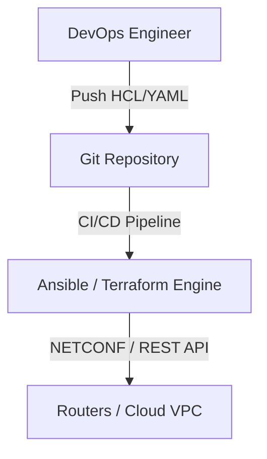

# 🌐 18.Orchestration_and_Automation: Tự Động Hóa Mạng, Infrastructure as Code (IaC) & APIs - Chuyên Sâu CompTIA Network+ Cho DevOps

> 💡 **Bản chất 1 câu**: Tự động hóa mạng (Network Automation), Infrastructure as Code (Ansible, Terraform), REST APIs (JSON/YAML), NETCONF (XML/...  
> 🎯 **Trọng tâm thực chiến DevOps**: Nắm vững lý thuyết chuyên sâu, sơ đồ kiến trúc, bộ lệnh CLI chẩn đoán thực tế và bộ câu hỏi phỏng vấn tuyển dụng.

---

## 1. 🧠 Hình Hình Dung Nhanh (Intuitive Mindset)

Tự động hóa mạng (Network Automation), Infrastructure as Code (Ansible, Terraform), REST APIs (JSON/YAML), NETCONF (XML/SSH Port 830, YANG models), RESTCONF (JSON/HTTP Port 443) và Git CI/CD (GitOps).



---

## 2. 📚 Lý Thuyết Chuyên Sâu & Bản Chất Hệ Thống (Under The Hood Architecture)

### 2.1 Infrastructure as Code & Network APIs (OBJ 1.8)
1. **Infrastructure as Code (IaC)**:
   - **Terraform (Declarative - HCL)**: Khởi tạo và quản lý hạ tầng mạng Cloud (AWS VPC, Subnets, Gateways).
   - **Ansible (Agentless - YAML)**: Đẩy cấu hình tự động qua SSH/API xuống hàng trăm thiết bị mạng.
2. **Các Chuẩn Network APIs**:
   - **NETCONF (RFC 6241)**: Quản lý thiết bị mạng sử dụng định dạng **XML** qua SSH Port 830, mô hình dữ liệu **YANG**.
   - **RESTCONF (RFC 8040)**: Biến thể HTTP RESTful API (JSON/XML) qua HTTPS Port 443.


---

## 3. ⚡ Bảng Tra Cứu Câu Lệnh & Khái Niệm Thực Hành (Reference Table)

| Công cụ / Khái niệm | Loại / Protocol | Ý nghĩa chi tiết | Ứng dụng thực tế |
| :--- | :--- | :--- | :--- |
| **`Ansible`** | `Automation Engine` | Tự động hóa agentless đẩy cấu hình bằng YAML Playbook | `Cấu hình hàng loạt 100 Switches` |
| **`Terraform`** | `IaC Tool` | Khởi tạo hạ tầng mạng Cloud bằng mã HCL | `Tự động tạo AWS VPC, Subnets` |
| **`NETCONF`** | `Network API` | Chuẩn quản lý cấu hình bằng XML qua SSH 830 (YANG model) | `Gửi cấu hình cấu trúc xuống Router` |
| **`RESTCONF`** | `Network API` | Chuẩn quản lý cấu hình bằng REST API JSON/XML qua HTTPS 443 | `Tương tác với Router qua REST API` |


---

## 4. 🛠 Thao Tác Thực Chiến & Kịch Bản DevOps

### 🛠 Các lệnh thực hành gõ là ăn ngay:
```bash
ansible-playbook -i inventory.ini configure_vlans.yml
terraform apply
```

### 🚀 Kịch bản xử lý sự cố thực tế khi đi làm:
Triển khai GitOps cho Network: Mỗi khi Kỹ sư tạo Pull Request sửa file YAML VLAN, CI/CD tự động kiểm tra cú pháp và chạy Ansible deploy xuống Switch.

---

## 5. 🚀 Bộ Câu Hỏi Phỏng Vấn DevOps & Network Thực Tế (Interview Q&A)

> **Q: Sự khác biệt cốt lõi giữa NETCONF và RESTCONF là gì?**  
> **A**: NETCONF sử dụng giao thức SSH (Port 830) truyền dữ liệu XML. RESTCONF sử dụng giao thức HTTP RESTful API (Port 443) hỗ trợ dữ liệu JSON và XML.

> **Q: Lợi ích lớn nhất của việc áp dụng Git và CI/CD vào quản trị mạng (NetOps) là gì?**  
> **A**: Cho phép Code Review kiểm duyệt cấu hình, chạy test tự động trước khi deploy, lưu vết lịch sử thay đổi và cho phép Rollback khôi phục cấu hình cũ tức thì khi có sự cố.


---

## 6. 📝 Cheat Sheet Ghi Nhớ Nhanh (Summary)

- [x] IaC: Quản lý hạ tầng mạng bằng Code (Git)
- [x] Terraform: Tạo VPC Cloud (HCL)
- [x] Ansible: Đẩy cấu hình tự động (YAML)
- [x] NETCONF/RESTCONF: API chuẩn hóa dữ liệu YANG

