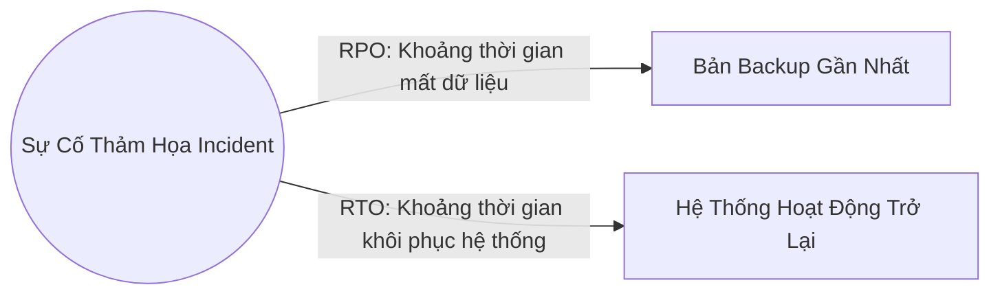

# 🌐 Khôi Phục Sau Thảm Họa (Disaster Recovery & High Availability) - Chuyên Sâu Mạng Máy Tính Cho DevOps

> 💡 **Bản chất 1 câu**: Thiết kế hạ tầng mạng tính sẵn sàng cao (High Availability), chỉ số khắc phục thảm họa (RTO, RPO) và các mô hình trung tâm dữ liệu dự phòng (Hot, Warm, Cold Site).  
> 🎯 **Trọng tâm thực chiến DevOps**: Nắm vững RTO (Recovery Time Objective) vs RPO (Recovery Point Objective), High Availability (HA), Redundant Sites (Hot Site, Warm Site, Cold Site) và DR Testing.

---

## 1. 🧠 Hình Hình Dung Nhanh (Intuitive Mindset)

RPO và RTO như bảo hiểm dữ liệu: RPO = Bạn chấp nhận mất tối đa bao nhiêu phút dữ liệu (mất 5 phút hay 1 giờ)? RTO = Hệ thống mất bao lâu thời gian để bật lại chạy bình thường (bật lại trong 10 phút hay 24 giờ)?

---

## 2. 📚 Lý Thuyết Chuyên Sâu & Bản Chất Mạng (Under The Hood Architecture)

### 2.1 Chi Tiết Các Chỉ Số Khắc Phục Thảm Họa RTO & RPO



1. **RPO (Recovery Point Objective - Chỉ số điểm khôi phục)**:
   - Mức độ tổn thất dữ liệu **TỐI ĐA** mà doanh nghiệp có thể chấp nhận được tính theo thời gian.
   - Ví dụ: Nếu Backup DB chạy lúc 12h00, sự cố xảy ra lúc 12h05 -> RPO = 5 phút mất dữ liệu.
2. **RTO (Recovery Time Objective - Chỉ số thời gian khôi phục)**:
   - Khoảng thời gian **TỐI ĐA** cho phép để khôi phục toàn bộ hệ thống hoạt động trở lại sau thảm họa.
3. **So Sánh Các Mô Hình Datacenter Dự Phòng (Redundant Sites)**:

| Tiêu chí | Hot Site | Warm Site | Cold Site |
| :--- | :--- | :--- | :--- |
| **Trạng thái phần cứng** | Có sẵn 100% giống hệt Site chính | Có sẵn phần cứng nhưng chưa bật full | Chỉ có phòng trống & điện lạnh |
| **Đồng bộ Dữ liệu** | Đồng bộ thời gian thực (Real-time sync) | Đồng bộ định kỳ (Hàng giờ/Hàng ngày) | Không có sẵn dữ liệu |
| **RTO (Thời gian khôi phục)**| **Gần như bằng 0** (Vài giây - Vài phút) | Vài giờ | Vài ngày đến Vài tuần |
| **Chi phí duy trì** | **Cực kỳ đắt đỏ** | Trung bình | Rất rẻ |


---

## 3. ⚡ Bảng Tra Cứu Câu Lệnh & Khái Niệm Thực Hành (Reference Table)

| Công cụ / Lệnh / Khái niệm | Tham số / Flag / Protocol | Giải thích ý nghĩa chi tiết | Ứng dụng thực tế trong DevOps / Network |
| :--- | :--- | :--- | :--- |
| **`RPO`** | `Recovery Point Objective` | Khoảng thời gian chấp nhận mất dữ liệu tối đa | `RPO = 15 phút (DB Sync 15p/lần)` |
| **`RTO`** | `Recovery Time Objective` | Khoảng thời gian tối đa để bật lại hệ thống | `RTO = 1 giờ (Bật lại hạ tầng)` |
| **`Hot Site`** | `DR Site` | Site dự phòng chạy song song đồng bộ data tức thì | `Chuyển đổi failover tự động trong vài giây` |
| **`Cold Site`** | `DR Site` | Site dự phòng chỉ có vỏ nhà và điện chưa có máy | `Chi phí rẻ nhưng RTO mất vài ngày` |


---

## 4. 🛠 Thao Tác Thực Chiến & Kịch Bản DevOps (Real-World Scenarios)

### 🛠 Các lệnh thực hành gõ là ăn ngay:
```bash
# Kiểm tra trạng thái đồng bộ dữ liệu Real-time giữa Primary DB và Hot Site Replica DB:
systemctl status repmgrd
```

### 🚀 Kịch bản xử lý sự cố thực tế khi đi làm:
Thiết kế kiến trúc Disaster Recovery cho Ngân hàng với chỉ số RPO gần bằng 0:
# Sử dụng mô hình Hot Site đa vùng (Multi-Region / Multi-AZ) đồng bộ dữ liệu bằng synchronous replication.

---

## 5. 🚀 Bộ Câu Hỏi Phỏng Vấn DevOps & Network Thực Tế (Interview Q&A)

> **Q: Sự khác biệt cốt lõi giữa RTO và RPO trong Disaster Recovery là gì?**  
> **A**: RPO chỉ độ tổn thất dữ liệu tối đa chấp nhận được tính theo thời gian (Data loss time). RTO chỉ khoảng thời gian cho phép để bật lại hệ thống hoạt động trở lại (Downtime duration).

> **Q: Mô hình Datacenter dự phòng nào có chỉ số RTO gần như bằng 0 nhưng chi phí duy trì đắt nhất?**  
> **A**: Mô hình **Hot Site** (đồng bộ dữ liệu thời gian thực và tự động Failover).


---

## 6. 📝 Cheat Sheet & Ghi Nhớ Nhanh (Summary)

- [x] RPO: Mức dữ liệu chấp nhận mất (tính theo thời gian)
- [x] RTO: Thời gian cho phép bật lại hệ thống
- [x] Hot Site: Đồng bộ real-time, RTO vài giây, đắt
- [x] Cold Site: Chỉ có vỏ nhà, RTO vài ngày, rẻ

