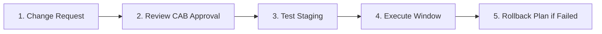

# 🌐 19.Documentation_and_Processes: Tài Liệu Mạng, NetBox IPAM & Quy Trình Change Management - Chuyên Sâu CompTIA Network+ Cho DevOps

> 💡 **Bản chất 1 câu**: Sơ đồ mạng (Physical vs Logical Diagrams), Asset Inventory, Quản lý địa chỉ IP (NetBox IPAM), Thỏa thuận dịch vụ SLA 99....  
> 🎯 **Trọng tâm thực chiến DevOps**: Nắm vững lý thuyết chuyên sâu, sơ đồ kiến trúc, bộ lệnh CLI chẩn đoán thực tế và bộ câu hỏi phỏng vấn tuyển dụng.

---

## 1. 🧠 Hình Hình Dung Nhanh (Intuitive Mindset)

Sơ đồ mạng (Physical vs Logical Diagrams), Asset Inventory, Quản lý địa chỉ IP (NetBox IPAM), Thỏa thuận dịch vụ SLA 99.99%, Vòng đời sản phẩm (EOL/EOS) và Quy trình Quản lý thay đổi Change Management (CR, CAB, Rollback Plan).



---

## 2. 📚 Lý Thuyết Chuyên Sâu & Bản Chất Hệ Thống (Under The Hood Architecture)

### 2.1 Tài Liệu & Quy Trình Quản Trị Mạng (OBJ 3.1)
1. **Sơ Đồ Mạng (Diagrams)**:
   - **Physical Diagram**: Thể hiện chính xác vị trí tủ Rack, cổng cắm cáp thật và mã thiết bị.
   - **Logical Diagram**: Thể hiện dải IP, Subnet, VLANs, đường đi Routing và Firewalls.
2. **NetBox IPAM**: Hệ thống quản lý địa chỉ IP tập trung làm Single Source of Truth.
3. **SLA 99.99% ("4 số 9")**: Cam kết thời gian Downtime tối đa **< 52.6 phút/năm**.
4. **Quy Trình Change Management**: Mọi thay đổi Production bắt buộc phải tạo **Change Request (CR)**, trình hội đồng **CAB** duyệt, chỉ thực thi trong khung giờ bảo trì (**Maintenance Window**) và BẮT BUỘC có **Rollback Plan**.


---

## 3. ⚡ Bảng Tra Cứu Câu Lệnh & Khái Niệm Thực Hành (Reference Table)

| Công cụ / Khái niệm | Loại / Protocol | Ý nghĩa chi tiết | Ứng dụng thực tế |
| :--- | :--- | :--- | :--- |
| **`IPAM`** | `NetBox / phpIPAM` | Hệ thống quản lý địa chỉ IP và sơ đồ thiết bị tập trung | `Single Source of Truth cho NetOps` |
| **`SLA 99.99%`** | `Service Level` | Cam kết Uptime 99.99% (Downtime max 52p/năm) | `Cam kết chất lượng đường truyền Cloud` |
| **`Change Request`** | `Process` | Đơn đề xuất thay đổi cấu hình hạ tầng có đánh giá rủi ro | `Quy trình bắt buộc trước khi sửa Production` |
| **`Rollback Plan`** | `Emergency Plan` | Kịch bản chi tiết đảo ngược về trạng thái cũ khi deploy lỗi | `Đảm bảo an toàn khi bảo trì hạ tầng` |


---

## 4. 🛠 Thao Tác Thực Chiến & Kịch Bản DevOps

### 🛠 Các lệnh thực hành gõ là ăn ngay:
```bash
curl -X GET -H "Authorization: Token YOUR_TOKEN" https://netbox.local/api/ipam/ip-addresses/
```

### 🚀 Kịch bản xử lý sự cố thực tế khi đi làm:
Thực hiện bảo trì nâng cấp Core Switch: Tạo CR-1024 có đính kèm Rollback Plan chi tiết được hội đồng CAB phê duyệt trước khi thao tác lúc 2h sáng.

---

## 5. 🚀 Bộ Câu Hỏi Phỏng Vấn DevOps & Network Thực Tế (Interview Q&A)

> **Q: Sự khác biệt giữa Sơ đồ mạng Vật lý (Physical Diagram) và Sơ đồ mạng Logic (Logical Diagram) là gì?**  
> **A**: Physical Diagram thể hiện vị trí thiết bị, tủ Rack và cáp cắm thật. Logical Diagram thể hiện kiến trúc luồng dữ liệu, dải IP, Subnet, VLANs và Routing.

> **Q: Tại sao mọi Change Request (CR) khi bảo trì hạ tầng đều BẮT BUỘC phải có Rollback Plan?**  
> **A**: Để trong trường hợp thao tác gặp sự cố ngoài dự kiến, kỹ sư có kịch bản khôi phục lại hệ thống nguyên trạng nhanh nhất, giảm thiểu tối đa thời gian Downtime.


---

## 6. 📝 Cheat Sheet Ghi Nhớ Nhanh (Summary)

- [x] Logical Diagram: Hiện IP/VLAN/Routing
- [x] Physical Diagram: Hiện Tủ Rack/Cáp cắm thật
- [x] NetBox: IPAM tiêu chuẩn cho DevOps
- [x] SLA 99.99%: Downtime max 52 phút/năm
- [x] Change Management: Bắt buộc có Rollback Plan

