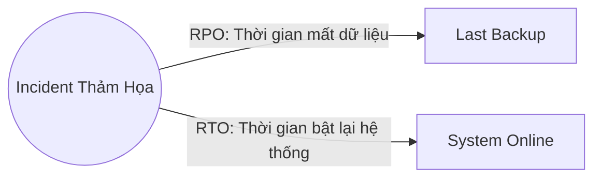

# 🌐 20.Disaster_Recovery: Khôi Phục Sau Thảm Họa (Disaster Recovery & High Availability) - Chuyên Sâu CompTIA Network+ Cho DevOps

> 💡 **Bản chất 1 câu**: High Availability (HA), Redundant Networks, Chỉ số RTO (Recovery Time Objective) vs RPO (Recovery Point Objective), Redu...  
> 🎯 **Trọng tâm thực chiến DevOps**: Nắm vững lý thuyết chuyên sâu, sơ đồ kiến trúc, bộ lệnh CLI chẩn đoán thực tế và bộ câu hỏi phỏng vấn tuyển dụng.

---

## 1. 🧠 Hình Hình Dung Nhanh (Intuitive Mindset)

High Availability (HA), Redundant Networks, Chỉ số RTO (Recovery Time Objective) vs RPO (Recovery Point Objective), Redundant Sites (Hot Site vs Warm Site vs Cold Site) và DR Testing.



---

## 2. 📚 Lý Thuyết Chuyên Sâu & Bản Chất Hệ Thống (Under The Hood Architecture)

### 2.1 RTO, RPO & Mô Hình DR Sites (OBJ 3.3)
1. **RPO (Recovery Point Objective)**: Mức độ tổn thất dữ liệu **TỐI ĐA** có thể chấp nhận được tính theo thời gian (Data loss duration).
2. **RTO (Recovery Time Objective)**: Khoảng thời gian **TỐI ĐA** cho phép để bật lại hệ thống hoạt động trở lại sau thảm họa (Downtime duration).
3. **So Sánh Mô Hình Redundant DR Sites**:
   - **Hot Site**: Đồng bộ dữ liệu Real-time, **RTO gần như bằng 0** (Failover vài giây), chi phí **cực kỳ đắt đỏ**.
   - **Warm Site**: Đồng bộ dữ liệu định kỳ (hàng giờ), RTO vài giờ, chi phí trung bình.
   - **Cold Site**: Chỉ có vỏ nhà và điện lạnh chưa có máy chủ, RTO vài ngày đến vài tuần, chi phí rất rẻ.


---


### 2.4 Cơ Chế Hoạt Động Bên Dưới Kernel & Kiến Trúc Hệ Thống Chi Tiết (Deep Under The Hood Architecture)
- **Tầng Giao Tiếp Mạng & Bắt Gói Tin**: Mọi gói tin đi qua Network Interface Card (NIC) đều trải qua quá trình xử lý Ring Buffer, ngắt phần cứng (Hardware Interrupts), Ring Buffer DMA và chồng giao thức Socket Buffers (`sk_buff`) trong Linux Kernel.
- **Tối Ưu Hóa & Cấu Trúc Dữ Liệu**: Hệ thống duy trì các bảng băm dữ liệu (Routing Table, ARP Cache Table, Connection Tracking Table `conntrack`, Socket Inode Tables) giúp chuyển tiếp gói tin ở tốc độ dây (Line-rate processing).
- **Phân Lập An Ninh & Phân Vùng**: Sử dụng cơ chế Linux Network Namespaces (`ip netns`), iptables/nftables hooks và mã hóa phần cứng để cách ly lưu lượng mạng tuyệt đối.

---

## 3. ⚡ Bảng Tra Cứu Câu Lệnh & Khái Niệm Thực Hành (Reference Table)

| Công cụ / Khái niệm | Loại / Protocol | Ý nghĩa chi tiết | Ứng dụng thực tế |
| :--- | :--- | :--- | :--- |
| **`RPO`** | `Recovery Point Objective` | Khoảng thời gian chấp nhận mất dữ liệu tối đa | `RPO = 15 phút (DB Sync 15p/lần)` |
| **`RTO`** | `Recovery Time Objective` | Khoảng thời gian tối đa để bật lại hệ thống | `RTO = 1 giờ (Bật lại hạ tầng)` |
| **`Hot Site`** | `DR Site` | Site dự phòng chạy song song đồng bộ data tức thì | `Failover tự động trong vài giây` |
| **`Cold Site`** | `DR Site` | Site dự phòng chỉ có vỏ nhà chưa có máy chủ | `Chi phí rẻ nhưng RTO mất vài ngày` |


---

## 4. 🛠 Thao Tác Thực Chiến & Kịch Bản DevOps

### 🛠 Các lệnh thực hành gõ là ăn ngay:
```bash
systemctl status repmgrd # Check DB replication real-time sang Hot Site
```

### 🚀 Kịch bản xử lý sự cố thực tế khi đi làm:
Thiết kế hạ tầng Disaster Recovery cho hệ thống Thanh toán Ngân hàng: Sử dụng mô hình Hot Site Multi-Region với RPO = 0 và RTO < 10 giây.

---


### 4.2 Chi Tiết Các Lỗi Thường Gặp & Kịch Bản Khắc Phục Lỗi (Troubleshooting Deep-Dive)
1. **Sự cố 1: Lỗi Mất Gói Tin & Mất Kết Nối Cổng Mạng (Packet Loss & Port Unreachable)**:
   - **Triệu chứng**: Gửi HTTP Request bị Timeout, SSH không kết nối được hoặc gói tin bị nảy rải rác.
   - **Các bước xử lý khẩn cấp**:
     ```bash
     # 1. Kiểm tra trạng thái cổng mạng TCP/UDP đang lắng nghe:
     sudo ss -tulpn | grep :80
     
     # 2. Bắt gói tin trực tiếp trên Interface để kiểm tra bắt tay 3 bước TCP:
     sudo tcpdump -i eth0 port 80 -nn -vv
     
     # 3. Phân tích đường đi của gói tin tìm điểm đứt gãy bằng MTR:
     mtr -n --report --report-cycles=10 8.8.8.8
     
     # 4. Kiểm tra xem gói tin có bị Firewall Drop không:
     sudo iptables -L -n -v | grep DROP
     ```

2. **Sự cố 2: Lỗi Sai Cấu Hình DNS & Chuyển Tiếp IP (DNS Resolution & IP Routing Error)**:
   - **Triệu chứng**: Ping IP thành công nhưng ping Domain Name báo `Could not resolve host`.
   - **Các bước xử lý khẩn cấp**:
     ```bash
     # 1. Tra cứu thử nghiệm phân giải DNS qua server cụ thể:
     dig @8.8.8.8 company.com +trace
     
     # 2. Kiểm tra file cấu hình DNS resolver địa phương:
     cat /etc/resolv.conf
     
     # 3. Kiểm tra bảng định tuyến Kernel IP Routing Table:
     ip route show default
     ```

---

## 5. 🚀 Bộ Câu Hỏi Phỏng Vấn DevOps & Network Thực Tế (Interview Q&A)

> **Q: Sự khác biệt cốt lõi giữa RTO và RPO trong Disaster Recovery là gì?**  
> **A**: RPO chỉ độ tổn thất dữ liệu tối đa chấp nhận được tính theo thời gian (Data loss time). RTO chỉ khoảng thời gian cho phép để bật lại hệ thống hoạt động trở lại (Downtime duration).

> **Q: Mô hình Datacenter dự phòng nào có chỉ số RTO gần như bằng 0 nhưng chi phí duy trì đắt nhất?**  
> **A**: Mô hình **Hot Site** (đồng bộ dữ liệu thời gian thực và tự động Failover).


> **Q: Làm thế nào để điều tra và dập tắt sự cố một Server bị tấn công làm tràn bộ đệm kết nối TCP SYN Flood DoS?**  
> **A**:  
> 1. **Nhận biết**: Lệnh `ss -ant | grep SYN_RECV | wc -l` trả về hàng ngàn kết nối ở trạng thái `SYN_RECV`.  
> 2. **Xử lý khẩn cấp**: Bật ngay cơ chế **SYN Cookies** của Linux Kernel bằng lệnh `sudo sysctl -w net.ipv4.tcp_syncookies=1`. Kích hoạt bộ lọc Firewall drop các gói tin SYN có tần suất bất thường: `sudo iptables -A INPUT -p tcp --syn -m limit --limit 1/s --limit-burst 3 -j ACCEPT`.

> **Q: Sự khác biệt về mặt bản chất giữa Stateful Firewall và Stateless Firewall là gì?**  
> **A**: Stateless Firewall chỉ kiểm tra từng gói tin riêng rẻ dựa trên IP nguồn/đích và Port mà KHÔNG nhớ ngữ cảnh. Stateful Firewall duy trì một bảng theo dõi trạng thái kết nối (**Connection Tracking Table `conntrack`**), tự động nhận diện gói tin thuộc về một kết nối hợp lệ đã được chấp nhận trước đó (như trạng thái `ESTABLISHED,RELATED`), giúp bảo mật và tối ưu hiệu năng vượt trội.

---

## 6. 📝 Cheat Sheet Ghi Nhớ Nhanh (Summary)

- [x] RPO: Mức dữ liệu chấp nhận mất (thời gian)
- [x] RTO: Thời gian cho phép bật lại hệ thống
- [x] Hot Site: Đồng bộ real-time, RTO vài giây, đắt
- [x] Cold Site: Chỉ có vỏ nhà, RTO vài ngày, rẻ

