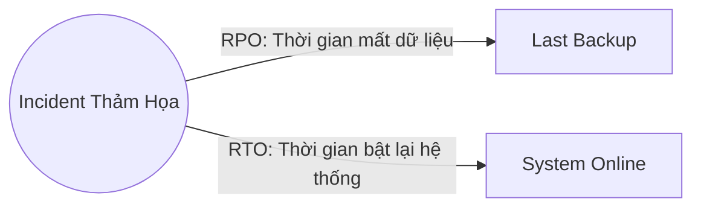

# 🌐 20.Disaster_Recovery: Khôi Phục Sau Thảm Họa (Disaster Recovery & High Availability) - Chuyên Sâu CompTIA Network+ Cho DevOps

> 💡 **Bản chất 1 câu**: High Availability (HA), Redundant Networks, Chỉ số RTO (Recovery Time Objective) vs RPO (Recovery Point Objective), Redu...  
> 🎯 **Trọng tâm thực chiến DevOps**: Nắm vững lý thuyết chuyên sâu, sơ đồ kiến trúc, bộ lệnh CLI chẩn đoán thực tế và bộ câu hỏi phỏng vấn tuyển dụng.

---

## 1. 🧠 Hình Hình Dung Nhanh (Intuitive Mindset)

High Availability (HA), Redundant Networks, Chỉ số RTO (Recovery Time Objective) vs RPO (Recovery Point Objective), Redundant Sites (Hot Site vs Warm Site vs Cold Site) và DR Testing.



---

## 2. 📚 Lý Thuyết Chuyên Sâu & Bản Chất Hệ Thống (Under The Hood Architecture)

### 2.1 RTO, RPO & Mô Hình DR Sites (OBJ 3.3)
1. **RPO (Recovery Point Objective)**: Mức độ tổn thất dữ liệu **TỐI ĐA** có thể chấp nhận được tính theo thời gian (Data loss duration).
2. **RTO (Recovery Time Objective)**: Khoảng thời gian **TỐI ĐA** cho phép để bật lại hệ thống hoạt động trở lại sau thảm họa (Downtime duration).
3. **So Sánh Mô Hình Redundant DR Sites**:
   - **Hot Site**: Đồng bộ dữ liệu Real-time, **RTO gần như bằng 0** (Failover vài giây), chi phí **cực kỳ đắt đỏ**.
   - **Warm Site**: Đồng bộ dữ liệu định kỳ (hàng giờ), RTO vài giờ, chi phí trung bình.
   - **Cold Site**: Chỉ có vỏ nhà và điện lạnh chưa có máy chủ, RTO vài ngày đến vài tuần, chi phí rất rẻ.


---

## 3. ⚡ Bảng Tra Cứu Câu Lệnh & Khái Niệm Thực Hành (Reference Table)

| Công cụ / Khái niệm | Loại / Protocol | Ý nghĩa chi tiết | Ứng dụng thực tế |
| :--- | :--- | :--- | :--- |
| **`RPO`** | `Recovery Point Objective` | Khoảng thời gian chấp nhận mất dữ liệu tối đa | `RPO = 15 phút (DB Sync 15p/lần)` |
| **`RTO`** | `Recovery Time Objective` | Khoảng thời gian tối đa để bật lại hệ thống | `RTO = 1 giờ (Bật lại hạ tầng)` |
| **`Hot Site`** | `DR Site` | Site dự phòng chạy song song đồng bộ data tức thì | `Failover tự động trong vài giây` |
| **`Cold Site`** | `DR Site` | Site dự phòng chỉ có vỏ nhà chưa có máy chủ | `Chi phí rẻ nhưng RTO mất vài ngày` |


---

## 4. 🛠 Thao Tác Thực Chiến & Kịch Bản DevOps

### 🛠 Các lệnh thực hành gõ là ăn ngay:
```bash
systemctl status repmgrd # Check DB replication real-time sang Hot Site
```

### 🚀 Kịch bản xử lý sự cố thực tế khi đi làm:
Thiết kế hạ tầng Disaster Recovery cho hệ thống Thanh toán Ngân hàng: Sử dụng mô hình Hot Site Multi-Region với RPO = 0 và RTO < 10 giây.

---

## 5. 🚀 Bộ Câu Hỏi Phỏng Vấn DevOps & Network Thực Tế (Interview Q&A)

> **Q: Sự khác biệt cốt lõi giữa RTO và RPO trong Disaster Recovery là gì?**  
> **A**: RPO chỉ độ tổn thất dữ liệu tối đa chấp nhận được tính theo thời gian (Data loss time). RTO chỉ khoảng thời gian cho phép để bật lại hệ thống hoạt động trở lại (Downtime duration).

> **Q: Mô hình Datacenter dự phòng nào có chỉ số RTO gần như bằng 0 nhưng chi phí duy trì đắt nhất?**  
> **A**: Mô hình **Hot Site** (đồng bộ dữ liệu thời gian thực và tự động Failover).


---

## 6. 📝 Cheat Sheet Ghi Nhớ Nhanh (Summary)

- [x] RPO: Mức dữ liệu chấp nhận mất (thời gian)
- [x] RTO: Thời gian cho phép bật lại hệ thống
- [x] Hot Site: Đồng bộ real-time, RTO vài giây, đắt
- [x] Cold Site: Chỉ có vỏ nhà, RTO vài ngày, rẻ

