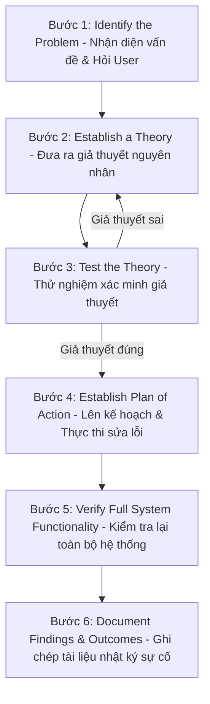

# 🌐 Quy Trình 7 Bước Giải Quyết Sự Cố Mạng CompTIA - Chuyên Sâu Mạng Máy Tính Cho DevOps

> 💡 **Bản chất 1 câu**: Chuẩn hóa tư duy xử lý sự cố mạng với Mô hình Troubleshooting 7 bước tiêu chuẩn của CompTIA.  
> 🎯 **Trọng tâm thực chiến DevOps**: Thành thạo 7 bước: 1. Identify Problem -> 2. Establish Theory -> 3. Test Theory -> 4. Plan & Execute -> 5. Verify -> 6. Document -> 7. Prevent.

---

## 1. 🧠 Hình Hình Dung Nhanh (Intuitive Mindset)

Quy trình Troubleshooting 7 bước như công an điều tra án phá án: Không đoán mò quy kết tội danh, phải thu thập chứng cứ tại hiện trường (Identify), đặt giả thuyết (Theory), thử nghiệm (Test) rồi mới đưa ra giải pháp xử lý và ghi sổ nhật ký phá án.

---

## 2. 📚 Lý Thuyết Chuyên Sâu & Bản Chất Mạng (Under The Hood Architecture)

### 2.1 Mô Hình 7 Bước Giải Quyết Sự Cố Mạng CompTIA (7-Step Troubleshooting Model)



1. **Bước 1: Nhận diện sự cố (Identify the Problem)**:
   - Thu thập thông tin sự cố, hỏi người dùng về triệu chứng, kiểm tra log hệ thống, xác định phạm vi ảnh hưởng (1 người hay cả công ty?).
2. **Bước 2: Đưa ra giả thuyết nguyên nhân (Establish a Theory of Probable Cause)**:
   - Liệt kê các nguyên nhân khả dĩ nhất (bắt đầu từ nguyên nhân đơn giản nhất L1 cáp rút, L3 sai IP).
3. **Bước 3: Kiểm tra thử nghiệm giả thuyết (Test the Theory to Determine Cause)**:
   - Dùng các công cụ diagnostic (`ping`, `traceroute`, `ss`, `tcpdump`) để xác nhận giả thuyết đúng hay sai.
4. **Bước 4: Lên kế hoạch hành động & Thực thi sửa lỗi (Establish a Plan of Action & Implement)**:
   - Lập kịch bản sửa lỗi chi tiết và thực thi sửa chữa.
5. **Bước 5: Kiểm tra toàn bộ chức năng (Verify Full System Functionality)**:
   - Kiểm tra lại xem sự cố đã hết hẳn chưa và đảm bảo KHÔNG gây ra sự cố mới tác dụng phụ.
6. **Bước 6: Ghi chép tài liệu (Document Findings, Actions, and Outcomes)**:
   - Ghi lại nguyên nhân root cause và phương án xử lý vào hệ thống Knowledge Base / Ticket để tham chiếu sau này.


---

## 3. ⚡ Bảng Tra Cứu Câu Lệnh & Khái Niệm Thực Hành (Reference Table)

| Công cụ / Lệnh / Khái niệm | Tham số / Flag / Protocol | Giải thích ý nghĩa chi tiết | Ứng dụng thực tế trong DevOps / Network |
| :--- | :--- | :--- | :--- |
| **`Step 1`** | `Identify Problem` | Thu thập thông tin triệu chứng sự cố và hỏi người dùng | `Hỏi user bị mất mạng 1 máy hay cả phòng` |
| **`Step 2`** | `Establish Theory` | Đưa ra danh sách các giả thuyết nguyên nhân khả dĩ | `Giả thuyết do cáp rút hoặc sai IP` |
| **`Step 3`** | `Test Theory` | Chạy lệnh chẩn đoán xác nhận giả thuyết đúng/sai | `Ping gateway kiểm tra thông mạng` |
| **`Step 6`** | `Document` | Ghi chép lại bài học kinh nghiệm xử lý sự cố vào Wiki | `Cập nhật bài viết troubleshooting vào NetBox/Wiki` |


---

## 4. 🛠 Thao Tác Thực Chiến & Kịch Bản DevOps (Real-World Scenarios)

### 🛠 Các lệnh thực hành gõ là ăn ngay:
```bash
# Thực hành Bước 3 Test Theory bằng bộ lệnh CLI:
ping -c 3 192.168.1.1 # Test L3 Gateway
nc -zvw3 10.0.0.10 443 # Test L4 Port
```

### 🚀 Kịch bản xử lý sự cố thực tế khi đi làm:
Kịch bản xử lý sự cố thực tế khi nhận Ticket 'Không truy cập được Web App':
# Bước 1: Hỏi User -> Chỉ bị trên máy cá nhân hay cả team?
# Bước 2: Đưa ra giả thuyết -> Lỗi DNS cache hay lỗi đường truyền?
# Bước 3: Test -> dig app.company.com (DNS fail!). Fix bằng cách flush DNS cache.

---

## 5. 🚀 Bộ Câu Hỏi Phỏng Vấn DevOps & Network Thực Tế (Interview Q&A)

> **Q: Bước đầu tiên BẮT BUỘC phải làm trong mô hình Troubleshooting 7 bước CompTIA là gì?**  
> **A**: Bước 1: **Identify the Problem** (Nhận diện vấn đề, thu thập thông tin và hỏi người dùng về triệu chứng).

> **Q: Tại sao Bước 6 (Document Findings) lại cực kỳ quan trọng đối với đội ngũ DevOps?**  
> **A**: Giúp lưu trữ tri thức hệ thống (Knowledge Base), giúp các thành viên khác xử lý sự cố tương tự nhanh hơn trong tương lai và hỗ trợ làm Post-Mortem incident report.


---

## 6. 📝 Cheat Sheet & Ghi Nhớ Nhanh (Summary)

- [x] 1. Identify Problem
- [x] 2. Establish Theory
- [x] 3. Test Theory
- [x] 4. Plan & Execute
- [x] 5. Verify System
- [x] 6. Document Findings
- [x] Luôn ưu tiên thử nghiệm nguyên nhân đơn giản nhất trước

