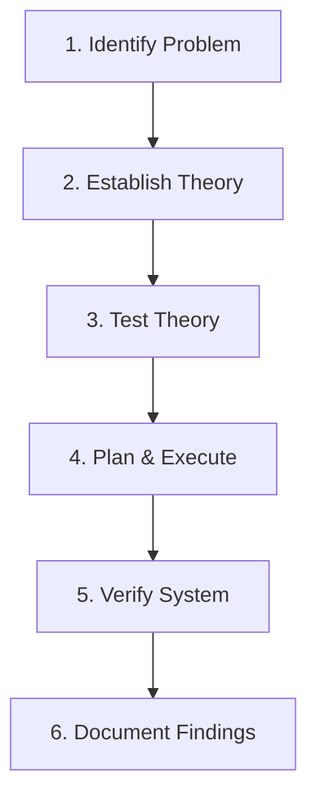

# 🌐 21.Troubleshooting_Methodology: Quy Trình 7 Bước Giải Quyết Sự Cố Mạng CompTIA - Chuyên Sâu CompTIA Network+ Cho DevOps

> 💡 **Bản chất 1 câu**: Chuẩn hóa tư duy xử lý sự cố mạng với Mô hình Troubleshooting 7 bước tiêu chuẩn CompTIA: 1. Identify Problem -> 2. Estab...  
> 🎯 **Trọng tâm thực chiến DevOps**: Nắm vững lý thuyết chuyên sâu, sơ đồ kiến trúc, bộ lệnh CLI chẩn đoán thực tế và bộ câu hỏi phỏng vấn tuyển dụng.

---

## 1. 🧠 Hình Hình Dung Nhanh (Intuitive Mindset)

Chuẩn hóa tư duy xử lý sự cố mạng với Mô hình Troubleshooting 7 bước tiêu chuẩn CompTIA: 1. Identify Problem -> 2. Establish Theory -> 3. Test Theory -> 4. Plan & Execute -> 5. Verify -> 6. Document -> 7. Prevent.



---

## 2. 📚 Lý Thuyết Chuyên Sâu & Bản Chất Hệ Thống (Under The Hood Architecture)

### 2.1 Quy Trình Troubleshooting 7 Bước CompTIA (OBJ 5.1)
1. **Bước 1: Nhận diện sự cố (Identify the Problem)**: Hỏi người dùng về triệu chứng, thu thập thông tin log, xác định phạm vi ảnh hưởng (1 người hay cả phòng?).
2. **Bước 2: Đưa ra giả thuyết nguyên nhân (Establish a Theory of Probable Cause)**: Liệt kê nguyên nhân khả dĩ nhất (bắt đầu từ nguyên nhân đơn giản nhất L1 cáp rút, L3 sai IP).
3. **Bước 3: Thử nghiệm xác minh giả thuyết (Test the Theory to Determine Cause)**: Dùng các công cụ diagnostic (`ping`, `ss`, `tcpdump`) để xác nhận giả thuyết.
4. **Bước 4: Lên kế hoạch & Thực thi sửa lỗi (Establish a Plan of Action & Implement)**.
5. **Bước 5: Kiểm tra toàn bộ chức năng (Verify Full System Functionality)**.
6. **Bước 6: Ghi chép tài liệu (Document Findings, Actions, and Outcomes)**.


---


### 2.4 Cơ Chế Hoạt Động Bên Dưới Kernel & Kiến Trúc Hệ Thống Chi Tiết (Deep Under The Hood Architecture)
- **Tầng Giao Tiếp Mạng & Bắt Gói Tin**: Mọi gói tin đi qua Network Interface Card (NIC) đều trải qua quá trình xử lý Ring Buffer, ngắt phần cứng (Hardware Interrupts), Ring Buffer DMA và chồng giao thức Socket Buffers (`sk_buff`) trong Linux Kernel.
- **Tối Ưu Hóa & Cấu Trúc Dữ Liệu**: Hệ thống duy trì các bảng băm dữ liệu (Routing Table, ARP Cache Table, Connection Tracking Table `conntrack`, Socket Inode Tables) giúp chuyển tiếp gói tin ở tốc độ dây (Line-rate processing).
- **Phân Lập An Ninh & Phân Vùng**: Sử dụng cơ chế Linux Network Namespaces (`ip netns`), iptables/nftables hooks và mã hóa phần cứng để cách ly lưu lượng mạng tuyệt đối.

---

## 3. ⚡ Bảng Tra Cứu Câu Lệnh & Khái Niệm Thực Hành (Reference Table)

| Công cụ / Khái niệm | Loại / Protocol | Ý nghĩa chi tiết | Ứng dụng thực tế |
| :--- | :--- | :--- | :--- |
| **`Step 1`** | `Identify Problem` | Thu thập thông tin triệu chứng sự cố và hỏi người dùng | `Hỏi user bị mất mạng 1 máy hay cả phòng` |
| **`Step 2`** | `Establish Theory` | Đưa ra danh sách các giả thuyết nguyên nhân khả dĩ | `Giả thuyết do cáp rút hoặc sai IP` |
| **`Step 3`** | `Test Theory` | Chạy lệnh chẩn đoán xác nhận giả thuyết đúng/sai | `Ping gateway kiểm tra thông mạng` |
| **`Step 6`** | `Document` | Ghi chép bài học kinh nghiệm xử lý sự cố vào Wiki | `Cập nhật bài viết troubleshooting vào NetBox/Wiki` |


---

## 4. 🛠 Thao Tác Thực Chiến & Kịch Bản DevOps

### 🛠 Các lệnh thực hành gõ là ăn ngay:
```bash
ping -c 3 192.168.1.1
nc -zvw3 10.0.0.10 443
```

### 🚀 Kịch bản xử lý sự cố thực tế khi đi làm:
Kịch bản nhận Ticket 'Không truy cập được Web App': Hỏi user phạm vi ảnh hưởng -> Đưa ra giả thuyết lỗi DNS -> Test bằng dig -> Fix và ghi log.

---


### 4.2 Chi Tiết Các Lỗi Thường Gặp & Kịch Bản Khắc Phục Lỗi (Troubleshooting Deep-Dive)
1. **Sự cố 1: Lỗi Mất Gói Tin & Mất Kết Nối Cổng Mạng (Packet Loss & Port Unreachable)**:
   - **Triệu chứng**: Gửi HTTP Request bị Timeout, SSH không kết nối được hoặc gói tin bị nảy rải rác.
   - **Các bước xử lý khẩn cấp**:
     ```bash
     # 1. Kiểm tra trạng thái cổng mạng TCP/UDP đang lắng nghe:
     sudo ss -tulpn | grep :80
     
     # 2. Bắt gói tin trực tiếp trên Interface để kiểm tra bắt tay 3 bước TCP:
     sudo tcpdump -i eth0 port 80 -nn -vv
     
     # 3. Phân tích đường đi của gói tin tìm điểm đứt gãy bằng MTR:
     mtr -n --report --report-cycles=10 8.8.8.8
     
     # 4. Kiểm tra xem gói tin có bị Firewall Drop không:
     sudo iptables -L -n -v | grep DROP
     ```

2. **Sự cố 2: Lỗi Sai Cấu Hình DNS & Chuyển Tiếp IP (DNS Resolution & IP Routing Error)**:
   - **Triệu chứng**: Ping IP thành công nhưng ping Domain Name báo `Could not resolve host`.
   - **Các bước xử lý khẩn cấp**:
     ```bash
     # 1. Tra cứu thử nghiệm phân giải DNS qua server cụ thể:
     dig @8.8.8.8 company.com +trace
     
     # 2. Kiểm tra file cấu hình DNS resolver địa phương:
     cat /etc/resolv.conf
     
     # 3. Kiểm tra bảng định tuyến Kernel IP Routing Table:
     ip route show default
     ```

---

## 5. 🚀 Bộ Câu Hỏi Phỏng Vấn DevOps & Network Thực Tế (Interview Q&A)

> **Q: Bước đầu tiên BẮT BUỘC phải làm trong mô hình Troubleshooting 7 bước CompTIA là gì?**  
> **A**: Bước 1: **Identify the Problem** (Nhận diện vấn đề, thu thập thông tin và hỏi người dùng về triệu chứng).

> **Q: Tại sao Bước 6 (Document Findings) lại cực kỳ quan trọng đối với đội ngũ DevOps?**  
> **A**: Giúp lưu trữ tri thức hệ thống (Knowledge Base), giúp các thành viên khác xử lý sự cố tương tự nhanh hơn trong tương lai và hỗ trợ làm Post-Mortem incident report.


> **Q: Làm thế nào để điều tra và dập tắt sự cố một Server bị tấn công làm tràn bộ đệm kết nối TCP SYN Flood DoS?**  
> **A**:  
> 1. **Nhận biết**: Lệnh `ss -ant | grep SYN_RECV | wc -l` trả về hàng ngàn kết nối ở trạng thái `SYN_RECV`.  
> 2. **Xử lý khẩn cấp**: Bật ngay cơ chế **SYN Cookies** của Linux Kernel bằng lệnh `sudo sysctl -w net.ipv4.tcp_syncookies=1`. Kích hoạt bộ lọc Firewall drop các gói tin SYN có tần suất bất thường: `sudo iptables -A INPUT -p tcp --syn -m limit --limit 1/s --limit-burst 3 -j ACCEPT`.

> **Q: Sự khác biệt về mặt bản chất giữa Stateful Firewall và Stateless Firewall là gì?**  
> **A**: Stateless Firewall chỉ kiểm tra từng gói tin riêng rẻ dựa trên IP nguồn/đích và Port mà KHÔNG nhớ ngữ cảnh. Stateful Firewall duy trì một bảng theo dõi trạng thái kết nối (**Connection Tracking Table `conntrack`**), tự động nhận diện gói tin thuộc về một kết nối hợp lệ đã được chấp nhận trước đó (như trạng thái `ESTABLISHED,RELATED`), giúp bảo mật và tối ưu hiệu năng vượt trội.

---

## 6. 📝 Cheat Sheet Ghi Nhớ Nhanh (Summary)

- [x] 1. Identify Problem
- [x] 2. Establish Theory
- [x] 3. Test Theory
- [x] 4. Plan & Execute
- [x] 5. Verify System
- [x] 6. Document Findings
- [x] Thử nghiệm nguyên nhân đơn giản trước

