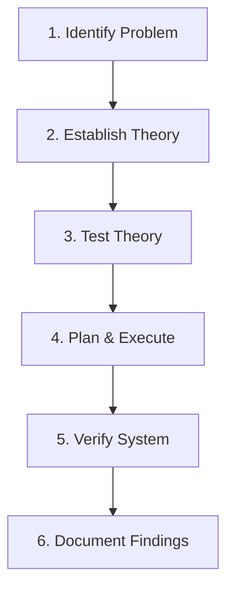

# 🌐 21.Troubleshooting_Methodology: Quy Trình 7 Bước Giải Quyết Sự Cố Mạng CompTIA - Chuyên Sâu CompTIA Network+ Cho DevOps

> 💡 **Bản chất 1 câu**: Chuẩn hóa tư duy xử lý sự cố mạng với Mô hình Troubleshooting 7 bước tiêu chuẩn CompTIA: 1. Identify Problem -> 2. Estab...  
> 🎯 **Trọng tâm thực chiến DevOps**: Nắm vững lý thuyết chuyên sâu, sơ đồ kiến trúc, bộ lệnh CLI chẩn đoán thực tế và bộ câu hỏi phỏng vấn tuyển dụng.

---

## 1. 🧠 Hình Hình Dung Nhanh (Intuitive Mindset)

Chuẩn hóa tư duy xử lý sự cố mạng với Mô hình Troubleshooting 7 bước tiêu chuẩn CompTIA: 1. Identify Problem -> 2. Establish Theory -> 3. Test Theory -> 4. Plan & Execute -> 5. Verify -> 6. Document -> 7. Prevent.



---

## 2. 📚 Lý Thuyết Chuyên Sâu & Bản Chất Hệ Thống (Under The Hood Architecture)

### 2.1 Quy Trình Troubleshooting 7 Bước CompTIA (OBJ 5.1)
1. **Bước 1: Nhận diện sự cố (Identify the Problem)**: Hỏi người dùng về triệu chứng, thu thập thông tin log, xác định phạm vi ảnh hưởng (1 người hay cả phòng?).
2. **Bước 2: Đưa ra giả thuyết nguyên nhân (Establish a Theory of Probable Cause)**: Liệt kê nguyên nhân khả dĩ nhất (bắt đầu từ nguyên nhân đơn giản nhất L1 cáp rút, L3 sai IP).
3. **Bước 3: Thử nghiệm xác minh giả thuyết (Test the Theory to Determine Cause)**: Dùng các công cụ diagnostic (`ping`, `ss`, `tcpdump`) để xác nhận giả thuyết.
4. **Bước 4: Lên kế hoạch & Thực thi sửa lỗi (Establish a Plan of Action & Implement)**.
5. **Bước 5: Kiểm tra toàn bộ chức năng (Verify Full System Functionality)**.
6. **Bước 6: Ghi chép tài liệu (Document Findings, Actions, and Outcomes)**.


---

## 3. ⚡ Bảng Tra Cứu Câu Lệnh & Khái Niệm Thực Hành (Reference Table)

| Công cụ / Khái niệm | Loại / Protocol | Ý nghĩa chi tiết | Ứng dụng thực tế |
| :--- | :--- | :--- | :--- |
| **`Step 1`** | `Identify Problem` | Thu thập thông tin triệu chứng sự cố và hỏi người dùng | `Hỏi user bị mất mạng 1 máy hay cả phòng` |
| **`Step 2`** | `Establish Theory` | Đưa ra danh sách các giả thuyết nguyên nhân khả dĩ | `Giả thuyết do cáp rút hoặc sai IP` |
| **`Step 3`** | `Test Theory` | Chạy lệnh chẩn đoán xác nhận giả thuyết đúng/sai | `Ping gateway kiểm tra thông mạng` |
| **`Step 6`** | `Document` | Ghi chép bài học kinh nghiệm xử lý sự cố vào Wiki | `Cập nhật bài viết troubleshooting vào NetBox/Wiki` |


---

## 4. 🛠 Thao Tác Thực Chiến & Kịch Bản DevOps

### 🛠 Các lệnh thực hành gõ là ăn ngay:
```bash
ping -c 3 192.168.1.1
nc -zvw3 10.0.0.10 443
```

### 🚀 Kịch bản xử lý sự cố thực tế khi đi làm:
Kịch bản nhận Ticket 'Không truy cập được Web App': Hỏi user phạm vi ảnh hưởng -> Đưa ra giả thuyết lỗi DNS -> Test bằng dig -> Fix và ghi log.

---

## 5. 🚀 Bộ Câu Hỏi Phỏng Vấn DevOps & Network Thực Tế (Interview Q&A)

> **Q: Bước đầu tiên BẮT BUỘC phải làm trong mô hình Troubleshooting 7 bước CompTIA là gì?**  
> **A**: Bước 1: **Identify the Problem** (Nhận diện vấn đề, thu thập thông tin và hỏi người dùng về triệu chứng).

> **Q: Tại sao Bước 6 (Document Findings) lại cực kỳ quan trọng đối với đội ngũ DevOps?**  
> **A**: Giúp lưu trữ tri thức hệ thống (Knowledge Base), giúp các thành viên khác xử lý sự cố tương tự nhanh hơn trong tương lai và hỗ trợ làm Post-Mortem incident report.


---

## 6. 📝 Cheat Sheet Ghi Nhớ Nhanh (Summary)

- [x] 1. Identify Problem
- [x] 2. Establish Theory
- [x] 3. Test Theory
- [x] 4. Plan & Execute
- [x] 5. Verify System
- [x] 6. Document Findings
- [x] Thử nghiệm nguyên nhân đơn giản trước

