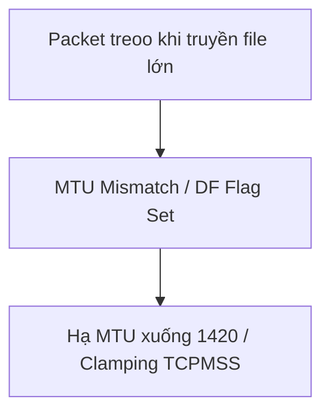

# 🌐 23.Troubleshooting_Scenarios: Kịch Bản Chẩn Đoán Sự Cố Mạng Thực Tế Cho DevOps - Chuyên Sâu CompTIA Network+ Cho DevOps

> 💡 **Bản chất 1 câu**: Chẩn đoán và khắc phục sự cố mạng thực tế: Trùng địa chỉ IP (Duplicate IP), Cạn dải IP DHCP (DHCP Pool Exhaustion), Sai ...  
> 🎯 **Trọng tâm thực chiến DevOps**: Nắm vững lý thuyết chuyên sâu, sơ đồ kiến trúc, bộ lệnh CLI chẩn đoán thực tế và bộ câu hỏi phỏng vấn tuyển dụng.

---

## 1. 🧠 Hình Hình Dung Nhanh (Intuitive Mindset)

Chẩn đoán và khắc phục sự cố mạng thực tế: Trùng địa chỉ IP (Duplicate IP), Cạn dải IP DHCP (DHCP Pool Exhaustion), Sai lệch MTU (MTU Mismatch / PMTUD Failure), Vòng lập Routing (Routing Loops) và Broadcast Storms.



---

## 2. 📚 Lý Thuyết Chuyên Sâu & Bản Chất Hệ Thống (Under The Hood Architecture)

### 2.1 Chẩn Đoán Các Sự Cố Mạng Thực Tế (OBJ 5.2, 5.3 & 5.4)
1. **Trùng Địa Chỉ IP (Duplicate IP Address)**: 2 máy tính cùng dùng 1 IP làm chập chờn rớt mạng -> Check `ip neighbor` và đổi IP / giải phóng DHCP lease.
2. **Cạn Dải Địa Chỉ IP DHCP (DHCP Pool Exhaustion)**: Máy tính mới nhận IP APIPA `169.254.x.x` -> Mở rộng dải IP range hoặc giảm DHCP Lease Time.
3. **Sai Khớp Kích Thước MTU (MTU Mismatch)**: Ping gói tin nhỏ thông bình thường, nhưng khi tải file lớn/HTTPS thì bị treo cứng đơ! -> Hạ MTU xuống `1420` bytes: `ip link set dev eth0 mtu 1420` hoặc bật `TCP MSS Clamping`.
4. **Vòng Lập Routing (Routing Loop)**: Gói tin chạy lặp vòng tròn giữa 2 Router cho tới khi hết TTL -> Kiểm tra bằng `traceroute -n`.


---

## 3. ⚡ Bảng Tra Cứu Câu Lệnh & Khái Niệm Thực Hành (Reference Table)

| Công cụ / Khái niệm | Loại / Protocol | Ý nghĩa chi tiết | Ứng dụng thực tế |
| :--- | :--- | :--- | :--- |
| **`Duplicate IP`** | `L3 Error` | 2 thiết bị trùng IP làm rớt kết nối chập chờn | `Kiểm tra ARP table và DHCP pool` |
| **`DHCP Exhaustion`** | `L7 Error` | Hết IP khả dụng trong pool làm client nhận APIPA 169.254 | `Mở rộng dải IP range / Giảm lease time` |
| **`MTU Mismatch`** | `L3 Error` | Sai lệch MTU làm đứt kết nối khi truyền file lớn | `Chỉnh MTU 1420 hoặc bật TCP MSS Clamping` |
| **`Routing Loop`** | `L3 Error` | Gói tin chạy lặp vòng tròn giữa 2 Router | `Kiểm tra traceroute và sửa Routing Table` |


---

## 4. 🛠 Thao Tác Thực Chiến & Kịch Bản DevOps

### 🛠 Các lệnh thực hành gõ là ăn ngay:
```bash
ping -M do -s 1472 8.8.8.8
sudo iptables -t mangle -A FORWARD -p tcp --tcp-flags SYN,RST SYN -j TCPMSS --clamp-mss-to-pmtu
```

### 🚀 Kịch bản xử lý sự cố thực tế khi đi làm:
Troubleshoot lỗi SSH/Web bị treo khi kết nối qua IPSec VPN Tunnel: Hạ MTU trên VPN interface xuống 1412 bytes và ép TCP MSS Clamping.

---

## 5. 🚀 Bộ Câu Hỏi Phỏng Vấn DevOps & Network Thực Tế (Interview Q&A)

> **Q: Triệu chứng đặc trưng nào giúp nhận biết sự cố sai lệch MTU (MTU Mismatch)?**  
> **A**: Ping gói tin nhỏ (mặc định) thông bình thường, nhưng khi thực hiện giao dịch nạp dữ liệu lớn (như tải file, HTTPS handshake hoặc SSH) thì kết nối bị treo đơ không phản hồi.

> **Q: Làm sao phát hiện sự cố Routing Loop giữa các Router bằng dòng lệnh?**  
> **A**: Sử dụng lệnh `traceroute <destination_IP>`, nếu thấy gói tin chạy lặp lại liên tục qua lại giữa 2 địa chỉ IP Router thì chắc chắn đang bị Routing Loop.


---

## 6. 📝 Cheat Sheet Ghi Nhớ Nhanh (Summary)

- [x] IP Duplicate: Trùng IP rớt mạng (Check ARP)
- [x] DHCP Exhaustion: Nhận IP 169.254 APIPA
- [x] MTU Mismatch: Treo khi truyền file lớn (Fix MTU 1420 / TCPMSS)
- [x] Routing Loop: Traceroute thấy IP chạy lặp

