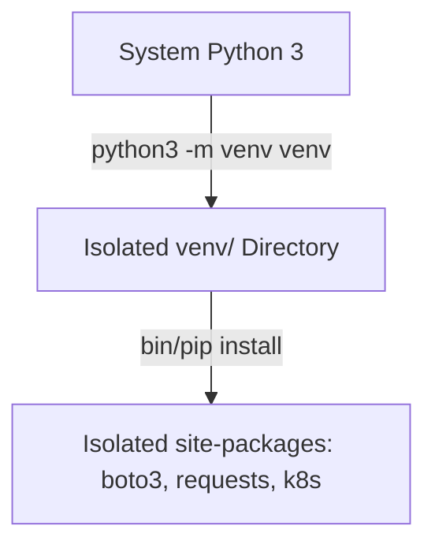
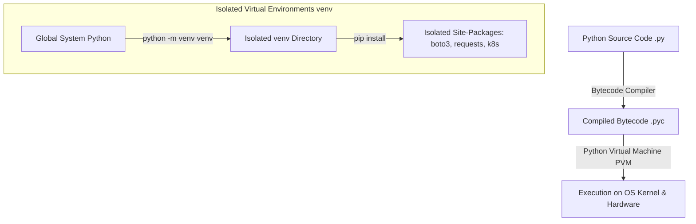

# 🐍 01.Python_Basics_for_DevOps: Nền Tảng Python Cho DevOps, Virtual Environments & PEP8 - Python Chuyên Sâu Cho DevOps

> 💡 **Bản chất 1 câu**: Python là ngôn ngữ thông dịch (Interpreted) dạng kịch bản siêu linh hoạt được DevOps dùng làm con dao pha tự động hóa hạ tầng.  
> 🎯 **Trọng tâm thực chiến DevOps**: Nắm vững cú pháp Python 3, Biến, Data Types, Control Flow (`if/elif/else`, `for/while`), Functions (`*args`, `**kwargs`), Virtual Environments (`venv`) và chuẩn PEP8.

---




---

## 2. 📚 Lý Thuyết Chuyên Sâu & Bản Sắc Hệ Thống (Under The Hood Architecture)

### 2.1 Cơ Chế Trực Tiếp Của Python Interpreter & Virtual Environments



1. **Python Execution Flow**: Python đọc file `.py`, biên dịch thành Bytecode `.pyc` chạy trên **PVM (Python Virtual Machine)**, giúp code vô cùng di động.
2. **Virtual Environments (`venv`)**: Cách ly môi trường cài đặt thư viện (`site-packages`), ngăn xung đột phiên bản thư viện giữa các DevOps scripts khác nhau trên máy chủ.
3. **Dynamic Typing & Memory Management**: Python tự động quản lý bộ nhớ bằng cơ chế **Reference Counting** và **Garbage Collector**.


---

## 3. ⚡ Bảng Tra Cứu Khái Niệm & Hàm / Thư Viện Thực Hành (Reference Table)

| Công cụ / Hàm / Thư viện | Tham số / Module | Ý nghĩa bản chất | Ứng dụng thực tế DevOps |
| :--- | :--- | :--- | :--- |
| **`venv`** | `Built-in Module` | Tạo môi trường ảo cách ly thư viện Python | `python3 -m venv venv` |
| **`pip`** | `Package Manager` | Trình quản lý cài đặt thư viện từ PyPI | `pip install -r requirements.txt` |
| **`f-strings`** | `String Syntax` | Cú pháp định dạng chuỗi nội suy biến siêu tốc (f'{var}') | `f'Server {host} is UP'` |
| **`*args & **kwargs`** | `Function Syntax` | Cho phép truyền số lượng tham số tùy ý (Tuple & Dict) | `def deploy_app(*hosts, **env_vars)` |


---

## 4. 🛠 Thao Tác Thực Chiến & Kịch Bản DevOps Automation (Real-World Scenarios)

### 🛠 Các đoạn Script Python thực hành gõ là ăn ngay:
```python
# Script Python cơ bản kiểm tra trạng thái nhiều Server:
import sys

def check_servers(servers: list, env: str = "production"):
    print(f"--- Deploying to {env.upper()} ---")
    for server in servers:
        if "prod" in server:
            print(f"[OK] Server {server} is healthy.")
        else:
            print(f"[WARN] Server {server} is staging.")

if __name__ == "__main__":
    server_list = ["prod-web-01", "prod-web-02", "stage-test-01"]
    check_servers(server_list, env="production")

```

### 🚀 Kịch bản tự động hóa thực tế khi đi làm (Production DevOps Scripting):
Tự động tạo môi trường ảo `venv` và cài đặt danh sách thư viện `requirements.txt` trong Jenkins / GitHub Actions CI Pipeline.

---

## 5. 🚀 Bộ Câu Hỏi Phỏng Vấn DevOps Python Thực Tế (Interview Q&A)

> **Q: Tại sao kỹ sư DevOps luôn phải tạo Virtual Environment (`venv`) trước khi cài thư viện?**  
> **A**: Để cách ly thư viện của dự án khỏi System Python của OS, tránh đè nén hỏng thư viện hệ thống và đảm bảo tính nhất quán giữa môi trường Dev và Production.

> **Q: Sự khác biệt giữa `*args` và `**kwargs` trong hàm Python là gì?**  
> **A**: `*args` nhận vào danh sách số lượng tham số không cố định dưới dạng Tuple. `**kwargs` nhận vào danh sách các tham số có tên (Key-Value) dưới dạng Dictionary.


---

## 6. 📝 Cheat Sheet Ghi Nhớ Nhanh (Summary)

- [x] Python 3: Ngôn ngữ thông dịch di động
- [x] venv: Cách ly môi trường thư viện
- [x] f-strings: f'{var}' định dạng chuỗi nhanh nhất
- [x] *args: Tuple tham số, **kwargs: Dict tham số
- [x] PEP8: Chuẩn viết code Python

