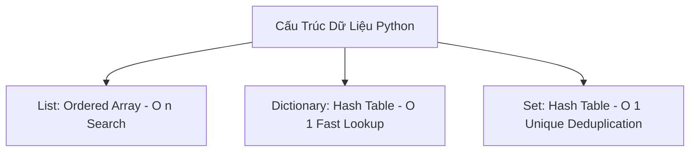
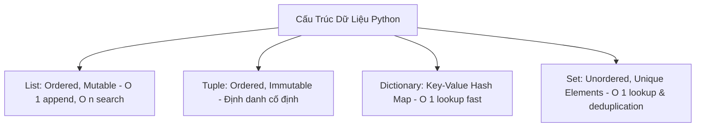

# 🐍 02.Data_Structures_and_Algorithms_for_DevOps: Cấu Trúc Dữ Liệu Python Nâng Cao Cho DevOps - Python Chuyên Sâu Cho DevOps

> 💡 **Bản chất 1 câu**: Master các cấu trúc dữ liệu cốt lõi: Lists, Tuples, Dictionaries, Sets, List/Dict Comprehensions, Slicing, Sorting và `collections.deque`.  
> 🎯 **Trọng tâm thực chiến DevOps**: Thành thạo thao tác mảng/dictionary, lọc dữ liệu lớn bằng Comprehensions, dọn trùng lặp bằng Set, và truy vấn cấu trúc dữ liệu JSON phức tạp từ Cloud APIs.

---




---

## 2. 📚 Lý Thuyết Chuyên Sâu & Bản Sắc Hệ Thống (Under The Hood Architecture)

### 2.1 Độ Phức Tạp Thuật Toán & Bản Chất Cấu Trúc Dữ Liệu (OBJ 2.1)



1. **Dictionary (Hash Map - $O(1)$ Lookup)**: Truy vấn dữ liệu theo Key với độ phức tạp $O(1)$. Cực kỳ tối ưu khi lưu thông tin cấu hình Server/Container.
2. **List Comprehensions**: Cú pháp ngắn gọn, tốc độ thực thi chạy bằng C-level nhanh hơn vòng lặp `for` truyền thống.
3. **Sets ($O(1)$ Deduplication)**: Tự động dọn dẹp các IP trùng lặp từ hàng nghìn dòng log chỉ trong 1 dòng lệnh.


---

## 3. ⚡ Bảng Tra Cứu Khái Niệm & Hàm / Thư Viện Thực Hành (Reference Table)

| Công cụ / Hàm / Thư viện | Tham số / Module | Ý nghĩa bản chất | Ứng dụng thực tế DevOps |
| :--- | :--- | :--- | :--- |
| **`List Comprehension`** | `Syntax` | Tạo List mới từ List cũ chỉ trong 1 dòng code | `[x for x in ips if '192' in x]` |
| **`Dict Comprehension`** | `Syntax` | Tạo Dict mới nhanh chóng từ danh sách data | `{s: 'UP' for s in servers}` |
| **`Set`** | `Data Structure` | Tập hợp các phần tử KHÔNG trùng lặp | `list(set(ip_list)) - Dọn trùng IP` |
| **`collections.deque`** | `Module` | Hàng đợi 2 đầu tối ưu cho sliding window log | `deque(maxlen=100) - Giữ 100 log mới nhất` |


---

## 4. 🛠 Thao Tác Thực Chiến & Kịch Bản DevOps Automation (Real-World Scenarios)

### 🛠 Các đoạn Script Python thực hành gõ là ăn ngay:
```python
# Script lọc danh sách IP unique và phân loại Server theo mảng:
raw_ip_logs = ["10.0.0.1", "192.168.1.1", "10.0.0.1", "172.16.0.5", "192.168.1.1"]

# Dọn trùng IP bằng Set:
unique_ips = list(set(raw_ip_logs))

# Lọc các IP nội bộ Class A (10.x.x.x) bằng List Comprehension:
class_a_ips = [ip for ip in unique_ips if ip.startswith("10.")]

# Tạo Dict trạng thái Health Check:
server_status = {ip: "HEALTHY" for ip in class_a_ips}
print(f"Unique Class A Servers: {server_status}")

```

### 🚀 Kịch bản tự động hóa thực tế khi đi làm (Production DevOps Scripting):
Xử lý và dọn dẹp danh sách 100,000 IP truy vấn từ CloudWatch log để tìm các IP có tần suất request cao nhất.

---

## 5. 🚀 Bộ Câu Hỏi Phỏng Vấn DevOps Python Thực Tế (Interview Q&A)

> **Q: Tại sao truy vấn tìm kiếm một Key trong Dictionary lại có tốc độ $O(1)$ trong khi trong List là $O(n)$?**  
> **A**: Vì Dictionary sử dụng bảng băm (Hash Table) tính toán vị trí ô nhớ trực tiếp từ Key. Trong khi List phải duyệt tuần tự từng phần tử từ đầu đến cuối.

> **Q: Khi nào nên dùng Tuple thay vì dùng List?**  
> **A**: Khi dữ liệu là cố định không thay đổi (Immutable) như tọa độ, thông số cấu hình hằng số, giúp bảo vệ dữ liệu không bị sửa đổi vô ý và tiết kiệm dung lượng RAM.


---

## 6. 📝 Cheat Sheet Ghi Nhớ Nhanh (Summary)

- [x] Dict: Hash Map O(1) lookup
- [x] Set: Tự động loại bỏ phần tử trùng lặp
- [x] List Comprehension: Tao list ngắn gọn siêu nhanh
- [x] Tuple: Immutable không thể sửa đổi

