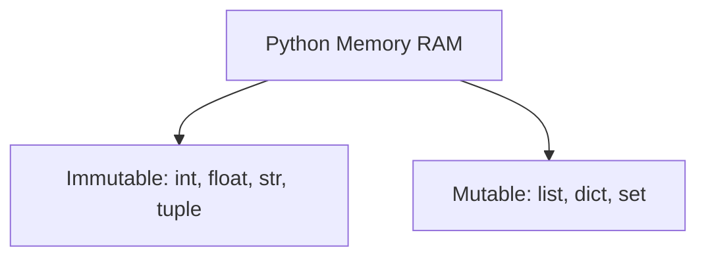
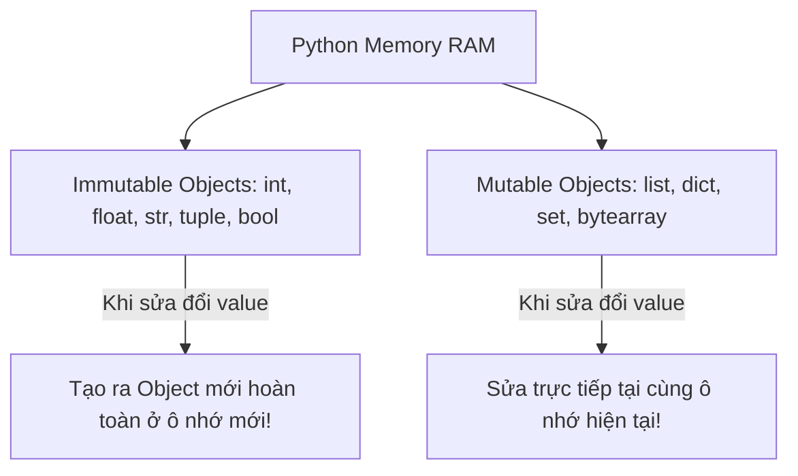

# 🐍 02.Variables_Data_Types_and_Operators: Biến, Kiểu Dữ Liệu, Mutability & Toán Tử Nâng Cao - Giáo Trình Python DevOps Chuyên Sâu Cực Chi Tiết

> 💡 **Bản chất 1 câu**: Python là ngôn ngữ Dynamic Typing nhưng Strong Typing, quản lý biến dưới dạng con trỏ đối tượng trong RAM với phân loại Mutable vs Immutable.  
> 🎯 **Trọng tâm thực chiến DevOps**: Nắm vững Mutability vs Immutability, String operations, Slicing `[start:stop:step]`, Memory IDs (`id()`), Bitwise & Logical operators.

---



---

## 2. 📚 Lý Thuyết Chuyên Sâu & Bản Chất Hệ Thống (Under The Hood Architecture)

### 2.1 Phân Loại Mutable vs Immutable & Memory Allocation (OBJ 2.1)



1. **Immutable Types (Không thể sửa đổi)**: `int`, `float`, `str`, `tuple`, `bool`. Khi bạn sửa chuỗi `s += "new"`, Python tạo một chuỗi mới ở ô nhớ khác và trỏ `s` sang đó.
2. **Mutable Types (Có thể sửa đổi)**: `list`, `dict`, `set`. Khi bạn `list.append()`, Python sửa trực tiếp ô nhớ hiện tại mà không tạo List mới.
3. **String Slicing `[start:stop:step]`**: Cú pháp trích xuất chuỗi/list cực mạnh.


---

## 3. ⚡ Bảng Tra Cứu Khái Niệm & Hàm / Thư Viện Thực Hành (Reference Table)

| Công cụ / Hàm / Thư viện | Tham số / Module | Ý nghĩa chi tiết bản chất | Ứng dụng thực tế DevOps |
| :--- | :--- | :--- | :--- |
| **`id()`** | `Built-in Function` | Trả về địa chỉ ô nhớ RAM của đối tượng | `print(id(my_var))` |
| **`is vs ==`** | `Operator` | is so sánh địa chỉ RAM, == so sánh giá trị | `a is b / a == b` |
| **`Slicing`** | `Syntax` | Trích xuất chuỗi/list [start:stop:step] | `ip_parts = ip.split('.')[::-1]` |
| **`type()`** | `Built-in Function` | Kiểm tra kiểu dữ liệu của đối tượng | `type(data)` |


---

## 4. 🛠 Thao Tác Thực Chiến & Kịch Bản DevOps Automation (Real-World Production Scripts)

### 🛠 Các đoạn Script Python thực hành chuyên sâu gõ là ăn ngay:
```python
# Kiểm tra Mutability và Slicing trong Python:
name = "devops-server"
print(f"Original string memory ID: {id(name)}")

# Đảo ngược chuỗi bằng slicing:
reversed_name = name[::-1]
print(f"Reversed: {reversed_name}")

# Thao tác với Mutable List:
servers = ["web-1", "web-2"]
print(f"List ID before append: {id(servers)}")
servers.append("web-3")
print(f"List ID after append (Same Memory): {id(servers)}")

```

### 🚀 Kịch bản tự động hóa thực tế khi đi làm (Production DevOps Incident Playbook):
Xử lý và chuẩn hóa danh sách tên host hostname bị sai định dạng từ file config để chuyển đổi về chuẩn viết thường và loại bỏ khoảng trắng.

---

## 5. 🚀 Bộ Câu Hỏi Phỏng Vấn DevOps Python Thực Tế (Middle-Senior Interview Q&A)

> **Q: Sự khác biệt cốt lõi giữa toán tử `is` và toán tử `==` trong Python là gì?**  
> **A**: `==` so sánh **giá trị (Value)** của 2 đối tượng xem có bằng nhau không. `is` so sánh **địa chỉ ô nhớ RAM (Identity)** xem 2 biến có trỏ cùng vào 1 đối tượng không.

> **Q: Tại sao việc hiểu khái niệm Mutable vs Immutable lại cực kỳ quan trọng khi truyền tham số vào hàm?**  
> **A**: Vì khi truyền Mutable object (như List/Dict) vào hàm, mọi sửa đổi bên trong hàm sẽ làm THAY ĐỔI trực tiếp dữ liệu của biến gốc ngoài hàm.


---

## 6. 📝 Cheat Sheet Ghi Nhớ Nhanh (Summary)

- [x] Mutable: List, Dict, Set (Sửa trực tiếp ô nhớ)
- [x] Immutable: Int, Str, Tuple (Tạo mới ô nhớ khi sửa)
- [x] is: So sánh địa chỉ RAM, ==: So sánh giá trị
- [x] Slicing: [start:stop:step]

