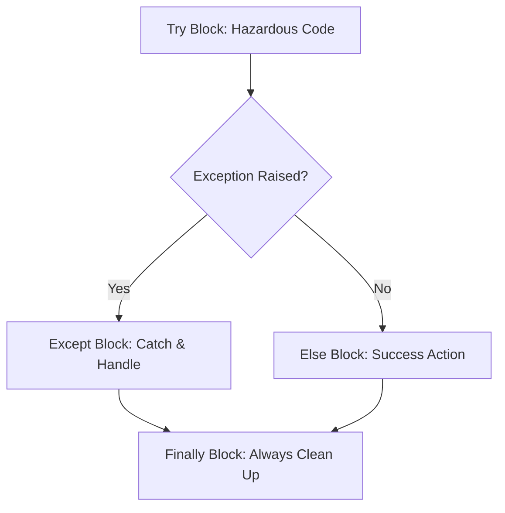
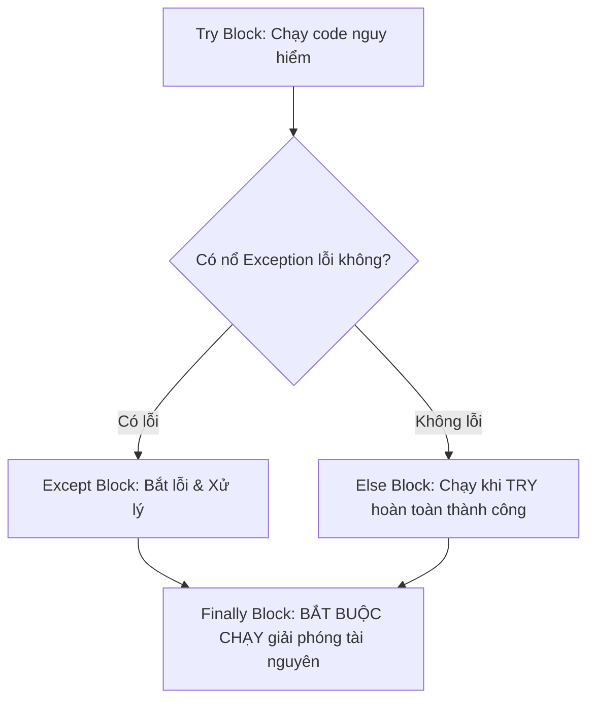

# 🐍 03.Control_Flow_Loops_and_Error_Handling: Cấu Trúc Điều Khiển, Vòng Lặp & Bắt Lỗi Exception Handling - Giáo Trình Python DevOps Chuyên Sâu Cực Chi Tiết

> 💡 **Bản chất 1 câu**: Bắt lỗi hệ thống chuyên nghiệp với khối `try/except/else/finally`, custom Exceptions và điều khiển vòng lặp `for/while`.  
> 🎯 **Trọng tâm thực chiến DevOps**: Nắm vững `try/except/else/finally`, ném Exception với `raise`, định nghĩa Custom Exception class kế thừa `Exception`, và `traceback` logging.

---



---

## 2. 📚 Lý Thuyết Chuyên Sâu & Bản Chất Hệ Thống (Under The Hood Architecture)

### 2.1 Luồng Thực Thi Khối Bắt Lỗi Try-Except-Else-Finally (OBJ 3.1)



1. **`try`**: Chứa đoạn code có nguy cơ ném lỗi (gọi API, đọc file, kết nối DB).
2. **`except ExceptionType as e`**: Bắt loại lỗi cụ thể để xử lý.
3. **`else`**: Chạy KHI VÀ CHỈ KHI khối `try` KHÔNG ném bất kỳ lỗi nào.
4. **`finally`**: BẮT BUỘC CHẠY dù có lỗi hay không (Dùng để đóng kết nối DB, đóng file).


---

## 3. ⚡ Bảng Tra Cứu Khái Niệm & Hàm / Thư Viện Thực Hành (Reference Table)

| Công cụ / Hàm / Thư viện | Tham số / Module | Ý nghĩa chi tiết bản chất | Ứng dụng thực tế DevOps |
| :--- | :--- | :--- | :--- |
| **`try/except`** | `Control Flow` | Bắt và xử lý lỗi Exception tránh sập script | `try: ... except Exception as e:` |
| **`raise`** | `Syntax` | Chủ động ném ra một Exception lỗi | `raise ValueError('IP invalid')` |
| **`finally`** | `Syntax` | Khối code luôn được thi hành để dọn tài nguyên | `finally: file.close()` |
| **`traceback`** | `Built-in Module` | In chi tiết dòng code bị sập lỗi | `traceback.format_exc()` |


---

## 4. 🛠 Thao Tác Thực Chiến & Kịch Bản DevOps Automation (Real-World Production Scripts)

### 🛠 Các đoạn Script Python thực hành chuyên sâu gõ là ăn ngay:
```python
import sys
import traceback

class DatabaseConnectionError(Exception):
    """Custom Exception cho lỗi kết nối DB"""
    pass

def connect_to_db(db_uri: str):
    if not db_uri.startswith("postgresql://"):
        raise DatabaseConnectionError(f"Invalid DB URI scheme: {db_uri}")
    print("[OK] Connected to DB successfully!")

try:
    connect_to_db("mysql://localhost:5432/mydb")
except DatabaseConnectionError as e:
    print(f"[CUSTOM ERROR] {e}")
    print(traceback.format_exc())
finally:
    print("[CLEANUP] Closing temporary resources...")

```

### 🚀 Kịch bản tự động hóa thực tế khi đi làm (Production DevOps Incident Playbook):
Script Python tự động retry kết nối 3 lần khi gặp lỗi mạng `ConnectionError`, nếu thất bại lần 3 mới gửi email alert cho SecOps.

---

## 5. 🚀 Bộ Câu Hỏi Phỏng Vấn DevOps Python Thực Tế (Middle-Senior Interview Q&A)

> **Q: Khối `else` trong cấu trúc `try/except/else/finally` có tác dụng gì?**  
> **A**: Khối `else` chỉ được thi hành khi khối `try` hoàn thành công việc thành công mà KHÔNG ném ra bất kỳ Exception lỗi nào.

> **Q: Tại sao không bao giờ nên dùng câu lệnh bắt lỗi chung chung `except:` mà không chỉ rõ Exception type?**  
> **A**: Vì `except:` sẽ bắt luôn cả `KeyboardInterrupt` (Ctrl+C) và `SystemExit`, khiến người dùng không thể bấm dừng script ngoài terminal.


---

## 6. 📝 Cheat Sheet Ghi Nhớ Nhanh (Summary)

- [x] try: Code nguy hiểm
- [x] except: Xử lý lỗi cụ thể
- [x] else: Chạy khi try KHÔNG lỗi
- [x] finally: Bắt buộc chạy dọn dẹp tài nguyên
- [x] raise: Chủ động ném lỗi

