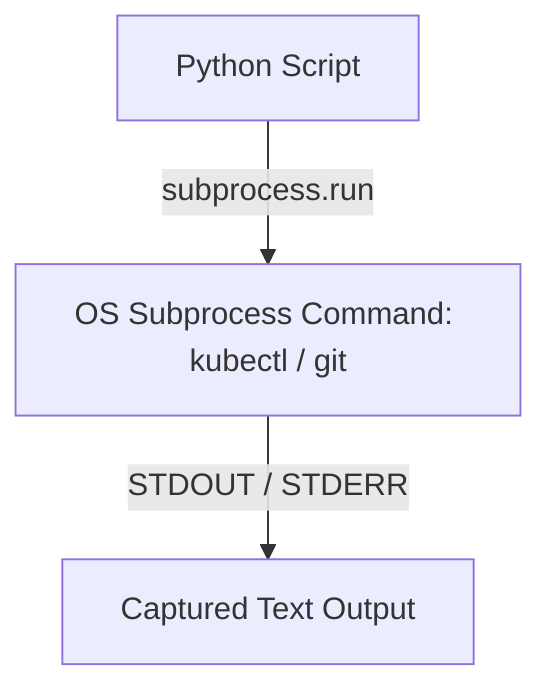
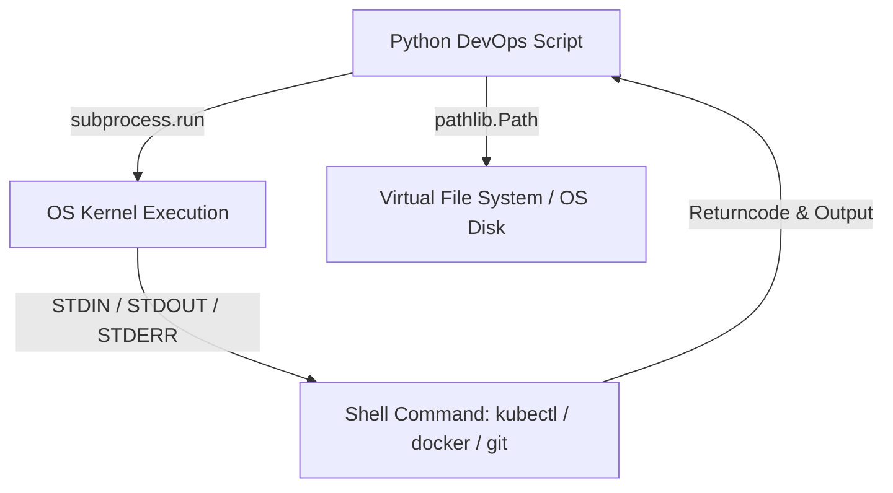

# 🐍 03.File_System_and_OS_Automation: Tự Động Hóa Hệ Điều Hành & Hệ Thống File System - Python Chuyên Sâu Cho DevOps

> 💡 **Bản chất 1 câu**: Tự động hóa OS với các module `os`, `sys`, `pathlib`, `shutil`, `glob`, đọc ghi file (`with open`), biến môi trường và gọi lệnh shell với `subprocess`.  
> 🎯 **Trọng tâm thực chiến DevOps**: Nắm vững `subprocess.run` vs `subprocess.Popen`, quản lý file bằng `pathlib.Path`, thao tác biến môi trường `os.environ` và xử lý tín hiệu OS.

---



---

## 2. 📚 Lý Thuyết Chuyên Sâu & Bản Sắc Hệ Thống (Under The Hood Architecture)

### 2.1 Cơ Chế Gọi Lệnh Hệ Điều Hành Với Subprocess & Pathlib (OBJ 3.1)



1. **Module `subprocess` (Thay thế hoàn toàn `os.system`)**:
   - `subprocess.run(..., capture_output=True, text=True, check=True)`: Chạy lệnh shell an toàn, bắt output và bắt lỗi theo returncode.
2. **Module `pathlib` (Hiện đại thay thế `os.path`)**:
   - Quản lý đường dẫn file/thư mục dưới dạng Object hướng đối tượng, tự động xử lý dấu suyệt `/` hay `\` trên Linux/Windows.


---

## 3. ⚡ Bảng Tra Cứu Khái Niệm & Hàm / Thư Viện Thực Hành (Reference Table)

| Công cụ / Hàm / Thư viện | Tham số / Module | Ý nghĩa bản chất | Ứng dụng thực tế DevOps |
| :--- | :--- | :--- | :--- |
| **`subprocess.run`** | `Built-in Module` | Chạy lệnh shell an toàn và bắt STDOUT/STDERR | `subprocess.run(['ls', '-l'], capture_output=True)` |
| **`pathlib.Path`** | `Built-in Module` | Quản lý đường dẫn file/folder dạng Object | `Path('/var/log').glob('*.log')` |
| **`os.environ`** | `Built-in Module` | Đọc và ghi biến môi trường OS | `os.environ.get('AWS_REGION', 'us-east-1')` |
| **`shutil`** | `Built-in Module` | Thao tác copy/move/zip thư mục dung lượng lớn | `shutil.copytree('/src', '/dst')` |


---

## 4. 🛠 Thao Tác Thực Chiến & Kịch Bản DevOps Automation (Real-World Scenarios)

### 🛠 Các đoạn Script Python thực hành gõ là ăn ngay:
```python
import subprocess
import os
from pathlib import Path

# Đọc biến môi trường:
env_name = os.environ.get("DEPLOY_ENV", "staging")

# Tạo thư mục log bằng pathlib:
log_dir = Path("/tmp/devops_logs")
log_dir.mkdir(parents=True, exist_ok=True)

# Chạy lệnh Shell an toàn với subprocess:
try:
    result = subprocess.run(
        ["uptime"],
        capture_output=True,
        text=True,
        check=True
    )
    print(f"System Uptime [{env_name}]: {result.stdout.strip()}")
except subprocess.CalledProcessError as e:
    print(f"Command failed with error: {e.stderr}")

```

### 🚀 Kịch bản tự động hóa thực tế khi đi làm (Production DevOps Scripting):
Script Python tự động quét thư mục `/var/log` tìm các file log cũ hơn 30 ngày để nén zip và đẩy sang đĩa lưu trữ dự phòng.

---

## 5. 🚀 Bộ Câu Hỏi Phỏng Vấn DevOps Python Thực Tế (Interview Q&A)

> **Q: Tại sao không nên dùng `os.system()` mà bắt buộc phải dùng `subprocess.run()`?**  
> **A**: Vì `os.system()` không an toàn (dễ bị lỗi Command Injection), không bắt được STDOUT/STDERR vào biến và không trả về chi tiết Exception khi lệnh lỗi.

> **Q: Lợi ích của việc dùng `pathlib.Path` so với `os.path` truyền thống là gì?**  
> **A**: `pathlib` xử lý đường dẫn dưới dạng Object sinh động, hỗ trợ các toán tử `/` nối chuỗi tự động chuẩn xác trên cả Linux và Windows.


---

## 6. 📝 Cheat Sheet Ghi Nhớ Nhanh (Summary)

- [x] subprocess.run: Chạy lệnh shell an toàn
- [x] pathlib.Path: Quản lý file/folder dạng Object
- [x] os.environ: Đọc biến môi trường OS
- [x] shutil: Copy/Move/Zip folder

