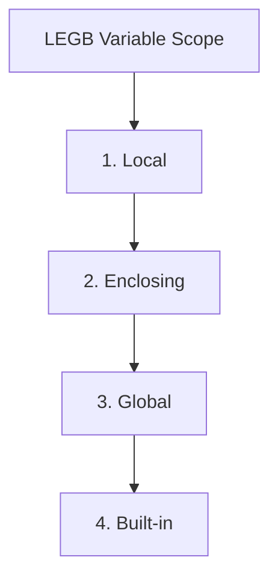
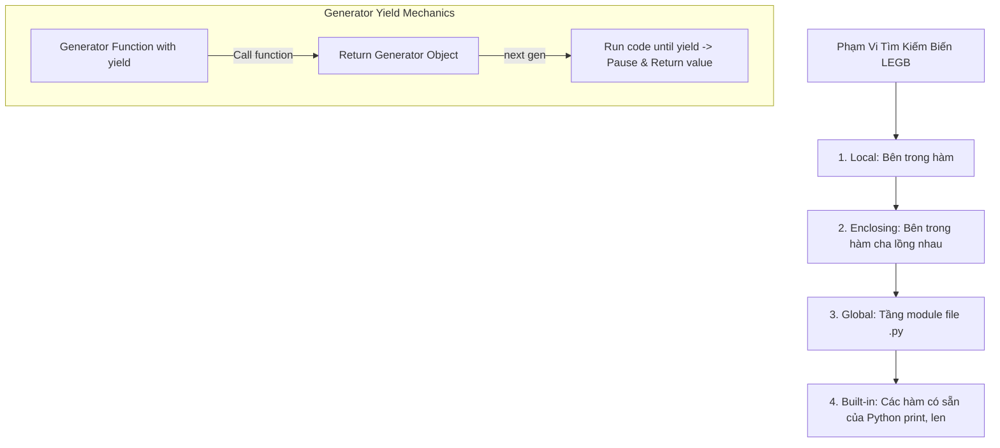

# 🐍 04.Functions_Lambda_Decorators_and_Generators: Hàm Nâng Cao, Scope LEGB, Closures, Decorators & Generators - Giáo Trình Python DevOps Chuyên Sâu Cực Chi Tiết

> 💡 **Bản chất 1 câu**: Lập trình hàm nâng cao: Phạm vi biến LEGB, Higher-order functions, Closures, Decorators (`@functools.wraps`), Generators (`yield`) và Iterators.  
> 🎯 **Trọng tâm thực chiến DevOps**: Nắm vững LEGB Scope (Local, Enclosing, Global, Built-in), Decorator bọc hàm log/timer, Generator `yield` tiết kiệm RAM khi duyệt hàng triệu dữ liệu.

---



---

## 2. 📚 Lý Thuyết Chuyên Sâu & Bản Chất Hệ Thống (Under The Hood Architecture)

### 2.1 Phạm Vi Biến LEGB & Cơ Chế Decorator / Generator (OBJ 4.1)



1. **Quy Tắc LEGB**: Khi tìm kiếm giá trị của một biến, Python tìm theo đúng thứ tự: **Local -> Enclosing -> Global -> Built-in**.
2. **Decorators**: Hàm nhận vào 1 hàm khác làm tham số và trả về hàm mới để mở rộng tính năng (thêm logging, đo thời gian chạy, check quyền auth) mà KHÔNG sửa code cũ. Dùng `@functools.wraps` để bảo toàn docstring.
3. **Generators (`yield`)**: Hàm trả về từng giá trị một thông qua `yield`. Dữ liệu được tính toán **Lazy Evaluation** (khi nào cần mới tính), tiết kiệm hàng GB RAM khi xử lý log lớn.


---

## 3. ⚡ Bảng Tra Cứu Khái Niệm & Hàm / Thư Viện Thực Hành (Reference Table)

| Công cụ / Hàm / Thư viện | Tham số / Module | Ý nghĩa chi tiết bản chất | Ứng dụng thực tế DevOps |
| :--- | :--- | :--- | :--- |
| **`yield`** | `Generator Syntax` | Tạm dừng hàm và trả về 1 giá trị (Lazy Evaluation) | `yield line` |
| **`@functools.wraps`** | `Decorator Tool` | Bảo toàn tên hàm và docstring nguyên bản khi dùng Decorator | `@wraps(func)` |
| **`global / nonlocal`** | `Scope Keyword` | Cho phép sửa biến ở Global hoặc Enclosing scope | `nonlocal count` |
| **`lambda`** | `Anonymous Func` | Hàm ẩn danh 1 dòng code gọn nhẹ | `lambda x: x * 2` |


---

## 4. 🛠 Thao Tác Thực Chiến & Kịch Bản DevOps Automation (Real-World Production Scripts)

### 🛠 Các đoạn Script Python thực hành chuyên sâu gõ là ăn ngay:
```python
import time
import functools

# Custom Decorator đo thời gian thực thi hàm:
def timer_decorator(func):
    @functools.wraps(func)
    def wrapper(*args, **kwargs):
        start = time.time()
        result = func(*args, **kwargs)
        duration = time.time() - start
        print(f"[METRIC] Function '{func.__name__}' executed in {duration:.4f}s")
        return result
    return wrapper

# Custom Generator đọc file log từng dòng một (Lazy Reading):
def read_huge_log(file_path):
    with open(file_path, 'r') as f:
        for line in f:
            if "ERROR" in line:
                yield line.strip()

@timer_decorator
def process_logs():
    # Giả lập đọc log:
    logs = ["INFO 1", "ERROR Connection timeout", "INFO 2", "ERROR Disk full"]
    for err in logs:
        if "ERROR" in err:
            print(f"Found: {err}")

process_logs()

```

### 🚀 Kịch bản tự động hóa thực tế khi đi làm (Production DevOps Incident Playbook):
Viết Decorator `@retry(max_retries=3)` tự động gọi lại hàm nạp cấu hình API 3 lần nếu gặp sự cố mạng ngắt kết nối.

---

## 5. 🚀 Bộ Câu Hỏi Phỏng Vấn DevOps Python Thực Tế (Middle-Senior Interview Q&A)

> **Q: Tại sao nên dùng Generator `yield` thay vì trả về một List đầy đủ khi đọc file log 10GB?**  
> **A**: Vì List 10GB sẽ nạp toàn bộ 10GB dữ liệu vào RAM gây tràn bộ nhớ (OOM). Generator chỉ nạp đúng 1 dòng tại một thời điểm vào RAM, tốn gần như 0MB RAM.

> **Q: Tác dụng của decorator `@functools.wraps(func)` khi viết custom decorator là gì?**  
> **A**: Giúp bảo toàn thuộc tính gốc của hàm bị bọc (như `__name__`, `__doc__`), tránh bị biến đổi thành tên của hàm wrapper.


---

## 6. 📝 Cheat Sheet Ghi Nhớ Nhanh (Summary)

- [x] LEGB: Local -> Enclosing -> Global -> Built-in
- [x] Decorator: Bọc mở rộng tính năng hàm
- [x] @functools.wraps: Bảo toàn metadata hàm gốc
- [x] Generator yield: Lazy evaluation tiết kiệm RAM

