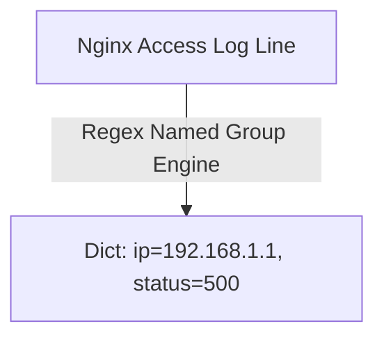
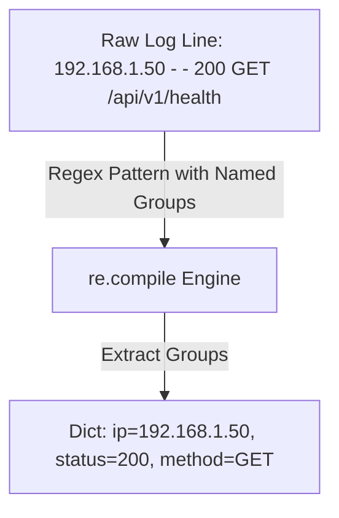

# 🐍 04.Text_Processing_Regex_and_Parsing: Xử Lý Văn Bản, Regular Expressions & Phân Tích Log - Python Chuyên Sâu Cho DevOps

> 💡 **Bản chất 1 câu**: Xử lý chuỗi văn bản và Regex chuyên sâu (`re` module: `search`, `match`, `findall`, `sub`), phân tích file log (Nginx, Syslog, K8s) và f-strings.  
> 🎯 **Trọng tâm thực chiến DevOps**: Nắm vững Regex pattern matching (`^`, `$`, `\d+`, `\s+`, Named Groups `(?P<name>...)`), bóc tách thông tin IP, Timestamp, HTTP Status Code từ file log rác.

---



---

## 2. 📚 Lý Thuyết Chuyên Sâu & Bản Sắc Hệ Thống (Under The Hood Architecture)

### 2.1 Phân Tích Cú Pháp Regex Named Groups Cho Log Parsing (OBJ 4.1)



```python
# Named Group Pattern cho Nginx Access Log:
pattern = r'(?P<ip>\d+\.\d+\.\d+\.\d+) - - \[(?P<time>.*?)\] "(?P<method>\A-Z]+) (?P<url>\S+) .*?" (?P<status>\d+)'
```
- **`re.compile()`**: Biên dịch trước Regex pattern giúp tăng tốc độ xử lý khi lặp hàng triệu dòng log.
- **Named Groups `(?P<key>pattern)`**: Tự động chuyển đổi kết quả match thành Python Dictionary cực kỳ tiện lợi!


---

## 3. ⚡ Bảng Tra Cứu Khái Niệm & Hàm / Thư Viện Thực Hành (Reference Table)

| Công cụ / Hàm / Thư viện | Tham số / Module | Ý nghĩa bản chất | Ứng dụng thực tế DevOps |
| :--- | :--- | :--- | :--- |
| **`re.compile`** | `Regex Module` | Biên dịch pattern Regex trước để tăng tốc độ lặp | `pattern = re.compile(r'\d+\.\d+\.\d+\.\d+')` |
| **`re.search`** | `Regex Module` | Tìm kiếm vị trí khớp đầu tiên trong chuỗi | `match = pattern.search(line)` |
| **`re.findall`** | `Regex Module` | Trả về tất cả các chuỗi khớp pattern dưới dạng List | `ips = re.findall(r'\d+\.\d+\.\d+\.\d+', text)` |
| **`Named Groups`** | `Regex Syntax` | Đặt tên nhãn cho group để xuất ra Dictionary | `(?P<ip>\d+\.\d+\.\d+\.\d+)` |


---

## 4. 🛠 Thao Tác Thực Chiến & Kịch Bản DevOps Automation (Real-World Scenarios)

### 🛠 Các đoạn Script Python thực hành gõ là ăn ngay:
```python
import re

log_line = '192.168.1.100 - - [04/Aug/2026:10:00:00] "GET /index.html HTTP/1.1" 500 2326'

# Pattern Regex bóc tách Log:
log_pattern = re.compile(r'(?P<ip>\d+\.\d+\.\d+\.\d+) .*?"(?P<method>\w+) (?P<url>\S+) .*?" (?P<status>\d+)')

match = log_pattern.search(log_line)
if match:
    data = match.groupdict()
    print(f"IP: {data['ip']} | Status: {data['status']} | URL: {data['url']}")
    if data['status'].startswith('5'):
        print("[ALERT] Detected 5xx Server Error!")

```

### 🚀 Kịch bản tự động hóa thực tế khi đi làm (Production DevOps Scripting):
Script Python đọc file Nginx `access.log` hàng trăm MB, bóc tách các truy vấn bị lỗi 5xx và đếm top 5 IP truy cập nhiều nhất.

---

## 5. 🚀 Bộ Câu Hỏi Phỏng Vấn DevOps Python Thực Tế (Interview Q&A)

> **Q: Tại sao nên dùng `re.compile()` khi xử lý file log có hàng triệu dòng?**  
> **A**: Vì `re.compile()` biên dịch Regex pattern thành Bytecode trong bộ nhớ trước 1 lần duy nhất, giúp tránh việc phải biên dịch lại pattern ở mỗi vòng lặp `for`, tăng tốc độ gấp nhiều lần.

> **Q: Sự khác biệt giữa `re.match()` và `re.search()` trong Python là gì?**  
> **A**: `re.match()` chỉ kiểm tra xem chuỗi có khớp pattern ngay tại **vị trí đầu tiên** (index 0) hay không. `re.search()` tìm kiếm pattern tại **bất kỳ vị trí nào** trong toàn bộ chuỗi.


---

## 6. 📝 Cheat Sheet Ghi Nhớ Nhanh (Summary)

- [x] re.compile: Biên dịch trước pattern tăng tốc
- [x] re.search: Tìm khớp ở bất kỳ đâu
- [x] Named Groups (?P<name>...): Bóc log ra Dict
- [x] f-strings: Formatting chuỗi cực nhanh

