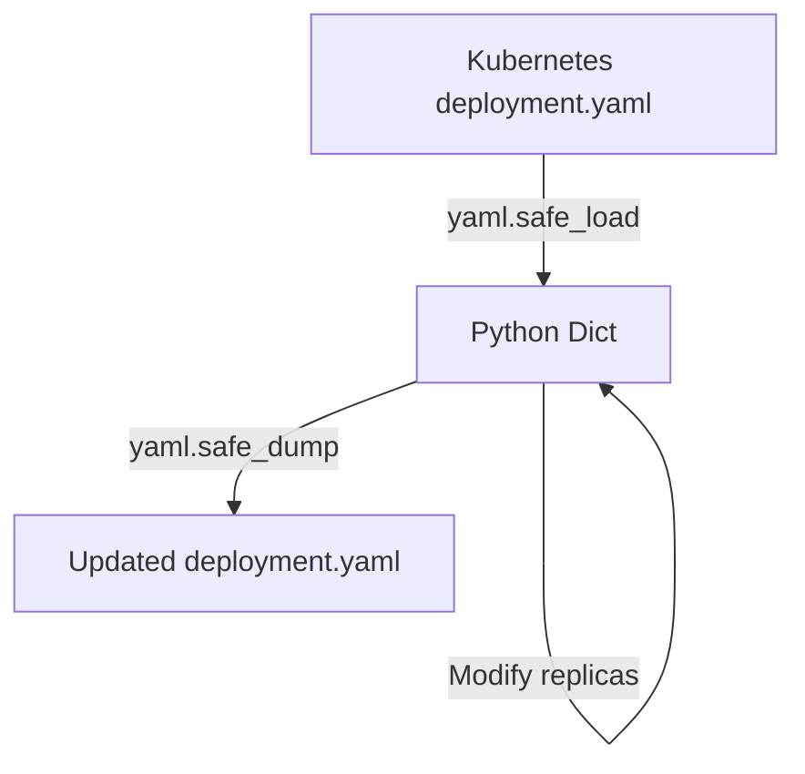
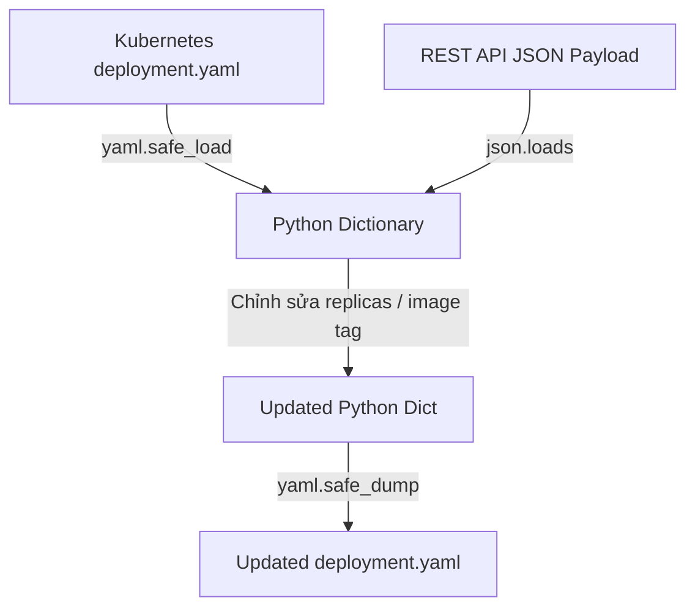

# 🐍 05.Data_Formats_Parsing_YAML_JSON_CSV_XML: Xử Lý Định Dạng Dữ Liệu: JSON, YAML, CSV & XML - Python Chuyên Sâu Cho DevOps

> 💡 **Bản chất 1 câu**: Phân tích và chuyển đổi các định dạng dữ liệu phổ biến nhất trong DevOps: JSON (`json`), YAML (`PyYAML`), CSV (`csv` / `pandas`) và XML (`xml.etree.ElementTree`).  
> 🎯 **Trọng tâm thực chiến DevOps**: Nắm vững `json.dumps/loads` vs `json.dump/load`, `yaml.safe_load/safe_dump`, thao tác chỉnh sửa file cấu hình Kubernetes Deployment YAML / Ansible Playbooks bằng Python.

---



---

## 2. 📚 Lý Thuyết Chuyên Sâu & Bản Sắc Hệ Thống (Under The Hood Architecture)

### 2.1 Bản Chất Đọc/Ghi Dữ Liệu JSON & YAML Trong Python (OBJ 5.1)



1. **`json.loads()` vs `json.load()`**:
   - `loads(string)`: Parse từ một chuỗi JSON String.
   - `load(file_object)`: Parse trực tiếp từ một file handle `with open()`.
2. **`yaml.safe_load()`**: BẮT BUỘC sử dụng `safe_load()` thay vì `load()` để ngăn chặn lỗ hổng Remote Code Execution khi load file YAML không tin tưởng.


---

## 3. ⚡ Bảng Tra Cứu Khái Niệm & Hàm / Thư Viện Thực Hành (Reference Table)

| Công cụ / Hàm / Thư viện | Tham số / Module | Ý nghĩa bản chất | Ứng dụng thực tế DevOps |
| :--- | :--- | :--- | :--- |
| **`json.loads / dumps`** | `Built-in Module` | Parse chuỗi JSON sang Dict và ngược lại | `data = json.loads(json_str)` |
| **`yaml.safe_load`** | `PyYAML Library` | Đọc file cấu hình YAML an toàn thành Dict | `config = yaml.safe_load(f)` |
| **`csv.DictReader`** | `Built-in Module` | Đọc file CSV trả về danh sách các Dictionary | `reader = csv.DictReader(f)` |
| **`ElementTree`** | `Built-in Module` | Phân tích và truy vấn dữ liệu XML | `tree = ET.parse('config.xml')` |


---

## 4. 🛠 Thao Tác Thực Chiến & Kịch Bản DevOps Automation (Real-World Scenarios)

### 🛠 Các đoạn Script Python thực hành gõ là ăn ngay:
```python
import json
import yaml

# Cấu hình Kubernetes Deployment dạng Dict:
k8s_manifest = {
    "apiVersion": "apps/v1",
    "kind": "Deployment",
    "metadata": {"name": "web-app"},
    "spec": {
        "replicas": 3,
        "template": {
            "spec": {
                "containers": [{"name": "nginx", "image": "nginx:1.25"}]
            }
        }
    }
}

# Chuyển đổi sang chuỗi YAML:
yaml_output = yaml.safe_dump(k8s_manifest, sort_keys=False)
print("--- Generated K8s YAML ---")
print(yaml_output)

```

### 🚀 Kịch bản tự động hóa thực tế khi đi làm (Production DevOps Scripting):
Script Python tự động đọc file `values.yaml` của Helm Chart, cập nhật version Docker Image mới vừa build từ CI/CD và ghi đè lại file.

---

## 5. 🚀 Bộ Câu Hỏi Phỏng Vấn DevOps Python Thực Tế (Interview Q&A)

> **Q: Tại sao BẮT BUỘC phải dùng `yaml.safe_load()` thay vì `yaml.load()` trong PyYAML?**  
> **A**: Vì `yaml.load()` mặc định cho phép thực thi các đối tượng mã Python произвольный (arbitrary code execution) chứa trong file YAML, dễ bị tấn công RCE.

> **Q: Phân biệt sự khác nhau giữa `json.dumps()` và `json.dump()` trong Python?**  
> **A**: `json.dumps()` chuyển đổi Python Dict thành **chuỗi JSON String** trên RAM. `json.dump()` ghi trực tiếp Python Dict thành **tệp tin file JSON** trên đĩa cứng.


---

## 6. 📝 Cheat Sheet Ghi Nhớ Nhanh (Summary)

- [x] JSON: json.loads (String) / json.load (File)
- [x] YAML: yaml.safe_load an toàn tuyệt đối
- [x] CSV: csv.DictReader đọc mảng dữ liệu
- [x] XML: ElementTree parse dữ liệu XML

