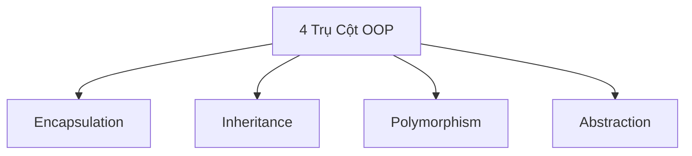

# 🐍 05.Object_Oriented_Programming_OOP: Lập Trình Hướng Đối Tượng OOP Chuyên Sâu Trong Python - Giáo Trình Python DevOps Chuyên Sâu Cực Chi Tiết

> 💡 **Bản chất 1 câu**: Lập trình hướng đối tượng OOP production: Classes, Objects, `__init__`, `self`, Inheritance, Polymorphism, Encapsulation, Dunder methods (`__str__`, `__repr__`, `__call__`), `@classmethod`, `@staticmethod` và Abstract Base Classes (`abc`).  
> 🎯 **Trọng tâm thực chiến DevOps**: Nắm vững 4 trụ cột OOP, Dunder methods magic, `@classmethod` làm Factory Constructor, `@staticmethod` làm utility, và `abc.ABC` định nghĩa Interface hạ tầng.

---



---

## 2. 📚 Lý Thuyết Chuyên Sâu & Bản Chất Hệ Thống (Under The Hood Architecture)

### 2.1 Kiến Trúc 4 Trụ Cột OOP & Dunder Methods In Python (OBJ 5.1)

```mermaid
graph TD
    OOP[4 Trụ Cột Lập Trình Hướng Đối Tượng] --> Encapsulation[Encapsulation - Đóng gói: _protected, __private]
    OOP --> Inheritance[Inheritance - Kế thừa: SuperClass -> SubClass]
    OOP --> Polymorphism[Polymorphism - Đa hình: Override method parent]
    OOP --> Abstraction[Abstraction - Trừu tượng: Abstract Base Class ABC]
    
    subgraph Dunder Magic Methods
        Init[__init__: Constructor khởi tạo]
        Str[__str__: String representation cho User]
        Repr[__repr__: String representation cho Developer]
        Call[__call__: Biến Object thành hàm có thể gọi()]
    end
```

1. **Magic Dunder Methods**:
   - `__init__(self, ...)`: Constructor khởi tạo thuộc tính object.
   - `__str__(self)`: Trả về chuỗi đẹp mắt cho người dùng (`print(obj)`).
   - `__repr__(self)`: Trả về chuỗi chi tiết phục vụ debugging.
   - `__call__(self)`: Cho phép gọi object như một hàm `my_obj()`.
2. **`@classmethod` vs `@staticmethod`**:
   - `@classmethod`: Nhận `cls` làm tham số đầu tiên, thường dùng làm **Factory Constructor** tạo object từ file JSON/YAML.
   - `@staticmethod`: Không nhận `self` hay `cls`, đóng vai trò hàm tiện ích độc lập nằm trong namespace của Class.
3. **Abstract Base Classes (`abc.ABC`)**: Bắt buộc các lớp con phải implement các hàm trừu tượng `@abstractmethod`.


---

## 3. ⚡ Bảng Tra Cứu Khái Niệm & Hàm / Thư Viện Thực Hành (Reference Table)

| Công cụ / Hàm / Thư viện | Tham số / Module | Ý nghĩa chi tiết bản chất | Ứng dụng thực tế DevOps |
| :--- | :--- | :--- | :--- |
| **`__init__`** | `Dunder Method` | Hàm khởi tạo Constructor cho Object | `def __init__(self, host, port):` |
| **`@classmethod`** | `Decorator` | Phương thức nhận class cls, dùng làm Factory | `@classmethod def from_dict(cls, data):` |
| **`@staticmethod`** | `Decorator` | Phương thức tiện ích không dùng self/cls | `@staticmethod def is_valid_ip(ip):` |
| **`abc.ABC`** | `Built-in Module` | Lớp trừu tượng bắt buộc lớp con override method | `class CloudProvider(ABC):` |


---

## 4. 🛠 Thao Tác Thực Chiến & Kịch Bản DevOps Automation (Real-World Production Scripts)

### 🛠 Các đoạn Script Python thực hành chuyên sâu gõ là ăn ngay:
```python
from abc import ABC, abstractmethod

# Định nghĩa Interface Trừu Tượng cho Cloud Provider:
class BaseCloudProvider(ABC):
    @abstractmethod
    def create_server(self, name: str) -> str:
        pass

class AWSProvider(BaseCloudProvider):
    def __init__(self, region: str = "us-east-1"):
        self.region = region
        
    def create_server(self, name: str) -> str:
        return f"[AWS {self.region}] Created EC2 Instance: {name}"
        
    @classmethod
    def from_config(cls, config_dict: dict):
        return cls(region=config_dict.get("region", "us-east-1"))

# Khởi tạo qua Factory Method:
aws = AWSProvider.from_config({"region": "ap-southeast-1"})
print(aws.create_server("prod-k8s-node-01"))

```

### 🚀 Kịch bản tự động hóa thực tế khi đi làm (Production DevOps Incident Playbook):
Thiết kế hệ thống Abstraction OOP chuẩn hóa việc gửi Notificationalert sang 3 kênh Slack, Telegram, PagerDuty thông qua chung 1 Interface `BaseNotifier`.

---

## 5. 🚀 Bộ Câu Hỏi Phỏng Vấn DevOps Python Thực Tế (Middle-Senior Interview Q&A)

> **Q: Sự khác biệt giữa `@classmethod` và `@staticmethod` trong Python Class là gì?**  
> **A**: `@classmethod` nhận tham số đầu tiên là lớp `cls`, có thể truy cập và sửa đổi trạng thái của Class (thường dùng làm Factory Method). `@staticmethod` không nhận `self` hay `cls`, hoạt động như một hàm độc lập.

> **Q: Tại sao nên sử dụng Abstract Base Class (`abc.ABC`) khi viết khung thư viện DevOps?**  
> **A**: Để định nghĩa các chuẩn giao tiếp (Interface/Contract) bắt buộc tất cả các lớp con triển khai (như các plugin bên thứ 3) phải tuân thủ và viết đầy đủ các hàm quy định.


---

## 6. 📝 Cheat Sheet Ghi Nhớ Nhanh (Summary)

- [x] __init__: Constructor khởi tạo
- [x] __str__ vs __repr__: User-friendly vs Dev-friendly string
- [x] @classmethod: Factory constructor nhận cls
- [x] @staticmethod: Hàm tiện ích độc lập
- [x] abc.ABC: Định nghĩa Interface trừu tượng

