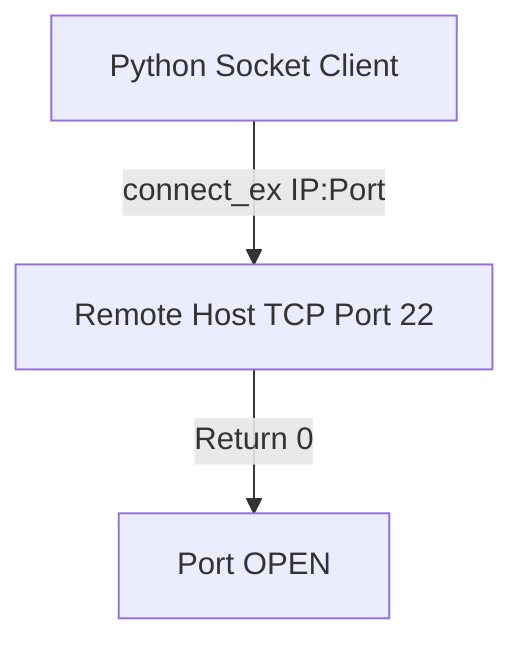
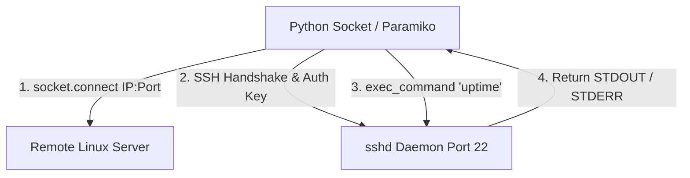

# 🐍 06.Network_Programming_Sockets_and_Scapy: Lập Trình Mạng Socket, Scapy & Tự Động Hóa SSH - Python Chuyên Sâu Cho DevOps

> 💡 **Bản chất 1 câu**: Lập trình Socket mạng (`socket` module: TCP/UDP Client/Server), tính toán IP (`ipaddress`), kiểm tra Port, quét mạng, tự động hóa SSH với `paramiko` / `netmiko` và bắt gói tin với `scapy`.  
> 🎯 **Trọng tâm thực chiến DevOps**: Nắm vững tạo Socket TCP/UDP, timeout, `socket.connect_ex()`, tự động SSH thực thi lệnh trên 100 Linux Servers bằng `paramiko`, bóc tách IP với `ipaddress`.

---



---

## 2. 📚 Lý Thuyết Chuyên Sâu & Bản Sắc Hệ Thống (Under The Hood Architecture)

### 2.1 Kiến Trúc Socket TCP Client & SSH Automation (OBJ 6.1)



1. **`socket.connect_ex((ip, port))`**: Trả về `0` nếu kết nối thành công (Port MỞ), trả về mã lỗi nếu Port ĐÓNG (Cực kỳ thích hợp viết Port Scanner).
2. **`paramiko.SSHClient()`**: Thư viện Python kết nối SSH mã hóa chuyên nghiệp để chạy lệnh và quản trị Server từ xa.


---

## 3. ⚡ Bảng Tra Cứu Khái Niệm & Hàm / Thư Viện Thực Hành (Reference Table)

| Công cụ / Hàm / Thư viện | Tham số / Module | Ý nghĩa bản chất | Ứng dụng thực tế DevOps |
| :--- | :--- | :--- | :--- |
| **`socket.socket`** | `Built-in Module` | Tạo socket kết nối TCP/UDP nguyên thủy | `s = socket.socket(socket.AF_INET, socket.SOCK_STREAM)` |
| **`connect_ex`** | `Socket Method` | Test kết nối Port trả về 0 nếu thành công | `res = s.connect_ex(('10.0.0.1', 80))` |
| **`ipaddress`** | `Built-in Module` | Tính toán dải IP, Subnet và Host IPs | `net = ipaddress.ip_network('10.0.0.0/24')` |
| **`paramiko`** | `SSH Library` | Thư viện tự động hóa kết nối SSH/SFTP | `ssh.connect('10.0.0.1', username='root')` |


---

## 4. 🛠 Thao Tác Thực Chiến & Kịch Bản DevOps Automation (Real-World Scenarios)

### 🛠 Các đoạn Script Python thực hành gõ là ăn ngay:
```python
import socket
import ipaddress

def scan_port(ip: str, port: int) -> bool:
    with socket.socket(socket.AF_INET, socket.SOCK_STREAM) as s:
        s.settimeout(1.0)
        return s.connect_ex((ip, port)) == 0

# Duyệt dải IP /28 bằng module ipaddress:
net = ipaddress.ip_network("192.168.1.0/28")
print(f"Scanning {net.num_addresses} IPs for Port 22...")

for host in net.hosts():
    is_open = scan_port(str(host), 22)
    if is_open:
        print(f"[OPEN] SSH Port 22 on {host}")

```

### 🚀 Kịch bản tự động hóa thực tế khi đi làm (Production DevOps Scripting):
Script Python kết nối SSH đồng loạt qua `paramiko` tới 50 máy chủ Linux để kiểm tra dung lượng đĩa `df -h` và tự động gửi email cảnh báo nếu đĩa đầy > 90%.

---

## 5. 🚀 Bộ Câu Hỏi Phỏng Vấn DevOps Python Thực Tế (Interview Q&A)

> **Q: Ưu điểm của hàm `socket.connect_ex()` so với `socket.connect()` khi viết script quét Port là gì?**  
> **A**: `connect()` ném ra Exception làm dừng script nếu Port đóng. `connect_ex()` không ném Exception mà trả về mã lỗi integer (`0` nếu mở), giúp code ngắn gọn và chạy nhanh hơn.

> **Q: Thư viện `paramiko` được dùng làm gì trong tự động hóa hạ tầng?**  
> **A**: Dùng để khởi tạo kết nối SSH/SFTP mã hóa từ Python tới máy chủ Linux từ xa để thực thi câu lệnh shell, tải/đẩy file mà không cần gõ tay.


---

## 6. 📝 Cheat Sheet Ghi Nhớ Nhanh (Summary)

- [x] socket: Lập trình mạng TCP/UDP nguyên thủy
- [x] connect_ex: Test thấu Port trả về 0
- [x] ipaddress: Tính toán dải Subnetting IP
- [x] paramiko: Tự động hóa kết nối SSH/SFTP

