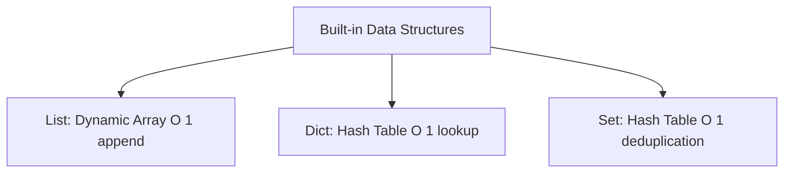
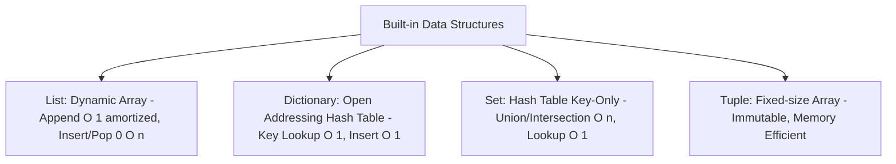

# 🐍 07.Builtin_Data_Structures_Deep_Dive: Cấu Trúc Dữ Liệu Built-in Python: List, Tuple, Dict, Set & Comprehensions - Giáo Trình Python DevOps Chuyên Sâu Cực Chi Tiết

> 💡 **Bản chất 1 câu**: Phân tích chuyên sâu 4 cấu trúc dữ liệu built-in cốt lõi: Lists (Dynamic arrays $O(1)$ amortized), Tuples, Dictionaries (Hash tables $O(1)$), Sets ($O(1)$ deduplication) và Comprehensions.  
> 🎯 **Trọng tâm thực chiến DevOps**: Nắm vững bảng độ phức tạp thời gian Big-O của các phép toán trên List/Dict/Set, kỹ thuật Comprehensions lồng nhau, và thao tác Slicing nâng cao.

---



---

## 2. 📚 Lý Thuyết Chuyên Sâu & Bản Chất Hệ Thống (Under The Hood Architecture)

### 2.1 Phân Tích Độ Phức Tạp Big-O & Cấu Trúc Bảng Băm (OBJ 7.1)



| Cấu Trúc Dữ Liệu | Phép toán phổ biến | Độ phức tạp thời gian (Big-O) | Trường hợp sử dụng tiêu chuẩn trong DevOps |
| :--- | :--- | :--- | :--- |
| **List** | `append()`, `pop()` cuối | **$O(1)$ amortized** | Lưu danh sách thứ tự các Task/Server |
| **List** | `insert(0)`, `remove()` | **$O(n)$ (Cực chậm)** | NÊN TRÁNH với dữ liệu lớn! |
| **Dictionary** | `dict[key]`, `in dict` | **$O(1)$ (Siêu nhanh)** | Lưu Config, JSON Payload, Cache |
| **Set** | `in set`, `add()` | **$O(1)$ (Siêu nhanh)** | Dọn trùng IP, tìm tập hợp giao nhau (Intersection)|

---

### 2.2 Comprehensions Nâng Cao Cho DevOps
Cú pháp Comprehension giúp viết mã xử lý mảng dữ liệu ngắn gọn, chạy hoàn toàn bằng C-code của CPython nên nhanh hơn vòng lặp `for` thường 20-30%.


---

## 3. ⚡ Bảng Tra Cứu Khái Niệm & Hàm / Thư Viện Thực Hành (Reference Table)

| Công cụ / Hàm / Thư viện | Tham số / Module | Ý nghĩa chi tiết bản chất | Ứng dụng thực tế DevOps |
| :--- | :--- | :--- | :--- |
| **`List Comprehension`** | `Syntax` | Tạo List mới từ Iterable chỉ 1 dòng code | `[x.upper() for x in servers if 'prod' in x]` |
| **`Dict Comprehension`** | `Syntax` | Tạo Dict mới bằng ánh xạ Key-Value | `{ip: 'UP' for ip in ip_list}` |
| **`Set Comprehension`** | `Syntax` | Tạo Set dọn trùng lặp trực tiếp | `{line.split()[0] for line in log_lines}` |
| **`zip()`** | `Built-in Function` | Gộp 2 hoặc nhiều List thành các cặp Tuple | `dict(zip(keys, values))` |


---

## 4. 🛠 Thao Tác Thực Chiến & Kịch Bản DevOps Automation (Real-World Production Scripts)

### 🛠 Các đoạn Script Python thực hành chuyên sâu gõ là ăn ngay:
```python
# Xử lý dữ liệu mảng phức tạp cho DevOps:
hosts = ["web-01", "web-02", "db-01", "cache-01"]
ips = ["10.0.0.1", "10.0.0.2", "10.0.0.3", "10.0.0.4"]

# Gộp 2 List thành Dictionary bằng zip():
inventory = dict(zip(hosts, ips))
print(f"Inventory: {inventory}")

# Lọc các host thuộc nhóm web bằng Dict Comprehension:
web_nodes = {k: v for k, v in inventory.items() if k.startswith("web")}
print(f"Web Nodes: {web_nodes}")

# Phép toán tập hợp Set (Union, Intersection, Difference):
dev_ips = {"10.0.0.1", "10.0.0.2", "10.0.0.99"}
prod_ips = {"10.0.0.2", "10.0.0.3", "10.0.0.4"}

# Tìm IP có ở cả Dev và Prod (Intersection):
common_ips = dev_ips & prod_ips
print(f"Common IPs: {common_ips}")

```

### 🚀 Kịch bản tự động hóa thực tế khi đi làm (Production DevOps Incident Playbook):
Script Python đọc danh sách IP từ 2 nguồn Firewall khác nhau, dùng phép toán Set `Difference` để phát hiện ngay các IP thiếu sót chưa được đồng bộ.

---

## 5. 🚀 Bộ Câu Hỏi Phỏng Vấn DevOps Python Thực Tế (Middle-Senior Interview Q&A)

> **Q: Tại sao phép toán `in` trên Set/Dict lại có tốc độ $O(1)$ trong khi trên List lại là $O(n)$?**  
> **A**: Vì Set và Dict sử dụng bảng băm (Hash Table) để tính toán trực tiếp vị trí phần tử từ mã Hash. List phải duyệt tuần tự từ đầu đến cuối mảng.

> **Q: Khi nào nên dùng `zip()` trong Python?**  
> **A**: Khi cần kết hợp nhiều danh sách Iterable có độ dài tương đương lại với nhau thành từng cặp phần tử (Tuple) để duyệt đồng thời hoặc chuyển đổi thành Dictionary.


---

## 6. 📝 Cheat Sheet Ghi Nhớ Nhanh (Summary)

- [x] List: $O(1)$ append/pop cuối, $O(n)$ search
- [x] Dict: Hash Table $O(1)$ lookup
- [x] Set: $O(1)$ lookup & deduplication
- [x] Comprehensions: Chạy C-speed nhanh hơn vòng `for` thường

