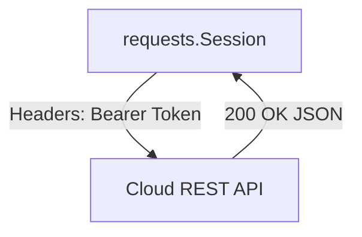
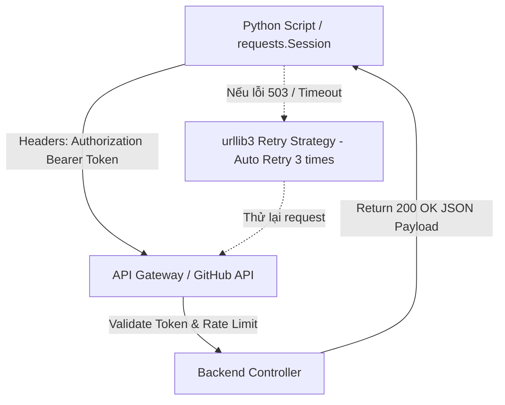

# 🐍 07.HTTP_REST_APIs_and_Web_Scraping: Tương Tác REST APIs, HTTP Client & Webhooks - Python Chuyên Sâu Cho DevOps

> 💡 **Bản chất 1 câu**: Tương tác REST APIs chuyên nghiệp với `requests` (GET, POST, PUT, DELETE, Headers, Auth, Bearer Token), Retry Strategy, Rate Limiting, Webhooks và bóc tách dữ liệu.  
> 🎯 **Trọng tâm thực chiến DevOps**: Nắm vững `requests.Session()`, xử lý JSON response (`response.json()`), `raise_for_status()`, Retry với `urllib3`, gửi Webhook thông báo tới Slack/Teams/Discord.

---



---

## 2. 📚 Lý Thuyết Chuyên Sâu & Bản Sắc Hệ Thống (Under The Hood Architecture)

### 2.1 Kiến Trúc Tương Tác REST API Với Retries & Auth (OBJ 7.1)



1. **`requests.Session()`**: Tái sử dụng kết nối TCP (HTTP Keep-Alive), giúp tăng tốc đáng kể khi gửi hàng loạt API requests.
2. **`response.raise_for_status()`**: Tự động ném ra `HTTPError` Exception nếu HTTP Status Code thuộc nhóm lỗi 4xx hoặc 5xx.


---

## 3. ⚡ Bảng Tra Cứu Khái Niệm & Hàm / Thư Viện Thực Hành (Reference Table)

| Công cụ / Hàm / Thư viện | Tham số / Module | Ý nghĩa bản chất | Ứng dụng thực tế DevOps |
| :--- | :--- | :--- | :--- |
| **`requests.get / post`** | `HTTP Library` | Gửi HTTP Request tới REST API | `r = requests.get(url, headers=headers)` |
| **`requests.Session`** | `HTTP Library` | Tạo session giữ kết nối TCP Keep-Alive | `session = requests.Session()` |
| **`response.json()`** | `HTTP Method` | Parse trực tiếp JSON response thành Python Dict | `data = response.json()` |
| **`raise_for_status`** | `HTTP Method` | Bắt lỗi Exception nếu HTTP status >= 400 | `response.raise_for_status()` |


---

## 4. 🛠 Thao Tác Thực Chiến & Kịch Bản DevOps Automation (Real-World Scenarios)

### 🛠 Các đoạn Script Python thực hành gõ là ăn ngay:
```python
import requests
from requests.adapters import HTTPAdapter
from urllib3.util import Retry

# Khởi tạo Session kèm cơ chế Auto-Retry:
session = requests.Session()
retries = Retry(total=3, backoff_factor=1, status_forcelist=[500, 502, 503, 504])
session.mount('https://', HTTPAdapter(max_retries=retries))

# Gửi Slack Webhook thông báo Deployment:
webhook_url = "https://hooks.slack.com/services/YOUR/WEBHOOK/URL"
payload = {"text": "🚀 Deployment to Production completed successfully!"}

try:
    response = session.post(webhook_url, json=payload, timeout=5)
    response.raise_for_status()
    print("[OK] Slack Notification sent!")
except requests.exceptions.RequestException as e:
    print(f"[ERROR] Failed to send Webhook: {e}")

```

### 🚀 Kịch bản tự động hóa thực tế khi đi làm (Production DevOps Scripting):
Script Python tương tác GitHub REST API tự động tạo Pull Request, gán Reviewer và comment kết quả test từ Jenkins CI.

---

## 5. 🚀 Bộ Câu Hỏi Phỏng Vấn DevOps Python Thực Tế (Interview Q&A)

> **Q: Tại sao nên dùng `requests.Session()` khi gọi nhiều API requests liên tiếp?**  
> **A**: Vì `requests.Session()` tái sử dụng cùng một kết nối TCP ngầm (HTTP Keep-Alive), không phải thực hiện lại quá trình bắt tay TCP/TLS ở mỗi request, giúp tăng tốc độ xử lý.

> **Q: Tác dụng của phương thức `response.raise_for_status()` là gì?**  
> **A**: Giúp tự động ném ra một Exception `HTTPError` nếu phản hồi từ API có Status Code báo lỗi (4xx hoặc 5xx), ngăn script tiếp tục chạy với dữ liệu lỗi.


---

## 6. 📝 Cheat Sheet Ghi Nhớ Nhanh (Summary)

- [x] requests.Session: Giữ kết nối TCP Keep-Alive
- [x] response.json(): Parse JSON response sang Dict
- [x] raise_for_status(): Ném lỗi nếu status >= 400
- [x] Slack/Teams Webhooks: Gửi alert từ Python

