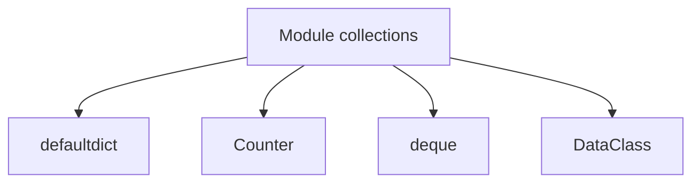

# 🐍 08.Advanced_Data_Structures_Collections: Cấu Trúc Dữ Liệu Nâng Cao Module `collections` & Dataclasses - Giáo Trình Python DevOps Chuyên Sâu Cực Chi Tiết

> 💡 **Bản chất 1 câu**: Các cấu trúc dữ liệu chuyên dụng cao cấp: Module `collections` (`defaultdict`, `Counter`, `deque`, `namedtuple`), `heapq` priority queue và `@dataclass`.  
> 🎯 **Trọng tâm thực chiến DevOps**: Nắm vững `defaultdict` tránh KeyError, `Counter` đếm tần suất log tự động, `deque` hàng đợi 2 đầu $O(1)$, `@dataclass` định nghĩa Struct dữ liệu sạch sẽ.

---



---

## 2. 📚 Lý Thuyết Chuyên Sâu & Bản Chất Hệ Thống (Under The Hood Architecture)

### 2.1 Chi Tiết Các Data Structures Trong Module Collections (OBJ 8.1)

```mermaid
graph TD
    CollectionsModule[Module collections & dataclasses] --> DefaultDict[defaultdict: Tự tạo value mặc định chống KeyError]
    CollectionsModule --> Counter[Counter: Tự động đếm tần suất xuất hiện]
    CollectionsModule --> Deque[deque: Double-ended Queue append/pop 2 đầu O 1]
    CollectionsModule --> DataClass[@dataclass: Khai báo Struct dữ liệu sạch tự động sinh __init__]
```

1. **`defaultdict`**: Tự động tạo giá trị mặc định cho Key chưa tồn tại (như `list`, `int`, `set`), loại bỏ hoàn toàn các câu lệnh kiểm tra `if key not in dict:`.
2. **`Counter`**: Đếm số lần xuất hiện của các phần tử và hỗ trợ hàm `most_common(N)` lấy Top N phần tử xuất hiện nhiều nhất.
3. **`deque` (Double-ended Queue)**: Thêm/Xóa ở CẢ 2 ĐẦU với tốc độ $O(1)$ (trong khi List xóa ở đầu index 0 tốn $O(n)$). Có thuộc tính `maxlen` cực kỳ thích hợp làm bộ nhớ đệm log trượt (Sliding Window Log).
4. **`@dataclass`**: Decorator giúp định nghĩa Class lưu trữ dữ liệu ngắn gọn, tự động tạo `__init__`, `__repr__`, `__eq__`.


---

## 3. ⚡ Bảng Tra Cứu Khái Niệm & Hàm / Thư Viện Thực Hành (Reference Table)

| Công cụ / Hàm / Thư viện | Tham số / Module | Ý nghĩa chi tiết bản chất | Ứng dụng thực tế DevOps |
| :--- | :--- | :--- | :--- |
| **`defaultdict`** | `Collections` | Dict tự khởi tạo value mặc định chống KeyError | `d = defaultdict(list)` |
| **`Counter`** | `Collections` | Đếm tần suất xuất hiện và lấy top N phần tử | `counts = Counter(log_ips).most_common(5)` |
| **`deque`** | `Collections` | Hàng đợi 2 đầu O(1) có giới hạn maxlen | `log_buffer = deque(maxlen=100)` |
| **`@dataclass`** | `Dataclasses` | Tự động sinh __init__ và __repr__ cho Struct | `@dataclass class ServerConfig:` |


---

## 4. 🛠 Thao Tác Thực Chiến & Kịch Bản DevOps Automation (Real-World Production Scripts)

### 🛠 Các đoạn Script Python thực hành chuyên sâu gõ là ăn ngay:
```python
from collections import defaultdict, Counter, deque
from dataclasses import dataclass

# 1. Sử dụng @dataclass cho Server Config:
@dataclass
class Server:
    name: str
    ip: str
    port: int = 22

s1 = Server("web-01", "10.0.0.1")
print(f"Server Struct: {s1}")

# 2. Sử dụng Counter đếm log lỗi:
error_logs = ["404", "500", "404", "503", "500", "500", "401"]
err_counts = Counter(error_logs)
print(f"Top 2 Errors: {err_counts.most_common(2)}")

# 3. Sử dụng deque giữ 3 log mới nhất:
recent_logs = deque(maxlen=3)
for log in ["Log 1", "Log 2", "Log 3", "Log 4"]:
    recent_logs.append(log)
print(f"Sliding Window Logs (Max 3): {list(recent_logs)}")

```

### 🚀 Kịch bản tự động hóa thực tế khi đi làm (Production DevOps Incident Playbook):
Script Python dùng `deque(maxlen=1000)` để duy trì bộ nhớ đệm 1,000 sự kiện log gần nhất trên RAM để gửi báo cáo khi có sự cố khẩn cấp.

---

## 5. 🚀 Bộ Câu Hỏi Phỏng Vấn DevOps Python Thực Tế (Middle-Senior Interview Q&A)

> **Q: Tại sao nên dùng `collections.deque` thay vì `list` làm hàng đợi Queue trong Python?**  
> **A**: Vì xóa hoặc thêm phần tử ở đầu mảng (`index 0`) trên `list` tốn độ phức tạp $O(n)$ (phải dồn toàn bộ mảng), trong khi `deque` thực hiện phép toán đó với độ phức tạp $O(1)$.

> **Q: Lợi ích của việc dùng `@dataclass` so với khai báo Class thường với `__init__` là gì?**  
> **A**: `@dataclass` giúp cắt giảm code thừa (boilerplate), tự động tạo các hàm `__init__`, `__repr__`, `__eq__` và hỗ trợ Type Hinting rõ ràng.


---

## 6. 📝 Cheat Sheet Ghi Nhớ Nhanh (Summary)

- [x] defaultdict: Tự tạo value mặc định chống KeyError
- [x] Counter: Đếm tần suất & lấy top most_common()
- [x] deque: Double-ended Queue $O(1)$ 2 đầu có maxlen
- [x] @dataclass: Tự động sinh boilerplate code cho Struct

