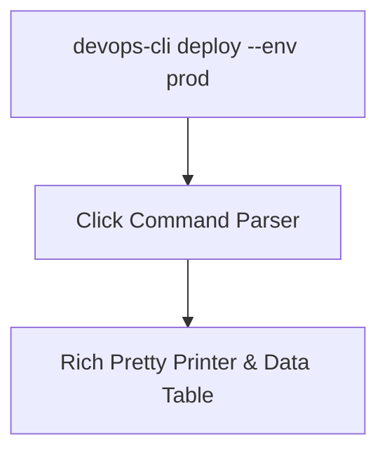
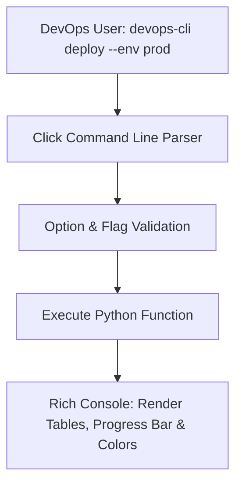

# 🐍 08.Building_CLI_Tools_for_DevOps: Xây Dựng Công Cụ CLI Chuyên Nghiệp (Click & Rich) - Python Chuyên Sâu Cho DevOps

> 💡 **Bản chất 1 câu**: Xây dựng công cụ dòng lệnh CLI chuyên nghiệp cho DevOps: `sys.argv`, `argparse`, `click` framework, định dạng màu sắc/bảng đẹp mắt với `rich` và đóng gói CLI tool.  
> 🎯 **Trọng tâm thực chiến DevOps**: Nắm vững tạo lệnh CLI sub-commands (`click.group`), tham số `--option`, `--flag`, hiển thị bảng Data Table, Progress Bar và Spinner đẹp mắt với `rich`.

---



---

## 2. 📚 Lý Thuyết Chuyên Sâu & Bản Sắc Hệ Thống (Under The Hood Architecture)

### 2.1 Kiến Trúc CLI Tool Với Framework Click & Rich (OBJ 8.1)



1. **`click` Framework**: Framework thiết kế CLI hiện đại bằng Decorators (`@click.group()`, `@click.command()`, `@click.option()`).
2. **`rich` Library**: Thư viện làm đẹp Terminal (Vẽ bảng `Table`, thanh tiến trình `Progress`, format mảng JSON màu sắc).


---

## 3. ⚡ Bảng Tra Cứu Khái Niệm & Hàm / Thư Viện Thực Hành (Reference Table)

| Công cụ / Hàm / Thư viện | Tham số / Module | Ý nghĩa bản chất | Ứng dụng thực tế DevOps |
| :--- | :--- | :--- | :--- |
| **`@click.command()`** | `Click Framework` | Biến một hàm Python thành một lệnh CLI | `@click.command()` |
| **`@click.option()`** | `Click Framework` | Thêm cờ tham số truyền vào (--env, --port) | `@click.option('--env', default='dev')` |
| **`rich.console`** | `Rich Library` | In văn bản màu sắc và định dạng phong phú | `console.print('[bold green]Success![/]')` |
| **`rich.table.Table`** | `Rich Library` | Vẽ bảng dữ liệu cực đẹp trên Terminal | `table.add_row('Server-1', 'UP')` |


---

## 4. 🛠 Thao Tác Thực Chiến & Kịch Bản DevOps Automation (Real-World Scenarios)

### 🛠 Các đoạn Script Python thực hành gõ là ăn ngay:
```python
import click
from rich.console import Console
from rich.table import Table

console = Console()

@click.group()
def cli():
    """DevOps Infrastructure CLI Tool"""
    pass

@cli.command()
@click.option('--env', default='staging', help='Environment to check')
def status(env):
    """Check infrastructure status"""
    console.print(f"[bold blue]Checking status for environment:[/] [yellow]{env}[/]")
    
    table = Table(title="Server Health Matrix")
    table.add_column("Host", style="cyan")
    table.add_column("Status", style="green")
    
    table.add_row(f"{env}-web-01", "RUNNING")
    table.add_row(f"{env}-db-01", "RUNNING")
    console.print(table)

if __name__ == '__main__':
    cli()

```

### 🚀 Kịch bản tự động hóa thực tế khi đi làm (Production DevOps Scripting):
Đóng gói công cụ CLI nội bộ của công ty (`devops-cli`) cho phép các kỹ sư dễ dàng gõ `devops-cli k8s scale --replicas 5` từ bất kỳ đâu.

---

## 5. 🚀 Bộ Câu Hỏi Phỏng Vấn DevOps Python Thực Tế (Interview Q&A)

> **Q: Tại sao nên chọn dùng framework `click` thay vì `argparse` mặc định khi viết CLI phức tạp?**  
> **A**: Vì `click` sử dụng Decorators giúp code gọn gàng, tự động tạo tài liệu `--help`, hỗ trợ lồng các sub-commands linh hoạt và dễ bảo trì hơn `argparse`.

> **Q: Thư viện `rich` cải thiện trải nghiệm người dùng (UX) trên Terminal như thế nào?**  
> **A**: `rich` giúp hiển thị màu sắc, chữ in đậm, vẽ bảng dữ liệu Table, thanh tiến trình Progress bar và định dạng JSON sắc nét trên Terminal.


---

## 6. 📝 Cheat Sheet Ghi Nhớ Nhanh (Summary)

- [x] click: Framework xây dựng CLI bằng Decorators
- [x] @click.option: Thêm tham số truyền vào
- [x] rich: Vẽ bảng & thanh progress đẹp mắt
- [x] Đóng gói CLI tool bằng setup.py

