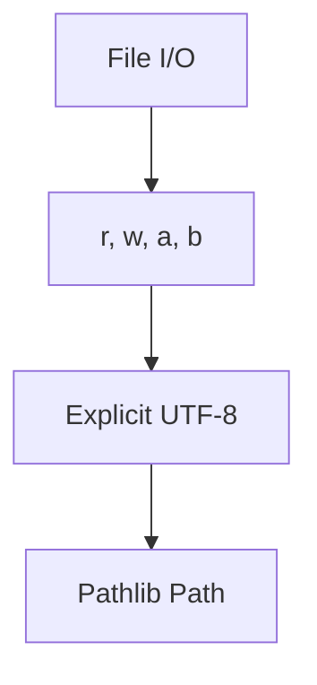
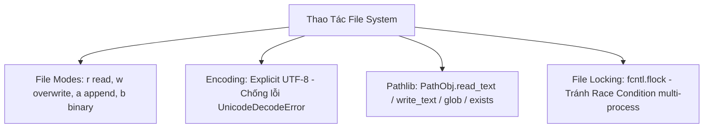

# 🐍 09.File_IO_and_Path_Management: Thao Tác File I/O, UTF-8 Encoding, Pathlib & File Locking - Giáo Trình Python DevOps Chuyên Sâu Cực Chi Tiết

> 💡 **Bản chất 1 câu**: Đọc ghi file production: `open()` modes (`r`, `w`, `a`, `b`), Encoding UTF-8, `pathlib.Path`, file tạm `tempfile` và khóa file `fcntl` tránh race-condition.  
> 🎯 **Trọng tâm thực chiến DevOps**: Nắm vững `open()` với context manager `with`, xử lý Encoding UTF-8 chuẩn xác, `pathlib.Path` đọc ghi nhanh `write_text()/read_text()`, và `fcntl.flock` khóa file.

---



---

## 2. 📚 Lý Thuyết Chuyên Sâu & Bản Chất Hệ Thống (Under The Hood Architecture)

### 2.1 Phân Tích Các Modes Đọc Ghi File & Module Pathlib (OBJ 9.1)



| File Mode | Hành vi khi mở file | Tạo file mới nếu chưa có? | Xóa sạch nội dung cũ? |
| :--- | :--- | :--- | :--- |
| **`r`** (Read) | Chỉ đọc dữ liệu | **KHÔNG** (Nổ FileNotFoundError) | KHÔNG |
| **`w`** (Write) | Chỉ ghi dữ liệu | **CÓ** | **CÓ (Ghi đè xóa sạch!)** |
| **`a`** (Append)| Ghi nối tiếp vào cuối | **CÓ** | KHÔNG (Giữ nguyên cũ) |
| **`rb` / `wb`** | Đọc/Ghi dữ liệu Nhị phân (Binary)| CÓ (với `wb`) | CÓ (với `wb`) |

---

### 2.2 An Toàn Mã Hóa Encoding & File Locking
Luôn luôn chỉ định rõ `encoding='utf-8'` khi gọi `open()` để tránh lỗi crash chương trình khi chuyển script từ Windows sang Linux Server.


---

## 3. ⚡ Bảng Tra Cứu Khái Niệm & Hàm / Thư Viện Thực Hành (Reference Table)

| Công cụ / Hàm / Thư viện | Tham số / Module | Ý nghĩa chi tiết bản chất | Ứng dụng thực tế DevOps |
| :--- | :--- | :--- | :--- |
| **`pathlib.Path`** | `Built-in Module` | Thao tác đường dẫn file/folder dạng Object | `p = Path('/var/log/app.log')` |
| **`write_text()`** | `Pathlib Method` | Ghi nhanh chuỗi văn bản vào file không cần open | `Path('file.txt').write_text('hello')` |
| **`tempfile`** | `Built-in Module` | Tạo file/folder tạm tự động xóa khi thoát | `with tempfile.NamedTemporaryFile() as tmp:` |
| **`fcntl.flock`** | `Linux Module` | Khóa file tránh xung đột ghi đè multi-process | `fcntl.flock(f, fcntl.LOCK_EX)` |


---

## 4. 🛠 Thao Tác Thực Chiến & Kịch Bản DevOps Automation (Real-World Production Scripts)

### 🛠 Các đoạn Script Python thực hành chuyên sâu gõ là ăn ngay:
```python
from pathlib import Path
import tempfile

# 1. Thao tác file hiện đại với Pathlib:
log_path = Path("/tmp/devops_app.log")

# Ghi văn bản UTF-8:
log_path.write_text("2026-08-04 INFO Deployment started
", encoding="utf-8")

# Đọc văn bản:
content = log_path.read_text(encoding="utf-8")
print(f"Log Content:
{content}")

# 2. Tạo File Tạm bằng tempfile:
with tempfile.NamedTemporaryFile(mode="w+", delete=True) as temp_file:
    temp_file.write("Temporary config data")
    temp_file.seek(0)
    print(f"Temp File Name: {temp_file.name}")
    print(f"Temp Content: {temp_file.read()}")

```

### 🚀 Kịch bản tự động hóa thực tế khi đi làm (Production DevOps Incident Playbook):
Script Python tự động quét tất cả các file trong `/etc/config/`, kiểm tra quyền file permission và ghi lại bản sao lưu mã hóa.

---

## 5. 🚀 Bộ Câu Hỏi Phỏng Vấn DevOps Python Thực Tế (Middle-Senior Interview Q&A)

> **Q: Tại sao BẮT BUỘC phải chỉ định tham số `encoding='utf-8'` khi mở file văn bản trong Python?**  
> **A**: Vì nếu không chỉ định, Python sẽ dùng Encoding mặc định của OS (như `cp1252` trên Windows hay `ANSI`), dẫn đến lỗi `UnicodeDecodeError` khi chạy script trên Linux Server.

> **Q: Ưu điểm của `Path.read_text()` và `Path.write_text()` trong `pathlib` là gì?**  
> **A**: Giúp đọc và ghi nhanh toàn bộ nội dung file chỉ trong 1 dòng code duy nhất mà không cần phải dùng cú pháp khối `with open(...)` thủ công.


---

## 6. 📝 Cheat Sheet Ghi Nhớ Nhanh (Summary)

- [x] open() modes: r (read), w (overwrite), a (append), b (binary)
- [x] BẮT BUỘC chỉ định encoding='utf-8'
- [x] pathlib Path: write_text() & read_text()
- [x] tempfile: Tự dọn dẹp file tạm

