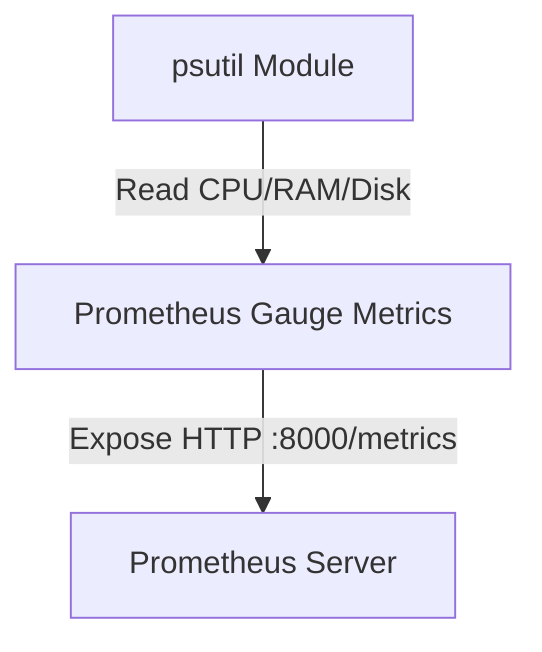
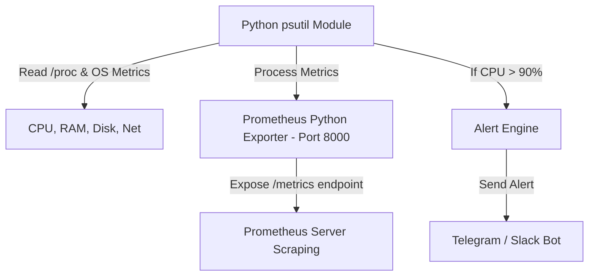

# 🐍 09.System_Monitoring_Metrics_and_Psutil: Giám Sát Hệ Thống, Thu Thập Metric & Prometheus - Python Chuyên Sâu Cho DevOps

> 💡 **Bản chất 1 câu**: Giám sát hiệu năng hệ thống với `psutil` (CPU, Memory, Disk, Network I/O), đẩy Metric sang Prometheus (`prometheus_client`) và cảnh báo qua Slack/Telegram.  
> 🎯 **Trọng tâm thực chiến DevOps**: Nắm vững `psutil.cpu_percent()`, `psutil.virtual_memory()`, `psutil.disk_usage()`, `psutil.net_io_counters()`, xuất Prometheus Gauges / Counters và cảnh báo ngưỡng.

---



---

## 2. 📚 Lý Thuyết Chuyên Sâu & Bản Sắc Hệ Thống (Under The Hood Architecture)

### 2.1 Kiến Trúc Metric Collection & Exporter Sang Prometheus (OBJ 9.1)



1. **`psutil` (Python System and Process Utilities)**: Thư viện cross-platform truy xuất trực tiếp chỉ số tài nguyên phần cứng và các tiến trình đang chạy.
2. **Prometheus Client (`prometheus_client`)**:
   - **Gauge**: Metric có thể tăng/giảm (VD: RAM usage, CPU percent).
   - **Counter**: Metric chỉ có tăng (VD: Tổng số HTTP requests, Total Errors).


---

## 3. ⚡ Bảng Tra Cứu Khái Niệm & Hàm / Thư Viện Thực Hành (Reference Table)

| Công cụ / Hàm / Thư viện | Tham số / Module | Ý nghĩa bản chất | Ứng dụng thực tế DevOps |
| :--- | :--- | :--- | :--- |
| **`psutil.cpu_percent`** | `Psutil Module` | Đo phần trăm sử dụng CPU trong khoảng thời gian | `psutil.cpu_percent(interval=1)` |
| **`psutil.virtual_memory`** | `Psutil Module` | Đo dung lượng RAM used, free, percent | `mem = psutil.virtual_memory()` |
| **`Gauge`** | `Prometheus` | Loại metric có thể tăng hoặc giảm | `g = Gauge('cpu_usage', 'CPU %')` |
| **`start_http_server`** | `Prometheus` | Khởi tạo HTTP server xuất metric cho Prometheus scrape | `start_http_server(8000)` |


---

## 4. 🛠 Thao Tác Thực Chiến & Kịch Bản DevOps Automation (Real-World Scenarios)

### 🛠 Các đoạn Script Python thực hành gõ là ăn ngay:
```python
import psutil
from prometheus_client import start_http_server, Gauge
import time

# Khai báo Prometheus Gauges:
CPU_GAUGE = Gauge('system_cpu_usage_percent', 'Current CPU usage in percent')
RAM_GAUGE = Gauge('system_ram_usage_percent', 'Current RAM usage in percent')

if __name__ == '__main__':
    # Khởi chạy Prometheus Metric Server ở Port 8000:
    start_http_server(8000)
    print("[OK] Prometheus Exporter running on port 8000...")
    
    while True:
        cpu = psutil.cpu_percent(interval=1)
        ram = psutil.virtual_memory().percent
        
        CPU_GAUGE.set(cpu)
        RAM_GAUGE.set(ram)
        
        if cpu > 90:
            print(f"[HIGH CPU ALERT] CPU is at {cpu}%!")
        time.sleep(5)

```

### 🚀 Kịch bản tự động hóa thực tế khi đi làm (Production DevOps Scripting):
Viết custom Exporter bằng Python để thu thập chỉ số queue của hệ thống RabbitMQ/Redis và đẩy sang Prometheus + Grafana Dashboard.

---

## 5. 🚀 Bộ Câu Hỏi Phỏng Vấn DevOps Python Thực Tế (Interview Q&A)

> **Q: Sự khác biệt giữa metric kiểu Counter và Gauge trong Prometheus là gì?**  
> **A**: Counter là metric chỉ có tăng dần lên (như tổng số lượt request/lỗi). Gauge là metric có thể tăng hoặc giảm linh hoạt theo thời gian (như phần trăm CPU, dung lượng RAM).

> **Q: Thư viện `psutil` lấy dữ liệu chỉ số tài nguyên trên Linux từ đâu?**  
> **A**: `psutil` đọc và bóc tách trực tiếp dữ liệu từ các file system ảo `/proc` (như `/proc/stat`, `/proc/meminfo`) và `/sys` của Linux Kernel.


---

## 6. 📝 Cheat Sheet Ghi Nhớ Nhanh (Summary)

- [x] psutil: Thu thập CPU, RAM, Disk, Network metrics
- [x] Prometheus Gauge: Metric tăng/giảm (RAM/CPU)
- [x] Prometheus Counter: Metric chỉ tăng (Requests count)
- [x] Expose HTTP /metrics port 8000

