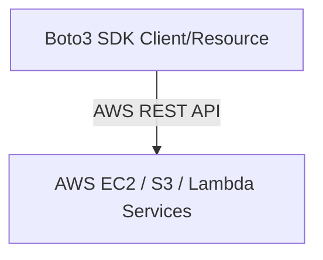
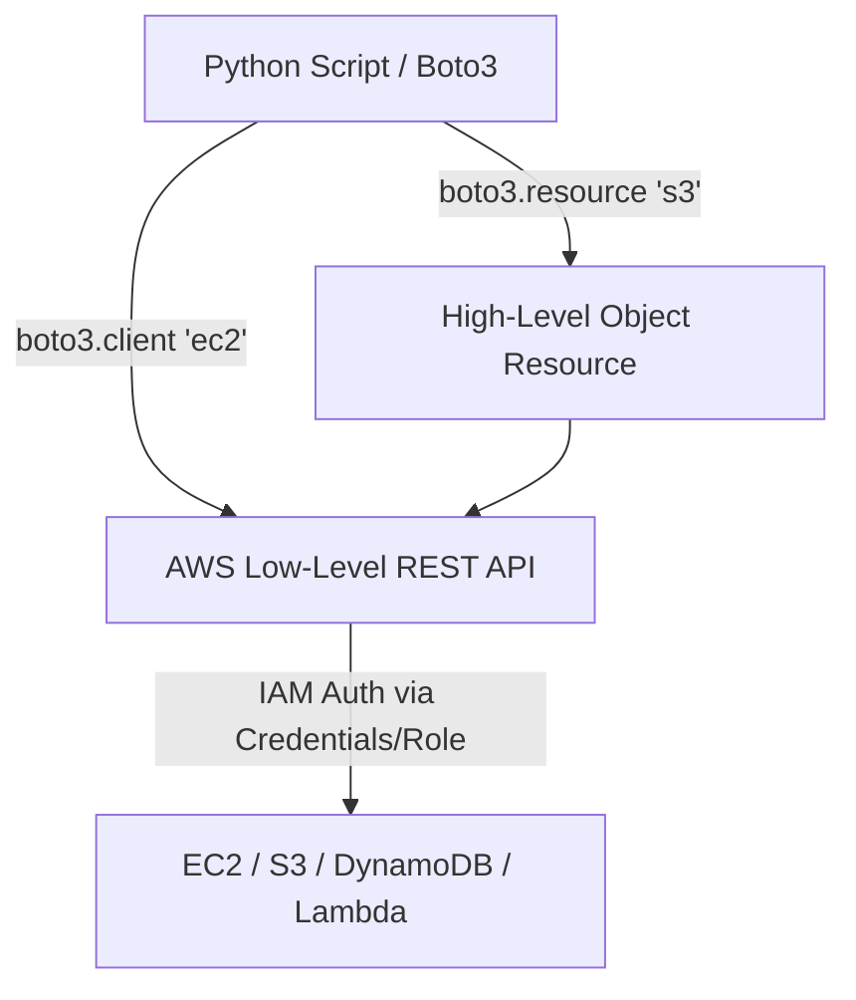

# 🐍 10.Cloud_Automation_with_Boto3_AWS: Tự Động Hóa Đám Mây AWS Với Boto3 SDK - Python Chuyên Sâu Cho DevOps

> 💡 **Bản chất 1 câu**: Tự động hóa điện toán đám mây AWS bằng `boto3` SDK: Quản lý EC2 (start/stop/terminate/tag), S3 Objects (upload/download/presigned URL), IAM Audits, DynamoDB và AWS Lambda Handlers.  
> 🎯 **Trọng tâm thực chiến DevOps**: Nắm vững `boto3.client()` (Low-level 1-1 với AWS API) vs `boto3.resource()` (High-level OOP), Paginators xử lý danh sách lớn, error handling `ClientError` và Lambda Python event/context.

---



---

## 2. 📚 Lý Thuyết Chuyên Sâu & Bản Sắc Hệ Thống (Under The Hood Architecture)

### 2.1 Kiến Trúc AWS Boto3 SDK Client vs Resource (OBJ 10.1)



1. **`boto3.client('service')`**: Trả về dữ liệu dạng Python Dictionary thuần túy. Hỗ trợ 100% tất cả các API của AWS.
2. **`boto3.resource('service')`**: Trả về các Đối tượng hướng đối tượng (OOP Objects), cho phép gọi hàm trực tiếp `bucket.upload_file()`.
3. **AWS Paginators**: Tự động duyệt qua hàng ngàn tài nguyên khi kết quả bị phân trang (Truncated).


---

## 3. ⚡ Bảng Tra Cứu Khái Niệm & Hàm / Thư Viện Thực Hành (Reference Table)

| Công cụ / Hàm / Thư viện | Tham số / Module | Ý nghĩa bản chất | Ứng dụng thực tế DevOps |
| :--- | :--- | :--- | :--- |
| **`boto3.client`** | `AWS SDK` | Tạo client tương tác API AWS dạng Low-level Dict | `ec2 = boto3.client('ec2')` |
| **`boto3.resource`** | `AWS SDK` | Tạo resource tương tác AWS dạng High-level OOP | `s3 = boto3.resource('s3')` |
| **`get_paginator`** | `AWS SDK` | Duyệt qua danh sách tài nguyên lớn bị phân trang | `paginator = client.get_paginator('list_objects_v2')` |
| **`ClientError`** | `AWS Exception` | Bắt lỗi phản hồi từ phía AWS API | `except ClientError as e:` |


---

## 4. 🛠 Thao Tác Thực Chiến & Kịch Bản DevOps Automation (Real-World Scenarios)

### 🛠 Các đoạn Script Python thực hành gõ là ăn ngay:
```python
import boto3
from botocore.exceptions import ClientError

s3_client = boto3.client('s3', region_name='us-east-1')

def upload_backup(file_name: str, bucket: str):
    try:
        s3_client.upload_file(file_name, bucket, file_name)
        print(f"[OK] Uploaded {file_name} to s3://{bucket}")
    except ClientError as e:
        print(f"[AWS ERROR] {e.response['Error']['Message']}")

if __name__ == '__main__':
    # Upload file backup:
    upload_backup("db_backup.sql", "my-company-devops-backups")

```

### 🚀 Kịch bản tự động hóa thực tế khi đi làm (Production DevOps Scripting):
Viết AWS Lambda Function bằng Python tự động dừng (Stop) tất cả các máy chủ EC2 môi trường Development vào 20h00 tối mỗi ngày để tiết kiệm chi phí.

---

## 5. 🚀 Bộ Câu Hỏi Phỏng Vấn DevOps Python Thực Tế (Interview Q&A)

> **Q: Sự khác nhau giữa `boto3.client()` và `boto3.resource()` trong Boto3 là gì?**  
> **A**: `boto3.client()` là giao diện Low-level tương ứng 1-1 với AWS REST API, trả về Dictionary. `boto3.resource()` là giao diện High-level OOP sinh động hơn nhưng không hỗ trợ 100% dịch vụ.

> **Q: Làm thế nào để xử lý an toàn khi danh sách tài nguyên AWS (như S3 objects hay EC2 instances) vượt quá 1000 phần tử?**  
> **A**: Sử dụng **Paginators** (`client.get_paginator()`) để Boto3 tự động lặp qua tất cả các trang kết quả mà không bị trôi sót dữ liệu.


---

## 6. 📝 Cheat Sheet Ghi Nhớ Nhanh (Summary)

- [x] boto3.client: Low-level API (Dict)
- [x] boto3.resource: High-level OOP
- [x] Paginators: Duyệt qua hàng ngàn tài nguyên AWS
- [x] AWS Lambda: Python handler (event, context)

