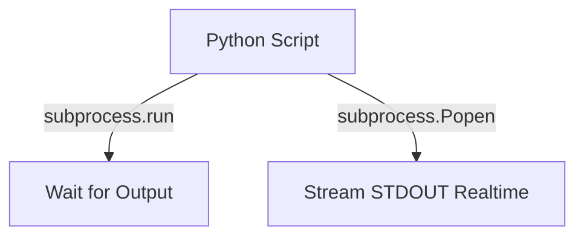
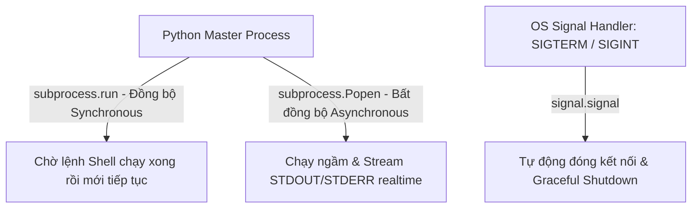

# 🐍 10.OS_Integration_and_Subprocess: Tự Động Hóa OS, Subprocess, Signal Handling & Environment Variables - Giáo Trình Python DevOps Chuyên Sâu Cực Chi Tiết

> 💡 **Bản chất 1 câu**: Gọi lệnh hệ điều hành Linux/Windows chuyên sâu: `os`, `sys`, `shutil`, `glob`, `subprocess.run`, `subprocess.Popen`, bắt STDOUT/STDERR, và xử lý tín hiệu OS `signal`.  
> 🎯 **Trọng tâm thực chiến DevOps**: Nắm vững `subprocess.run()` vs `subprocess.Popen()` luồng dữ liệu realtime, xử lý tín hiệu `SIGTERM`/`SIGINT`, đọc/ghi biến môi trường `os.environ`.

---



---

## 2. 📚 Lý Thuyết Chuyên Sâu & Bản Chất Hệ Thống (Under The Hood Architecture)

### 2.1 Phân Tích Subprocess Run vs Popen & Signal Handling (OBJ 10.1)



1. **`subprocess.run()`**: Dùng cho các lệnh chạy ngắn (Short-lived commands). Script dừng chờ lệnh chạy xong rồi lấy kết quả.
2. **`subprocess.Popen()`**: Dùng cho các lệnh chạy lâu (Long-running processes). Cho phép đọc luồng dữ liệu STDOUT realtime từng dòng khi lệnh đang chạy.
3. **`signal.signal(signal.SIGTERM, handler)`**: Bắt tín hiệu ngắt từ Linux Kernel (`kill` hoặc `Ctrl+C`) để thực hiện **Graceful Shutdown** dọn dẹp tài nguyên trước khi thoát.


---

## 3. ⚡ Bảng Tra Cứu Khái Niệm & Hàm / Thư Viện Thực Hành (Reference Table)

| Công cụ / Hàm / Thư viện | Tham số / Module | Ý nghĩa chi tiết bản chất | Ứng dụng thực tế DevOps |
| :--- | :--- | :--- | :--- |
| **`subprocess.run`** | `Subprocess` | Chạy lệnh shell đồng bộ và bắt kết quả | `subprocess.run(['df', '-h'], capture_output=True)` |
| **`subprocess.Popen`** | `Subprocess` | Chạy lệnh ngầm bất đồng bộ & stream output realtime | `proc = subprocess.Popen(['ping', '8.8.8.8'], stdout=subprocess.PIPE)` |
| **`signal.signal`** | `Built-in Module` | Bắt và xử lý tín hiệu Linux OS (SIGTERM/SIGINT) | `signal.signal(signal.SIGINT, shutdown_handler)` |
| **`sys.exit()`** | `Sys Module` | Thoát chương trình Python với mã lỗi Exit Code | `sys.exit(1)` |


---

## 4. 🛠 Thao Tác Thực Chiến & Kịch Bản DevOps Automation (Real-World Production Scripts)

### 🛠 Các đoạn Script Python thực hành chuyên sâu gõ là ăn ngay:
```python
import subprocess
import signal
import sys
import time

# Xử lý Graceful Shutdown khi nhận tín hiệu SIGINT (Ctrl+C):
def graceful_shutdown(signum, frame):
    print("
[SIGNAL] Received termination signal. Cleaning up...")
    sys.exit(0)

signal.signal(signal.SIGINT, graceful_shutdown)

# Chạy lệnh Stream Output realtime với Popen:
print("Streaming ping command realtime...")
process = subprocess.Popen(["ping", "-c", "3", "8.8.8.8"], stdout=subprocess.PIPE, text=True)

for line in process.stdout:
    print(f"[PING OUTPUT] {line.strip()}")

process.wait()
print(f"Process finished with returncode: {process.returncode}")

```

### 🚀 Kịch bản tự động hóa thực tế khi đi làm (Production DevOps Incident Playbook):
Script Python tự động lắng nghe tín hiệu `SIGTERM` từ Docker/Kubernetes để thực hiện dọn dẹp tạm ngưng nhận traffic trước khi Pod bị xoá hoàn toàn.

---

## 5. 🚀 Bộ Câu Hỏi Phỏng Vấn DevOps Python Thực Tế (Middle-Senior Interview Q&A)

> **Q: Khi nào bắt buộc phải dùng `subprocess.Popen()` thay vì `subprocess.run()`?**  
> **A**: Khi cần chạy một lệnh tốn thời gian dài (như build Docker image hay rsync dữ liệu lớn) và muốn đọc/hiển thị luồng dữ liệu STDOUT/STDERR realtime từng dòng thay vì chờ lệnh chạy xong.

> **Q: Graceful Shutdown có ý nghĩa như thế nào đối với các ứng dụng Python chạy trên Kubernetes?**  
> **A**: Giúp ứng dụng bắt tín hiệu `SIGTERM` từ K8s để hoàn tất các request đang xử lý dở, đóng kết nối DB và dọn dẹp tài nguyên trước khi bị ngắt hẳn bởi `SIGKILL`.


---

## 6. 📝 Cheat Sheet Ghi Nhớ Nhanh (Summary)

- [x] subprocess.run: Chạy lệnh đồng bộ
- [x] subprocess.Popen: Stream STDOUT realtime lệnh dài
- [x] signal.signal: Graceful shutdown bắt SIGTERM/SIGINT
- [x] sys.exit(code): Trả về Exit Code cho OS

