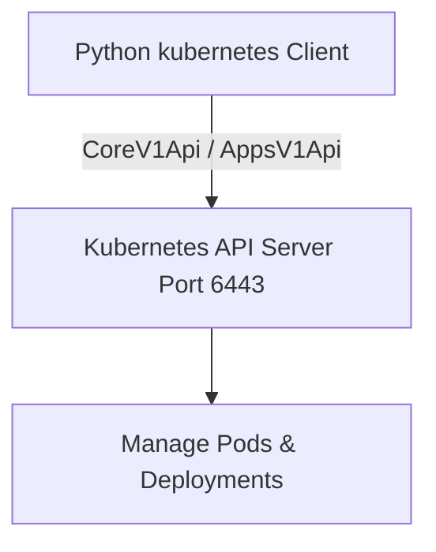
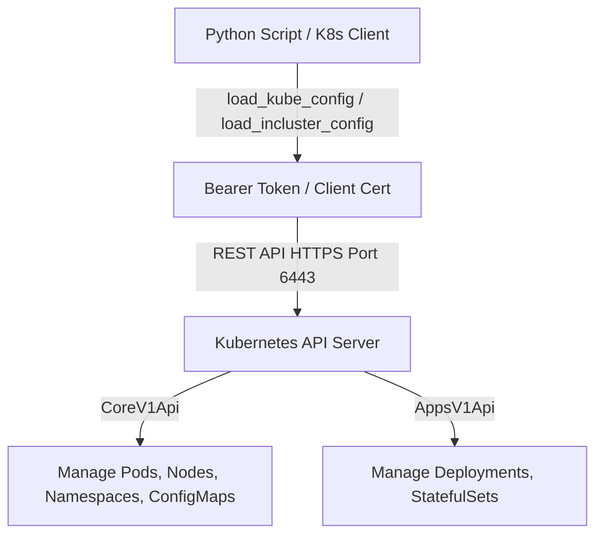

# 🐍 11.Container_and_Kubernetes_Automation: Tự Động Hóa Container Docker & Kubernetes Client - Python Chuyên Sâu Cho DevOps

> 💡 **Bản chất 1 câu**: Tự động hóa Container & Kubernetes bằng Python: Docker SDK (`docker` module), Kubernetes Python Client (`kubernetes`), quản lý Pods, Deployments, Services, Kubeconfig và In-Cluster Auth.  
> 🎯 **Trọng tâm thực chiến DevOps**: Nắm vững `docker.from_env()`, `config.load_kube_config()` vs `config.load_incluster_config()`, `CoreV1Api()`, `AppsV1Api()`, theo dõi Pod logs real-time và custom Kubernetes Controllers.

---



---

## 2. 📚 Lý Thuyết Chuyên Sâu & Bản Sắc Hệ Thống (Under The Hood Architecture)

### 2.1 Kiến Trúc Tương Tác Kubernetes API Server Với Python Client (OBJ 11.1)



1. **In-Cluster vs Kubeconfig Auth**:
   - `config.load_kube_config()`: Dùng khi chạy script từ máy local (Đọc `~/.kube/config`).
   - `config.load_incluster_config()`: Dùng khi chạy script bên trong một Pod nằm trong Kubernetes Cluster (Dùng ServiceAccount Token).
2. **`kubernetes.client.CoreV1Api()`**: Quản lý Pods, Services, Namespaces, Nodes.
3. **`kubernetes.client.AppsV1Api()`**: Quản lý Deployments, DaemonSets, StatefulSets.


---

## 3. ⚡ Bảng Tra Cứu Khái Niệm & Hàm / Thư Viện Thực Hành (Reference Table)

| Công cụ / Hàm / Thư viện | Tham số / Module | Ý nghĩa bản chất | Ứng dụng thực tế DevOps |
| :--- | :--- | :--- | :--- |
| **`docker.from_env`** | `Docker SDK` | Khởi tạo Docker Client kết nối tới Docker Daemon local | `client = docker.from_env()` |
| **`load_kube_config`** | `K8s Client` | Nạp cấu hình xác thực Kubernetes từ file ~/.kube/config | `config.load_kube_config()` |
| **`CoreV1Api`** | `K8s Client` | API client quản lý Pods, Services, Namespaces, Nodes | `v1 = client.CoreV1Api()` |
| **`AppsV1Api`** | `K8s Client` | API client quản lý Deployments và ReplicaSets | `apps_v1 = client.AppsV1Api()` |


---

## 4. 🛠 Thao Tác Thực Chiến & Kịch Bản DevOps Automation (Real-World Scenarios)

### 🛠 Các đoạn Script Python thực hành gõ là ăn ngay:
```python
from kubernetes import client, config

# Nạp cấu hình Kubeconfig:
config.load_kube_config()

v1 = client.CoreV1Api()
print("--- Listing Pods in Default Namespace ---")

# Duyệt danh sách Pods:
ret = v1.list_namespaced_pod(namespace="default")
for i in ret.items:
    print(f"Pod: {i.metadata.name} | IP: {i.status.pod_ip} | Status: {i.status.phase}")

```

### 🚀 Kịch bản tự động hóa thực tế khi đi làm (Production DevOps Scripting):
Viết một Kubernetes Custom Controller bằng Python tự động quét tất cả các Pods bị trạng thái `CrashLoopBackOff` và gửi cảnh báo kèm 50 dòng log cuối về Slack.

---

## 5. 🚀 Bộ Câu Hỏi Phỏng Vấn DevOps Python Thực Tế (Interview Q&A)

> **Q: Khi nào nên dùng `load_incluster_config()` thay vì `load_kube_config()` trong Python Kubernetes Client?**  
> **A**: Dùng `load_incluster_config()` khi script Python được đóng gói thành Container và chạy trực tiếp như một Pod bên trong Kubernetes Cluster, sử dụng ServiceAccount Token được mount sẵn.

> **Q: API Class nào trong thư viện `kubernetes` được dùng để quản lý Deployment và StatefulSet?**  
> **A**: Class **`client.AppsV1Api()`** (Trong khi `client.CoreV1Api()` dùng quản lý Pods, Services, Nodes).


---

## 6. 📝 Cheat Sheet Ghi Nhớ Nhanh (Summary)

- [x] Docker SDK: docker.from_env()
- [x] K8s load_kube_config: Chạy từ local
- [x] K8s load_incluster_config: Chạy bên trong Pod
- [x] CoreV1Api: Manage Pods/Services
- [x] AppsV1Api: Manage Deployments

