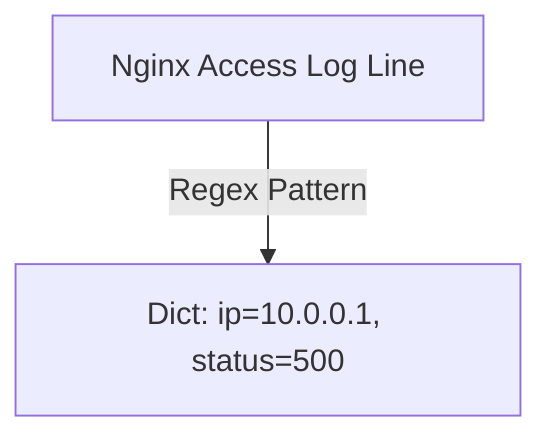

# 🐍 11.Regular_Expressions_and_Log_Parsing: Biểu Thức Chính Quy Regular Expressions & Log Parsing Sâu - Giáo Trình Python DevOps Chuyên Sâu Cực Chi Tiết

> 💡 **Bản chất 1 câu**: Phân tích cú pháp văn bản & Log Parsing chuyên sâu: Module `re` (`compile`, `search`, `match`, `findall`, `finditer`, `sub`), Lookahead/Lookbehind, Named Groups `(?P<name>...)` và Log Analyzer.  
> 🎯 **Trọng tâm thực chiến DevOps**: Nắm vững Regex Metacharacters, Quantifiers (`*`, `+`, `?`, `{m,n}`), Named Groups, Lookaround Assertions, và tối ưu hiệu năng log parser.

---



---

## 2. 📚 Lý Thuyết Chuyên Sâu & Bản Chất Hệ Thống (Under The Hood Architecture)

### 2.1 Phân Tích Cú Pháp Lookaround & Named Groups In Regex (OBJ 11.1)

```mermaid
graph TD
    RawLog[Raw Syslog / Nginx Log Line] -->|re.compile Pattern| RegexEngine[Regex Engine with Named Groups]
    RegexEngine -->|Extract Named Groups| Dict[Dict: ip=10.0.0.1, status=500, user=admin]
    
    subgraph Advanced Lookaround Assertions
        PositiveLookahead[Positive Lookahead: (?=pattern) - Khớp nếu đằng sau có...]
        NegativeLookahead[Negative Lookahead: (?!pattern) - Khớp nếu đằng sau KHÔNG có...]
    end
```

```python
# Named Group Pattern chuyên sâu cho Nginx Access Log:
LOG_PATTERN = re.compile(
    r'(?P<ip>\d{1,3}\.\d{1,3}\.\d{1,3}\.\d{1,3})\s+-\s+-\s+\['
    r'(?P<timestamp>.*?)\]\s+"(?P<method>GET|POST|PUT|DELETE)\s+'
    r'(?P<url>\S+)\s+HTTP/.*?"\s+(?P<status>\d{3})\s+(?P<bytes>\d+)'
)
```
- **`re.finditer()`**: Duyệt lặp qua từng kết quả match dưới dạng Iterator, tiết kiệm RAM tuyệt đối khi file log có hàng triệu bản ghi.


---

## 3. ⚡ Bảng Tra Cứu Khái Niệm & Hàm / Thư Viện Thực Hành (Reference Table)

| Công cụ / Hàm / Thư viện | Tham số / Module | Ý nghĩa chi tiết bản chất | Ứng dụng thực tế DevOps |
| :--- | :--- | :--- | :--- |
| **`re.compile`** | `Regex Module` | Biên dịch pattern trước giúp tăng tốc độ lặp | `pattern = re.compile(r'\d+\.\d+\.\d+\.\d+')` |
| **`re.finditer`** | `Regex Module` | Trả về Iterator các Match object tiết kiệm bộ nhớ | `for match in pattern.finditer(text):` |
| **`re.sub`** | `Regex Module` | Thay thế chuỗi khớp pattern bằng chuỗi mới | `clean_text = re.sub(r'password=\w+', 'password=***', text)` |
| **`Named Groups`** | `Regex Syntax` | Đặt tên nhãn cho group xuất ra Dictionary | `(?P<ip>\d+\.\d+\.\d+\.\d+)` |


---

## 4. 🛠 Thao Tác Thực Chiến & Kịch Bản DevOps Automation (Real-World Production Scripts)

### 🛠 Các đoạn Script Python thực hành chuyên sâu gõ là ăn ngay:
```python
import re

# File log giả lập:
log_data = """
192.168.1.1 - - [04/Aug/2026:10:00:01] "GET /api/v1/users HTTP/1.1" 200 1024
10.0.0.50 - - [04/Aug/2026:10:00:02] "POST /api/v1/login HTTP/1.1" 500 512
172.16.0.2 - - [04/Aug/2026:10:00:03] "GET /health HTTP/1.1" 200 128
"""

log_pattern = re.compile(
    r'(?P<ip>\d+\.\d+\.\d+\.\d+) - - \[(?P<time>.*?)\] "(?P<method>\w+) (?P<url>\S+) .*?" (?P<status>\d+)'
)

# Duyệt từng match với finditer:
for match in log_pattern.finditer(log_data):
    info = match.groupdict()
    if info['status'].startswith('5'):
        print(f"[ALERT 5XX ERROR] IP: {info['ip']} | URL: {info['url']} | Time: {info['time']}")

```

### 🚀 Kịch bản tự động hóa thực tế khi đi làm (Production DevOps Incident Playbook):
Script Python tự động lọc file log ứng dụng, ẩn (Mask/Redact) tất cả các thông tin nhạy cảm như số thẻ credit card hay API keys trước khi đẩy log lên SIEM.

---

## 5. 🚀 Bộ Câu Hỏi Phỏng Vấn DevOps Python Thực Tế (Middle-Senior Interview Q&A)

> **Q: Tại sao nên dùng `re.finditer()` thay vì `re.findall()` khi phân tích file log lớn?**  
> **A**: `re.findall()` gom toàn bộ kết quả vào một List trên RAM gây tốn bộ nhớ. `re.finditer()` trả về từng Match object dưới dạng Iterator, xử lý tới đâu giải phóng RAM tới đó.

> **Q: Ý nghĩa của kỹ thuật Regex Masking bằng `re.sub()` trong DevSecOps là gì?**  
> **A**: Giúp tự động tìm kiếm và ghi đè các thông tin nhạy cảm (như mật khẩu, token, PII) bằng chuỗi `***` để tuân thủ quy định GDPR/PCI-DSS trước khi ghi log.


---

## 6. 📝 Cheat Sheet Ghi Nhớ Nhanh (Summary)

- [x] re.compile: Biên dịch trước pattern tăng tốc
- [x] re.finditer: Iterator tiết kiệm RAM cho log lớn
- [x] re.sub: Tìm và thay thế (dùng mask PII/Secrets)
- [x] Named Groups (?P<name>...): Bóc log ra Dict

