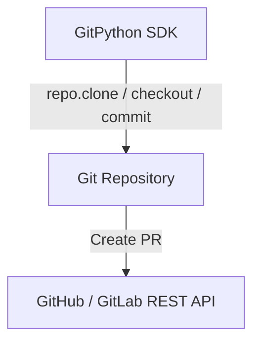
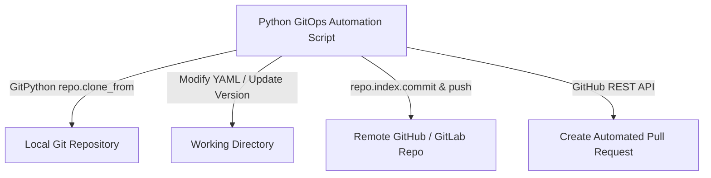

# 🐍 12.CI_CD_Pipeline_and_Git_Automation: Tự Động Hóa Git & CI/CD Pipeline Với Python - Python Chuyên Sâu Cho DevOps

> 💡 **Bản chất 1 câu**: Tự động hóa Version Control và CI/CD với `GitPython` (clone, commit, push, checkout branch, diff), tự động tạo Release Notes, Semantic Versioning (`semver`) và GitHub/GitLab API.  
> 🎯 **Trọng tâm thực chiến DevOps**: Nắm vững `git.Repo()`, tự động hóa GitOps Workflow (tạo branch mới, sửa file config, commit và push), quét Git commit tìm Secrets bị lộ.

---



---

## 2. 📚 Lý Thuyết Chuyên Sâu & Bản Sắc Hệ Thống (Under The Hood Architecture)

### 2.1 Kiến Trúc Tự Động Hóa GitOps Với GitPython & GitHub API (OBJ 12.1)



1. **`git.Repo.clone_from(url, path)`**: Clone kho mã nguồn Git từ xa về máy local.
2. **GitOps Automation**: Tự động hóa quá trình đồng bộ trạng thái cấu hình giữa Git và Kubernetes Cluster.


---

## 3. ⚡ Bảng Tra Cứu Khái Niệm & Hàm / Thư Viện Thực Hành (Reference Table)

| Công cụ / Hàm / Thư viện | Tham số / Module | Ý nghĩa bản chất | Ứng dụng thực tế DevOps |
| :--- | :--- | :--- | :--- |
| **`git.Repo`** | `GitPython` | Khởi tạo đối tượng thao tác với Git Repository local | `repo = git.Repo('/path/to/repo')` |
| **`repo.git.checkout`** | `GitPython` | Chuyển đổi nhánh Git Branch | `repo.git.checkout('-b', 'feature-v2')` |
| **`repo.index.commit`** | `GitPython` | Tạo commit mới lưu vào lịch sử Git | `repo.index.commit('auto: update version')` |
| **`semver`** | `Library` | Phân tích và nâng cấp phiên bản Semantic Versioning | `ver = semver.VersionInfo.parse('1.2.0')` |


---

## 4. 🛠 Thao Tác Thực Chiến & Kịch Bản DevOps Automation (Real-World Scenarios)

### 🛠 Các đoạn Script Python thực hành gõ là ăn ngay:
```python
import git
import os

repo_dir = "/tmp/my_infrastructure_repo"
repo_url = "https://github.com/my-org/infra-live.git"

# Clone hoặc open repo:
if not os.path.exists(repo_dir):
    repo = git.Repo.clone_from(repo_url, repo_dir)
else:
    repo = git.Repo(repo_dir)

# Tạo branch mới và commit:
repo.git.checkout('-b', 'auto-update-manifests')
# Thêm tất cả thay đổi:
repo.git.add(update=True)
repo.index.commit("chore(config): auto-update image tags from CI/CD")
print("[OK] Git commit created successfully!")

```

### 🚀 Kịch bản tự động hóa thực tế khi đi làm (Production DevOps Scripting):
Script Python tự động quét tất cả các kho mã nguồn Git trong Org của công ty để tìm kiếm các API Keys / Hardcoded Passwords lỡ bị commit trót dại.

---

## 5. 🚀 Bộ Câu Hỏi Phỏng Vấn DevOps Python Thực Tế (Interview Q&A)

> **Q: Tư tưởng cốt lõi của GitOps trong tự động hóa hạ tầng là gì?**  
> **A**: GitOps coi **Git Repository là nguồn sự thật duy nhất (Single Source of Truth)**. Mọi thay đổi hạ tầng đều phải được thực hiện thông qua Git Commit/Pull Request và tự động hóa đồng bộ xuống hạ tầng.

> **Q: Thư viện `GitPython` hỗ trợ những thao tác Git cơ bản nào?**  
> **A**: Hỗ trợ đầy đủ clone, checkout branch, add, commit, push, pull, xem git diff, git log và quản lý tags.


---

## 6. 📝 Cheat Sheet Ghi Nhớ Nhanh (Summary)

- [x] GitPython: git.Repo('/path')
- [x] GitOps: Git là Single Source of Truth
- [x] semver: Quản lý phiên bản Major.Minor.Patch
- [x] Auto-generate Release Notes

