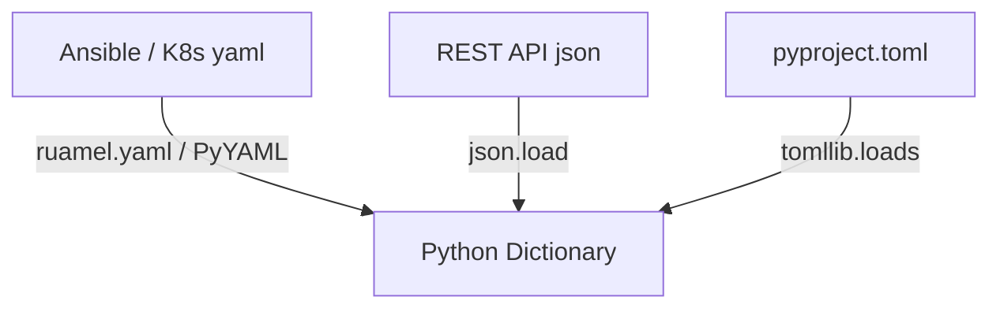
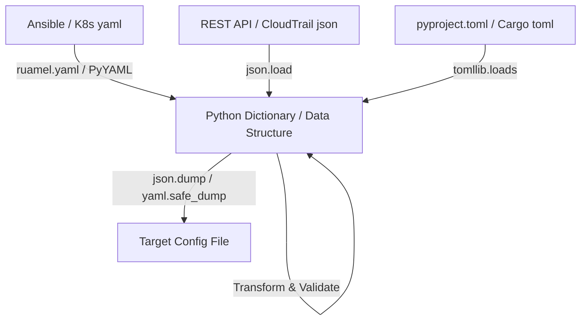

# 🐍 12.Data_Formats_JSON_YAML_CSV_TOML: Xử Lý Định Dạng Dữ Liệu Config: JSON, YAML, CSV & TOML - Giáo Trình Python DevOps Chuyên Sâu Cực Chi Tiết

> 💡 **Bản chất 1 câu**: Đọc ghi và chuyển đổi cấu hình chuyên sâu: `json` (Custom Encoders), `yaml` (`PyYAML` & `ruamel.yaml` giữ nguyên comment), `csv` (`DictReader`/`DictWriter`), và `tomllib` (Python 3.11+).  
> 🎯 **Trọng tâm thực chiến DevOps**: Nắm vững `json.JSONEncoder`, `yaml.safe_load/safe_dump`, giữ nguyên định dạng comment trong YAML với `ruamel.yaml`, đọc ghi file CSV báo cáo tài nguyên.

---



---

## 2. 📚 Lý Thuyết Chuyên Sâu & Bản Chất Hệ Thống (Under The Hood Architecture)

### 2.1 Kiến Trúc Chuyển Đổi Dữ Liệu Config Trong DevOps (OBJ 12.1)



1. **`PyYAML` vs `ruamel.yaml`**: `PyYAML` xóa sạch toàn bộ các câu comment (`# comment`) khi load và dump lại file. `ruamel.yaml` bảo toàn 100% các câu comment trong file YAML gốc!
2. **`tomllib` (Built-in từ Python 3.11)**: Module chuẩn hóa việc đọc các file cấu hình định dạng TOML (`pyproject.toml`).


---

## 3. ⚡ Bảng Tra Cứu Khái Niệm & Hàm / Thư Viện Thực Hành (Reference Table)

| Công cụ / Hàm / Thư viện | Tham số / Module | Ý nghĩa chi tiết bản chất | Ứng dụng thực tế DevOps |
| :--- | :--- | :--- | :--- |
| **`yaml.safe_load`** | `PyYAML` | Đọc file YAML an toàn tuyệt đối chống RCE | `data = yaml.safe_load(f)` |
| **`json.JSONEncoder`** | `JSON Module` | Custom class mã hóa các đối tượng phức tạp (Datetime, Set) sang JSON | `class CustomEncoder(json.JSONEncoder):` |
| **`csv.DictWriter`** | `CSV Module` | Ghi dữ liệu từ Dictionary ra file CSV có header | `writer = csv.DictWriter(f, fieldnames=keys)` |
| **`tomllib.loads`** | `TOML Module` | Parse chuỗi TOML thành Python Dict (Python 3.11+) | `config = tomllib.loads(toml_str)` |


---

## 4. 🛠 Thao Tác Thực Chiến & Kịch Bản DevOps Automation (Real-World Production Scripts)

### 🛠 Các đoạn Script Python thực hành chuyên sâu gõ là ăn ngay:
```python
import json
import yaml
from datetime import datetime

# Custom JSON Encoder cho đối tượng Datetime:
class DateTimeEncoder(json.JSONEncoder):
    def default(self, obj):
        if isinstance(obj, datetime):
            return obj.isoformat()
        return super().default(obj)

payload = {
    "service": "user-api",
    "timestamp": datetime.now(),
    "status": "UP"
}

# Chuyển đổi sang JSON String với Custom Encoder:
json_data = json.dumps(payload, cls=DateTimeEncoder, indent=2)
print("--- Custom Encoded JSON ---")
print(json_data)

```

### 🚀 Kịch bản tự động hóa thực tế khi đi làm (Production DevOps Incident Playbook):
Script Python tự động đọc file `docker-compose.yml`, chuyển đổi toàn bộ cấu hình sang định dạng Kubernetes Manifests YAML và xuất báo cáo CSV.

---

## 5. 🚀 Bộ Câu Hỏi Phỏng Vấn DevOps Python Thực Tế (Middle-Senior Interview Q&A)

> **Q: Tại sao khi làm việc với file YAML cấu hình Kubernetes/Ansible quan trọng lại nên cân nhắc dùng `ruamel.yaml` thay vì `PyYAML`?**  
> **A**: Vì `PyYAML` sẽ loại bỏ hoàn toàn các câu ghi chú comment trong file YAML khi dump lại. `ruamel.yaml` giữ nguyên được tất cả các dòng comment và thứ tự key gốc.

> **Q: Làm thế nào để serialize một đối tượng `datetime` hoặc `Set` trong Python sang định dạng JSON?**  
> **A**: Phải kế thừa lớp `json.JSONEncoder` và đè hàm `default()` để tự định nghĩa cách chuyển đổi đối tượng đó về dạng primitive type (như string hay list).


---

## 6. 📝 Cheat Sheet Ghi Nhớ Nhanh (Summary)

- [x] PyYAML: yaml.safe_load an toàn chống RCE
- [x] ruamel.yaml: Giữ nguyên comment trong file YAML gốc
- [x] Custom JSONEncoder: Mã hóa Datetime/Set sang JSON
- [x] tomllib: Đọc file TOML built-in

