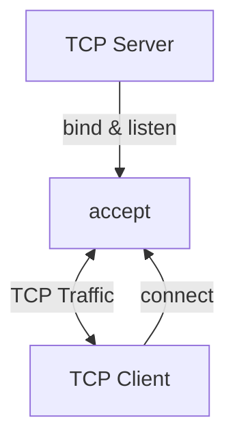
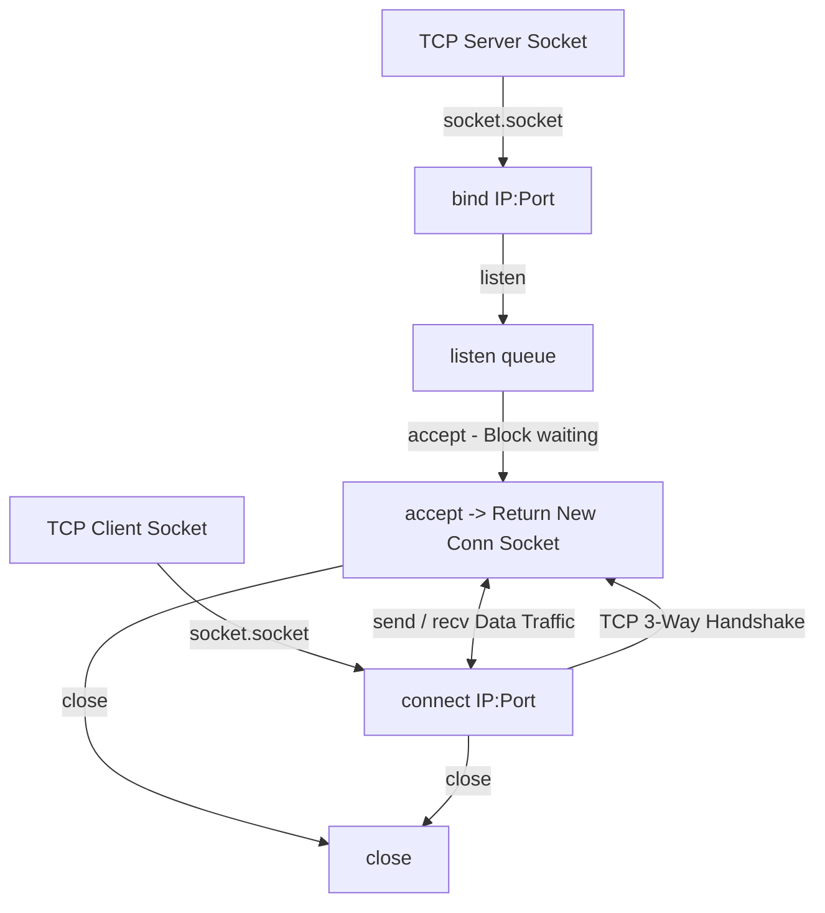

# 🐍 13.Network_Programming_Sockets: Lập Trình Mạng Socket TCP/UDP, IP Subnetting & Non-blocking - Giáo Trình Python DevOps Chuyên Sâu Cực Chi Tiết

> 💡 **Bản chất 1 câu**: Lập trình mạng chuyên sâu: `socket` module (TCP/UDP Client/Server), `bind()`, `listen()`, `accept()`, `connect_ex()`, tính toán IP `ipaddress`, Socket Timeouts và Non-blocking Sockets.  
> 🎯 **Trọng tâm thực chiến DevOps**: Nắm vững vòng đời Socket TCP 3-way handshake, tạo TCP Echo Server, quét Port siêu tốc với Timeout, và xử lý dải IPCIDR với `ipaddress`.

---



---

## 2. 📚 Lý Thuyết Chuyên Sâu & Bản Chất Hệ Thống (Under The Hood Architecture)

### 2.1 Vòng Đời Kết Nối Socket TCP Client/Server (OBJ 13.1)



1. **TCP vs UDP Socket**:
   - TCP (`SOCK_STREAM`): Kết nối tin cậy, đảm bảo thứ tự gói tin và có bắt tay 3 bước.
   - UDP (`SOCK_DGRAM`): Không kết nối (Connectionless), tốc độ siêu nhanh nhưng có thể rơi gói tin.
2. **`socket.settimeout(seconds)`**: Tránh việc socket bị ngắt đơ vĩnh viễn (hang) khi Server từ xa không trả lời.


---

## 3. ⚡ Bảng Tra Cứu Khái Niệm & Hàm / Thư Viện Thực Hành (Reference Table)

| Công cụ / Hàm / Thư viện | Tham số / Module | Ý nghĩa chi tiết bản chất | Ứng dụng thực tế DevOps |
| :--- | :--- | :--- | :--- |
| **`socket.socket`** | `Socket Module` | Khởi tạo đối tượng Socket TCP/UDP | `s = socket.socket(socket.AF_INET, socket.SOCK_STREAM)` |
| **`connect_ex`** | `Socket Method` | Test kết nối Port trả về 0 nếu thành công | `res = s.connect_ex(('10.0.0.1', 80))` |
| **`settimeout`** | `Socket Method` | Cấu hình thời gian chờ tối đa cho socket | `s.settimeout(2.0)` |
| **`ipaddress.ip_network`** | `IPaddress Module` | Phân tích và tính toán dải IP Subnetting CIDR | `net = ipaddress.ip_network('10.0.0.0/24')` |


---

## 4. 🛠 Thao Tác Thực Chiến & Kịch Bản DevOps Automation (Real-World Production Scripts)

### 🛠 Các đoạn Script Python thực hành chuyên sâu gõ là ăn ngay:
```python
import socket
import ipaddress

def check_tcp_port(ip: str, port: int, timeout: float = 1.0) -> bool:
    with socket.socket(socket.AF_INET, socket.SOCK_STREAM) as s:
        s.settimeout(timeout)
        result = s.connect_ex((ip, port))
        return result == 0

# Tính toán các IP khả dụng trong Subnet /29:
subnet = ipaddress.ip_network("192.168.1.0/29")
print(f"Network: {subnet} | Usable Hosts: {list(subnet.hosts())}")

for host in subnet.hosts():
    status = "OPEN" if check_tcp_port(str(host), 22) else "CLOSED"
    print(f"Host: {host}:22 -> {status}")

```

### 🚀 Kịch bản tự động hóa thực tế khi đi làm (Production DevOps Incident Playbook):
Viết dịch vụ TCP Health Check Agent bằng Python chạy ngầm lắng nghe Port 9999 để trả về thông số tài nguyên cho Load Balancer.

---

## 5. 🚀 Bộ Câu Hỏi Phỏng Vấn DevOps Python Thực Tế (Middle-Senior Interview Q&A)

> **Q: Tại sao nên dùng `connect_ex()` thay vì `connect()` khi viết script quét Port hàng loạt?**  
> **A**: `connect()` sẽ ném ra Exception lỗi nếu Port đóng làm gián đoạn script. `connect_ex()` trả về mã integer (`0` nếu thành công, mã lỗi errno nếu thất bại), giúp code sạch hơn.

> **Q: Sự khác biệt giữa TCP Socket (`SOCK_STREAM`) và UDP Socket (`SOCK_DGRAM`) là gì?**  
> **A**: TCP Socket đảm bảo truyền dữ liệu tin cậy, đúng thứ tự và không mất gói nhờ có bắt tay 3 bước. UDP Socket truyền dữ liệu không cần kết nối, tốc độ nhanh hơn nhưng không đảm bảo mất gói.


---

## 6. 📝 Cheat Sheet Ghi Nhớ Nhanh (Summary)

- [x] TCP (SOCK_STREAM): Tin cậy, có bắt tay 3 bước
- [x] UDP (SOCK_DGRAM): Nhanh, không kết nối
- [x] connect_ex: Test port trả về 0
- [x] ipaddress: Tính toán subnetting CIDR

