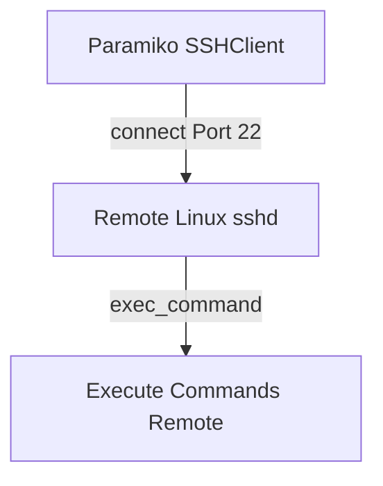
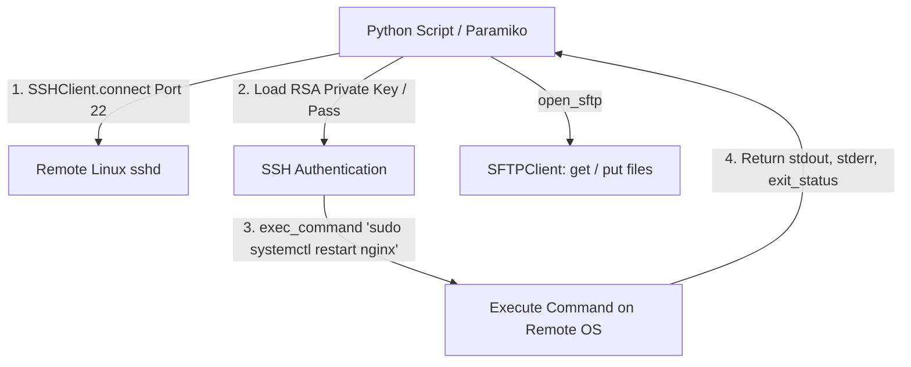

# 🐍 14.SSH_Automation_Paramiko_Netmiko: Tự Động Hóa SSH Mã Hóa Với Paramiko & Netmiko - Giáo Trình Python DevOps Chuyên Sâu Cực Chi Tiết

> 💡 **Bản chất 1 câu**: Tự động hóa SSH & SFTP chuyên nghiệp: `paramiko` SDK (`SSHClient`, `AutoAddPolicy`, `exec_command`, `SFTPClient`), quản lý SSH Keys (`RSAKey`), và thực thi lệnh song song.  
> 🎯 **Trọng tâm thực chiến DevOps**: Nắm vững `paramiko.SSHClient()`, xử lý Host Key verification, nạp Private Key mã hóa, truyền nhận file qua SFTP, và xử lý lệnh đòi hỏi sudo pass.

---



---

## 2. 📚 Lý Thuyết Chuyên Sâu & Bản Chất Hệ Thống (Under The Hood Architecture)

### 2.1 Kiến Trúc Kết Nối SSH & SFTP Qua Paramiko (OBJ 14.1)



1. **`paramiko.AutoAddPolicy()`**: Tự động chấp nhận Host Key của Server lạ (Cần cẩn trọng với tấn công MitM trong môi trường Production).
2. **`exec_command(cmd)`**: Trả về 3 luồng dữ liệu `(stdin, stdout, stderr)`. Luôn cần gọi `stdout.channel.recv_exit_status()` để lấy Exit Code của lệnh remote!
3. **`open_sftp()`**: Khai thác kết nối SFTP để Upload (`put`) hoặc Download (`get`) file mã hóa qua kết nối SSH có sẵn.


---

## 3. ⚡ Bảng Tra Cứu Khái Niệm & Hàm / Thư Viện Thực Hành (Reference Table)

| Công cụ / Hàm / Thư viện | Tham số / Module | Ý nghĩa chi tiết bản chất | Ứng dụng thực tế DevOps |
| :--- | :--- | :--- | :--- |
| **`paramiko.SSHClient`** | `Paramiko` | Khởi tạo đối tượng điều khiển kết nối SSH Client | `ssh = paramiko.SSHClient()` |
| **`exec_command`** | `Paramiko Method` | Thực thi câu lệnh shell trên Server từ xa | `stdin, stdout, stderr = ssh.exec_command('uptime')` |
| **`recv_exit_status`** | `Channel Method` | Lấy mã lỗi Exit Status của lệnh remote | `code = stdout.channel.recv_exit_status()` |
| **`open_sftp`** | `Paramiko Method` | Mở kênh truyền nhận file SFTP trên SSH | `sftp = ssh.open_sftp(); sftp.put(src, dst)` |


---

## 4. 🛠 Thao Tác Thực Chiến & Kịch Bản DevOps Automation (Real-World Production Scripts)

### 🛠 Các đoạn Script Python thực hành chuyên sâu gõ là ăn ngay:
```python
import paramiko

def execute_remote_cmd(host: str, user: str, key_path: str, cmd: str):
    ssh = paramiko.SSHClient()
    ssh.set_missing_host_key_policy(paramiko.AutoAddPolicy())
    
    try:
        # Nạp RSA Private Key:
        key = paramiko.RSAKey.from_private_key_file(key_path)
        ssh.connect(hostname=host, username=user, pkey=key, timeout=5)
        
        stdin, stdout, stderr = ssh.exec_command(cmd)
        exit_code = stdout.channel.recv_exit_status()
        
        output = stdout.read().decode('utf-8')
        error = stderr.read().decode('utf-8')
        
        print(f"[{host}] Exit Code: {exit_code}")
        print(f"[{host}] Output:
{output.strip()}")
    finally:
        ssh.close()

# Sử dụng (Ví dụ):
# execute_remote_cmd("10.0.0.1", "ubuntu", "/home/user/.ssh/id_rsa", "uptime")

```

### 🚀 Kịch bản tự động hóa thực tế khi đi làm (Production DevOps Incident Playbook):
Script Python đẩy file binary cập nhật ứng dụng tới 30 Server qua SFTP, cấp quyền `chmod +x` và tự động restart service qua SSH.

---

## 5. 🚀 Bộ Câu Hỏi Phỏng Vấn DevOps Python Thực Tế (Middle-Senior Interview Q&A)

> **Q: Tại sao sau khi gọi `exec_command()` trong Paramiko ta bắt buộc phải gọi `stdout.channel.recv_exit_status()`?**  
> **A**: Vì `exec_command()` chạy bất đồng bộ. Việc gọi `recv_exit_status()` sẽ chặn script chờ đến khi lệnh trên Server từ xa chạy xong hoàn toàn và lấy về đúng Exit Code (0 nếu thành công).

> **Q: Rủi ro an ninh mạng khi sử dụng `paramiko.AutoAddPolicy()` trong Production là gì?**  
> **A**: `AutoAddPolicy()` tự động tin tưởng và lưu Host Key của Server lạ mà không kiểm tra, dẫn tới nguy cơ bị tấn công Man-in-the-Middle (MitM) giả mạo SSH Server.


---

## 6. 📝 Cheat Sheet Ghi Nhớ Nhanh (Summary)

- [x] paramiko.SSHClient: Kết nối SSH tự động
- [x] AutoAddPolicy: Tự nhận Host Key (Cẩn trọng MitM)
- [x] exec_command: Trả về (stdin, stdout, stderr)
- [x] recv_exit_status: Lấy exit code lệnh remote
- [x] open_sftp: Upload/Download file qua SFTP

