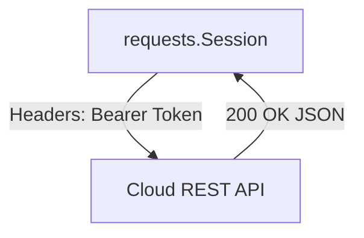
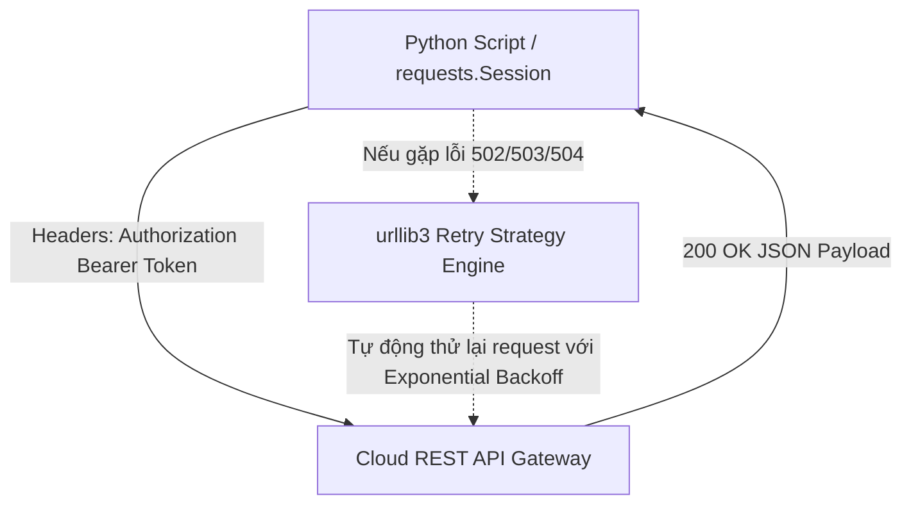

# 🐍 15.HTTP_Clients_REST_APIs_Requests: HTTP Client Chuyên Nghiệp, REST APIs & Tương Tác Cloud Services - Giáo Trình Python DevOps Chuyên Sâu Cực Chi Tiết

> 💡 **Bản chất 1 câu**: Tương tác REST APIs chuyên nghiệp: Thư viện `requests` (GET, POST, PUT, DELETE, PATCH), `requests.Session()`, Headers, Authentication (Basic, Bearer Token), Timeouts và Retry Strategy.  
> 🎯 **Trọng tâm thực chiến DevOps**: Nắm vững `requests.Session()`, `urllib3` Retries, `response.raise_for_status()`, gửi Bearer Token qua Headers, xử lý JSON response và Multipart file upload.

---



---

## 2. 📚 Lý Thuyết Chuyên Sâu & Bản Chất Hệ Thống (Under The Hood Architecture)

### 2.1 Kiến Trúc Requests Session & Retries Engine (OBJ 15.1)



1. **`requests.Session()`**: Tái sử dụng kết nối TCP Keep-Alive ngầm, giúp tăng tốc độ gửi hàng trăm API requests liên tiếp gấp 3-5 lần.
2. **`urllib3.util.Retry`**: Tự động thử lại (Retry) các request thất bại do sự cố mạng tạm thời hoặc server quá tải (502, 503, 504) kèm chiến lược hoãn tăng dần (Exponential Backoff).
3. **`response.raise_for_status()`**: Ném ra Exception nếu HTTP Status Code >= 400.


---

## 3. ⚡ Bảng Tra Cứu Khái Niệm & Hàm / Thư Viện Thực Hành (Reference Table)

| Công cụ / Hàm / Thư viện | Tham số / Module | Ý nghĩa chi tiết bản chất | Ứng dụng thực tế DevOps |
| :--- | :--- | :--- | :--- |
| **`requests.Session`** | `Requests Library` | Tạo session giữ kết nối TCP Keep-Alive | `session = requests.Session()` |
| **`urllib3.util.Retry`** | `Urllib3 Module` | Cấu hình chiến lược tự động thử lại khi API lỗi | `Retry(total=3, backoff_factor=1)` |
| **`raise_for_status`** | `Response Method` | Tự động ném Exception nếu status code >= 400 | `response.raise_for_status()` |
| **`Bearer Token`** | `Auth Header` | Chuẩn xác thực API phổ biến truyền qua Headers | `{'Authorization': 'Bearer <TOKEN>'}` |


---

## 4. 🛠 Thao Tác Thực Chiến & Kịch Bản DevOps Automation (Real-World Production Scripts)

### 🛠 Các đoạn Script Python thực hành chuyên sâu gõ là ăn ngay:
```python
import requests
from requests.adapters import HTTPAdapter
from urllib3.util import Retry

def create_secure_session() -> requests.Session:
    session = requests.Session()
    # Cấu hình Auto-Retry 3 lần nếu gặp lỗi 500, 502, 503, 504:
    retries = Retry(total=3, backoff_factor=1, status_forcelist=[500, 502, 503, 504])
    session.mount('https://', HTTPAdapter(max_retries=retries))
    return session

session = create_secure_session()
headers = {"Authorization": "Bearer MY_SECRET_API_TOKEN", "Content-Type": "application/json"}

try:
    response = session.get("https://api.github.com/user", headers=headers, timeout=5)
    response.raise_for_status()
    user_data = response.json()
    print(f"Logged in as GitHub User: {user_data.get('login')}")
except requests.exceptions.HTTPError as e:
    print(f"[HTTP ERROR] Status: {e.response.status_code}")

```

### 🚀 Kịch bản tự động hóa thực tế khi đi làm (Production DevOps Incident Playbook):
Script Python tự động tương tác GitLab REST API để tạo Release, đính kèm file Changelog và gửi tin nhắn Webhook thông báo cho đội Dev.

---

## 5. 🚀 Bộ Câu Hỏi Phỏng Vấn DevOps Python Thực Tế (Middle-Senior Interview Q&A)

> **Q: Tại sao bắt buộc phải truyền tham số `timeout` trong tất cả các cuộc gọi `requests.get()` hoặc `requests.post()`?**  
> **A**: Vì nếu không có `timeout`, khi máy chủ từ xa bị treo, script Python sẽ bị đứng chờ vĩnh viễn (hang), gây treo luôn toàn bộ CI/CD Pipeline hay hệ thống tự động hóa.

> **Q: Tác dụng của `backoff_factor` trong `urllib3.util.Retry` là gì?**  
> **A**: Giúp tăng thời gian hoãn giữa các lần thử lại (Exponential Backoff: 1s, 2s, 4s...), tránh việc dồn dập gửi request liên tục làm nổ thêm tải cho Server đang bị sự cố.


---

## 6. 📝 Cheat Sheet Ghi Nhớ Nhanh (Summary)

- [x] requests.Session: Giữ kết nối TCP Keep-Alive
- [x] urllib3 Retry: Tự động retry với Exponential Backoff
- [x] raise_for_status: Ném Exception khi status >= 400
- [x] BẮT BUỘC luôn có tham số timeout

