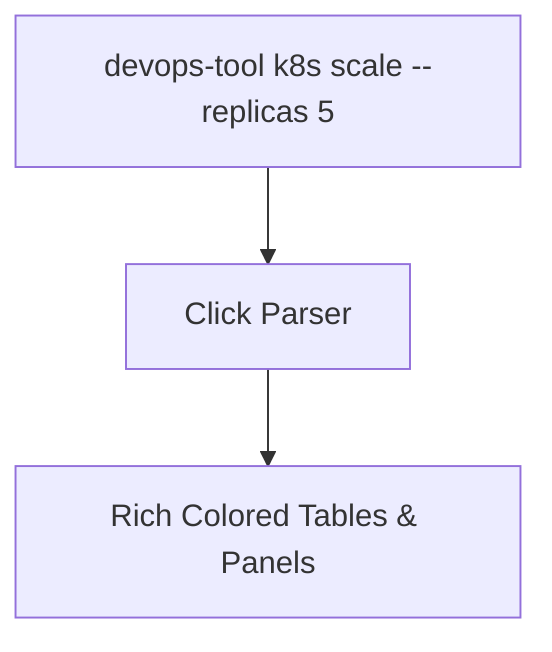
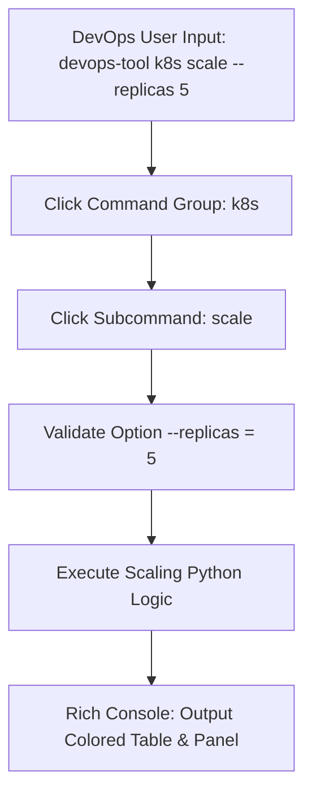

# 🐍 16.Building_CLI_Tools_Click_Rich: Xây Dựng Công Cụ CLI Chuyên Nghiệp Với Framework Click & Rich - Giáo Trình Python DevOps Chuyên Sâu Cực Chi Tiết

> 💡 **Bản chất 1 câu**: Xây dựng CLI tool chuyên nghiệp cho DevOps: `sys.argv`, `argparse`, `click` framework (`@click.group()`, `@click.option()`, `@click.argument()`), `rich` formatting (Tables, Progress bars, Panel) và packaging.  
> 🎯 **Trọng tâm thực chiến DevOps**: Nắm vững thiết kế sub-commands, cờ option, truyền tham số, vẽ bảng dữ liệu sắc nét với `rich.table.Table`, hiển thị thanh tiến trình `Progress`, và đóng gói `setup.py`.

---



---

## 2. 📚 Lý Thuyết Chuyên Sâu & Bản Chất Hệ Thống (Under The Hood Architecture)

### 2.1 Kiến Trúc CLI Tool Sử Dụng Click Decorators & Rich Console (OBJ 16.1)



1. **`click` Framework**: Khai báo lệnh CLI bằng Decorators ngắn gọn, tự động tạo trang `--help` đẹp mắt.
2. **`rich` Library**: Render bảng dữ liệu màu sắc, thanh progress bar, format JSON màu sắc trực tiếp trên Terminal.


---

## 3. ⚡ Bảng Tra Cứu Khái Niệm & Hàm / Thư Viện Thực Hành (Reference Table)

| Công cụ / Hàm / Thư viện | Tham số / Module | Ý nghĩa chi tiết bản chất | Ứng dụng thực tế DevOps |
| :--- | :--- | :--- | :--- |
| **`@click.group()`** | `Click Framework` | Khai báo nhóm lệnh chính (Root Command Group) | `@click.group()` |
| **`@click.option()`** | `Click Framework` | Thêm cờ tham số truyền vào (--env, --replicas) | `@click.option('--env', default='dev')` |
| **`rich.table.Table`** | `Rich Library` | Tạo và hiển thị bảng dữ liệu màu sắc trên Terminal | `table = Table(title='Nodes')` |
| **`rich.progress.track`** | `Rich Library` | Bọc vòng lặp hiển thị thanh tiến trình Progress Bar | `for item in track(items):` |


---

## 4. 🛠 Thao Tác Thực Chiến & Kịch Bản DevOps Automation (Real-World Production Scripts)

### 🛠 Các đoạn Script Python thực hành chuyên sâu gõ là ăn ngay:
```python
import click
from rich.console import Console
from rich.table import Table
from rich.panel import Panel

console = Console()

@click.group()
def main():
    """Production DevOps Automation CLI Tool"""
    pass

@main.command()
@click.option('--cluster', default='prod-us-1', help='Target Kubernetes Cluster')
def nodes(cluster):
    """List all nodes in target cluster"""
    console.print(Panel(f"[bold green]Connecting to Cluster:[/] {cluster}", title="K8s Status"))
    
    table = Table(title="Cluster Nodes Overview")
    table.add_column("Node Name", style="cyan")
    table.add_column("Role", style="magenta")
    table.add_column("Status", style="green")
    
    table.add_row(f"{cluster}-master-01", "Control-Plane", "Ready")
    table.add_row(f"{cluster}-worker-01", "Worker", "Ready")
    console.print(table)

if __name__ == '__main__':
    main()

```

### 🚀 Kịch bản tự động hóa thực tế khi đi làm (Production DevOps Incident Playbook):
Đóng gói CLI Tool `ops-cli` bằng `setup.py` với `entry_points` để tất cả các kỹ sư trong công ty có thể cài qua `pip install` và gõ lệnh trực tiếp ngoài Terminal.

---

## 5. 🚀 Bộ Câu Hỏi Phỏng Vấn DevOps Python Thực Tế (Middle-Senior Interview Q&A)

> **Q: Làm thế nào để đóng gói một script Python thành tệp lệnh CLI thực thi có thể gõ trực tiếp ngoài Shell?**  
> **A**: Sử dụng file `setup.py` hoặc `pyproject.toml` định nghĩa tham số `entry_points={'console_scripts': ['my-cli = my_package.module:main']}` và cài đặt bằng `pip install -e .`.

> **Q: Tại sao nên ưu tiên chọn `click` hơn `argparse` khi viết các công cụ CLI phức tạp?**  
> **A**: Vì `click` giúp code ngắn gọn nhờ cú pháp Decorators, tự động ép kiểu dữ liệu, hỗ trợ lồng nhóm lệnh (Sub-commands) linh hoạt và tạo trang `--help` chuẩn mực.


---

## 6. 📝 Cheat Sheet Ghi Nhớ Nhanh (Summary)

- [x] click: Framework CLI chuyên nghiệp dùng Decorators
- [x] rich: Làm đẹp Terminal (Table, Progress, Colors)
- [x] setup.py entry_points: Đóng gói lệnh CLI cài qua pip
- [x] Auto-generated --help documentation

