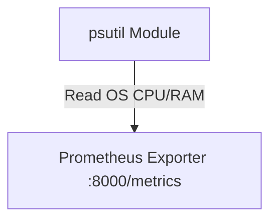
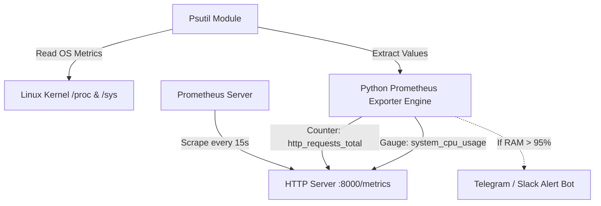

# 🐍 17.System_Metrics_Monitoring_Psutil: Giám Sát Hệ Thống Chi Tiết, Psutil, Prometheus Exporter & Alerting - Giáo Trình Python DevOps Chuyên Sâu Cực Chi Tiết

> 💡 **Bản chất 1 câu**: Thu thập chỉ số hạ tầng & giám sát hệ thống: `psutil` (CPU, Memory, Disk, Swap, Network, Processes), Prometheus Client SDK (`prometheus_client`), Gauges, Counters, Histograms và Alerting.  
> 🎯 **Trọng tâm thực chiến DevOps**: Nắm vững `psutil.cpu_percent()`, `psutil.virtual_memory()`, `psutil.disk_usage()`, `psutil.net_io_counters()`, xuất Prometheus Exporter tại port `:8000/metrics`, và gửi alert Telegram/Slack.

---



---

## 2. 📚 Lý Thuyết Chuyên Sâu & Bản Chất Hệ Thống (Under The Hood Architecture)

### 2.1 Kiến Trúc Prometheus Metric Exporter Với Psutil (OBJ 17.1)



1. **`psutil` (Process and System Utilities)**: Thư viện cross-platform truy xuất trực tiếp tài nguyên phần cứng hệ thống.
2. **Prometheus Metrics Types**:
   - **Gauge**: Giá trị tăng/giảm linh hoạt (CPU %, RAM used, Active Connections).
   - **Counter**: Giá trị chỉ có tăng dần lên (Total Requests, Total Errors).
   - **Histogram / Summary**: Đo phân phối tần suất và thời gian trễ (Latency, Request Duration).


---

## 3. ⚡ Bảng Tra Cứu Khái Niệm & Hàm / Thư Viện Thực Hành (Reference Table)

| Công cụ / Hàm / Thư viện | Tham số / Module | Ý nghĩa chi tiết bản chất | Ứng dụng thực tế DevOps |
| :--- | :--- | :--- | :--- |
| **`psutil.cpu_percent`** | `Psutil` | Đo phần trăm sử dụng CPU | `psutil.cpu_percent(interval=1)` |
| **`psutil.virtual_memory`** | `Psutil` | Đo dung lượng RAM used, free, percent | `mem = psutil.virtual_memory()` |
| **`prometheus_client.Gauge`** | `Prometheus` | Loại metric có thể tăng hoặc giảm | `g = Gauge('cpu_percent', 'CPU %')` |
| **`prometheus_client.start_http_server`** | `Prometheus` | Khởi tạo HTTP Server xuất endpoint /metrics | `start_http_server(8000)` |


---

## 4. 🛠 Thao Tác Thực Chiến & Kịch Bản DevOps Automation (Real-World Production Scripts)

### 🛠 Các đoạn Script Python thực hành chuyên sâu gõ là ăn ngay:
```python
import psutil
from prometheus_client import start_http_server, Gauge, Counter
import time

# Khai báo Prometheus Metrics:
CPU_GAUGE = Gauge('node_cpu_usage_percent', 'CPU usage percentage')
RAM_GAUGE = Gauge('node_ram_usage_percent', 'RAM usage percentage')
ERROR_COUNTER = Counter('node_monitoring_errors_total', 'Total monitoring errors')

def collect_metrics():
    try:
        cpu = psutil.cpu_percent(interval=None)
        ram = psutil.virtual_memory().percent
        
        CPU_GAUGE.set(cpu)
        RAM_GAUGE.set(ram)
        print(f"[METRIC] CPU: {cpu}% | RAM: {ram}%")
    except Exception as e:
        ERROR_COUNTER.inc()
        print(f"[ERROR] Failed to collect metrics: {e}")

if __name__ == '__main__':
    start_http_server(8000)
    print("[OK] Prometheus Exporter listening on port 8000...")
    while True:
        collect_metrics()
        time.sleep(5)

```

### 🚀 Kịch bản tự động hóa thực tế khi đi làm (Production DevOps Incident Playbook):
Viết Custom Exporter bằng Python thu thập chỉ số số lượng file log nằm trong thư mục queue và cảnh báo lên Telegram nếu queue bị nghẽn > 10,000 files.

---

## 5. 🚀 Bộ Câu Hỏi Phỏng Vấn DevOps Python Thực Tế (Middle-Senior Interview Q&A)

> **Q: Sự khác biệt cốt lõi giữa metric loại Gauge và Counter trong Prometheus là gì?**  
> **A**: Gauge đại diện cho giá trị có thể tăng hoặc giảm linh hoạt theo thời gian (như % CPU, RAM). Counter là số đếm tích lũy chỉ có tăng (hoặc reset về 0 khi restart), dùng đo tổng số lượt sự kiện.

> **Q: Thư viện `psutil` thu thập thông số CPU và Memory trên Linux bằng cách nào?**  
> **A**: `psutil` đọc và bóc tách dữ liệu trực tiếp từ các tệp tin hệ thống ảo `/proc/stat`, `/proc/meminfo` và `/proc/diskstats` của Linux Kernel.


---

## 6. 📝 Cheat Sheet Ghi Nhớ Nhanh (Summary)

- [x] psutil: Đọc chỉ số CPU, RAM, Disk, Network
- [x] Prometheus Gauge: Metric tăng/giảm (% RAM/CPU)
- [x] Prometheus Counter: Metric đếm tích lũy chỉ tăng (Total Requests)
- [x] Expose HTTP /metrics port 8000

