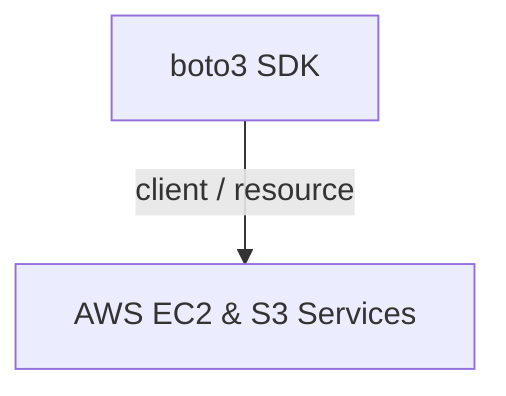
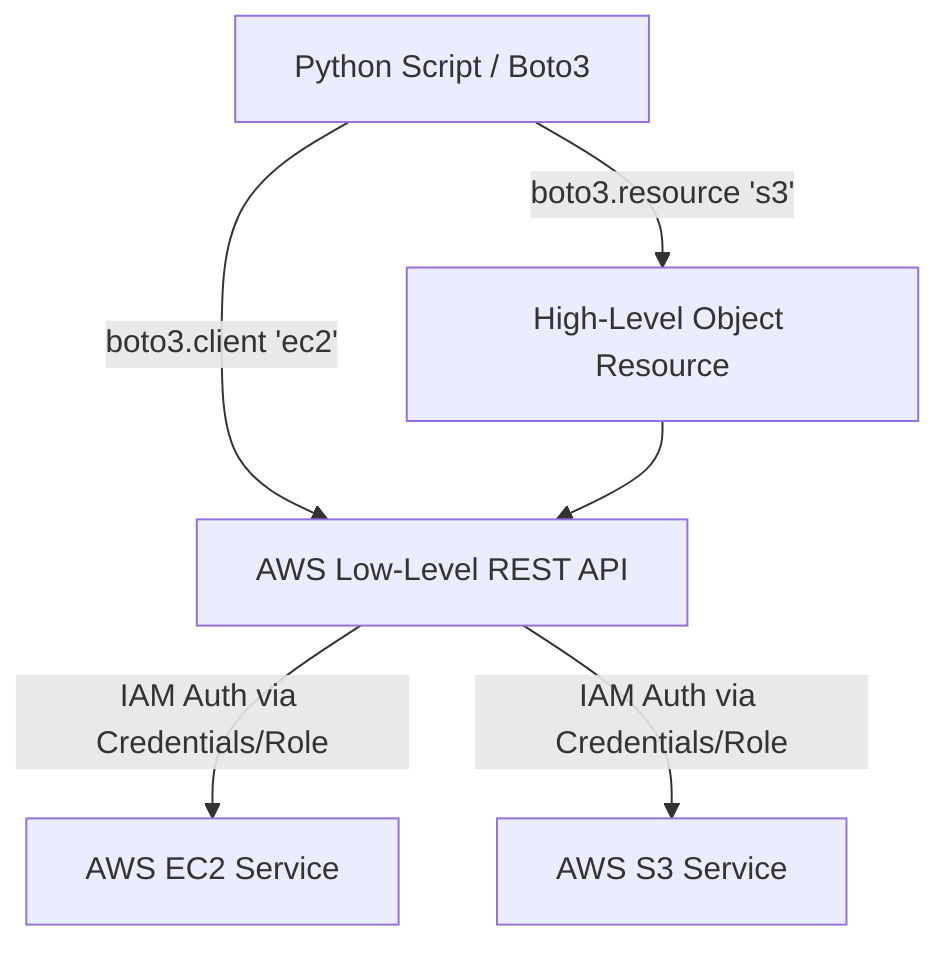

# 🐍 18.Cloud_Automation_Boto3_AWS_EC2_S3: Tự Động Hóa Đám Mây AWS Với Boto3 SDK: EC2 & S3 - Giáo Trình Python DevOps Chuyên Sâu Cực Chi Tiết

> 💡 **Bản chất 1 câu**: Tự động hóa đám mây AWS với `boto3` SDK: Quản lý EC2 (start, stop, reboot, terminate, tag, filter), S3 Buckets & Objects (upload, download, presigned URL, multipart upload) và IAM Auth.  
> 🎯 **Trọng tâm thực chiến DevOps**: Nắm vững `boto3.client('ec2')` vs `boto3.resource('s3')`, lọc tài nguyên bằng `Filters`, quản lý S3 Presigned URLs và dán nhãn AWS Tags tự động.

---



---

## 2. 📚 Lý Thuyết Chuyên Sâu & Bản Chất Hệ Thống (Under The Hood Architecture)

### 2.1 Kiến Trúc AWS Boto3 SDK Client vs Resource Architecture (OBJ 18.1)



1. **`boto3.client('service')`**: Giao diện Low-level tương ứng 1-1 với AWS API. Trả về kết quả dưới dạng Python Dictionary thuần túy.
2. **`boto3.resource('service')`**: Giao diện High-level OOP sinh động. Cho phép gọi hàm trực tiếp trên Object (như `bucket.upload_file()`).
3. **AWS S3 Presigned URLs**: Tạo đường dẫn URL có thời hạn cho phép người dùng upload/download file trực tiếp từ S3 mà KHÔNG cần công khai bucket.


---

## 3. ⚡ Bảng Tra Cứu Khái Niệm & Hàm / Thư Viện Thực Hành (Reference Table)

| Công cụ / Hàm / Thư viện | Tham số / Module | Ý nghĩa chi tiết bản chất | Ứng dụng thực tế DevOps |
| :--- | :--- | :--- | :--- |
| **`boto3.client`** | `Boto3 SDK` | Tạo client tương tác AWS API Low-level Dict | `ec2 = boto3.client('ec2')` |
| **`boto3.resource`** | `Boto3 SDK` | Tạo resource tương tác AWS High-level OOP | `s3 = boto3.resource('s3')` |
| **`generate_presigned_url`** | `S3 Method` | Tạo URL xem/tải file S3 có thời hạn an toàn | `s3.generate_presigned_url('get_object', Params=...)` |
| **`upload_file`** | `S3 Method` | Upload file local lên S3 Bucket | `s3.upload_file('local.txt', 'bucket', 'key.txt')` |


---

## 4. 🛠 Thao Tác Thực Chiến & Kịch Bản DevOps Automation (Real-World Production Scripts)

### 🛠 Các đoạn Script Python thực hành chuyên sâu gõ là ăn ngay:
```python
import boto3
from botocore.exceptions import ClientError

ec2_client = boto3.client('ec2', region_name='us-east-1')
s3_client = boto3.client('s3', region_name='us-east-1')

# 1. Lọc và liệt kê các EC2 đang RUNNING:
def list_running_instances():
    response = ec2_client.describe_instances(
        Filters=[{'Name': 'instance-state-name', 'Values': ['running']}]
    )
    for reservation in response['Reservations']:
        for inst in reservation['Instances']:
            print(f"Running EC2: {inst['InstanceId']} | Type: {inst['InstanceType']}")

# 2. Tạo S3 Presigned URL cho phép download file trong 15 phút:
def get_s3_download_url(bucket: str, key: str) -> str:
    try:
        url = s3_client.generate_presigned_url(
            'get_object',
            Params={'Bucket': bucket, 'Key': key},
            ExpiresIn=900
        )
        return url
    except ClientError as e:
        print(f"Error: {e}")
        return ""

list_running_instances()

```

### 🚀 Kịch bản tự động hóa thực tế khi đi làm (Production DevOps Incident Playbook):
Script Python tự động quét tất cả các S3 Buckets trong tài khoản AWS, phát hiện các bucket bị bật Public Read/Write nguy hiểm và tự động khóa Public Access.

---

## 5. 🚀 Bộ Câu Hỏi Phỏng Vấn DevOps Python Thực Tế (Middle-Senior Interview Q&A)

> **Q: Sự khác biệt giữa `boto3.client()` và `boto3.resource()` là gì?**  
> **A**: `boto3.client()` là giao diện Low-level tương ứng 1-1 với AWS REST API, trả về Dictionary. `boto3.resource()` là giao diện High-level OOP sinh động hơn nhưng không hỗ trợ 100% dịch vụ AWS.

> **Q: S3 Presigned URL giải quyết bài toán an ninh mạng nào?**  
> **A**: Cho phép cấp quyền truy cập tạm thời (upload/download) một file cụ thể trên S3 cho người dùng mà không cần mở Public Bucket và không cần chia sẻ AWS Credentials.


---

## 6. 📝 Cheat Sheet Ghi Nhớ Nhanh (Summary)

- [x] boto3.client: Low-level API (Dict)
- [x] boto3.resource: High-level OOP
- [x] EC2 Filters: Lọc tài nguyên theo tag/state
- [x] S3 Presigned URL: Cấp quyền truy cập S3 có thời hạn

