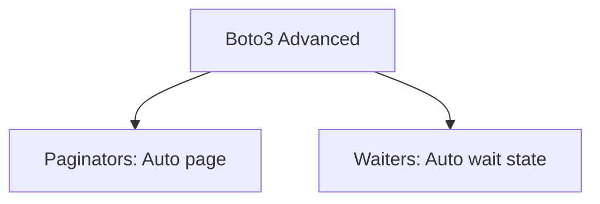
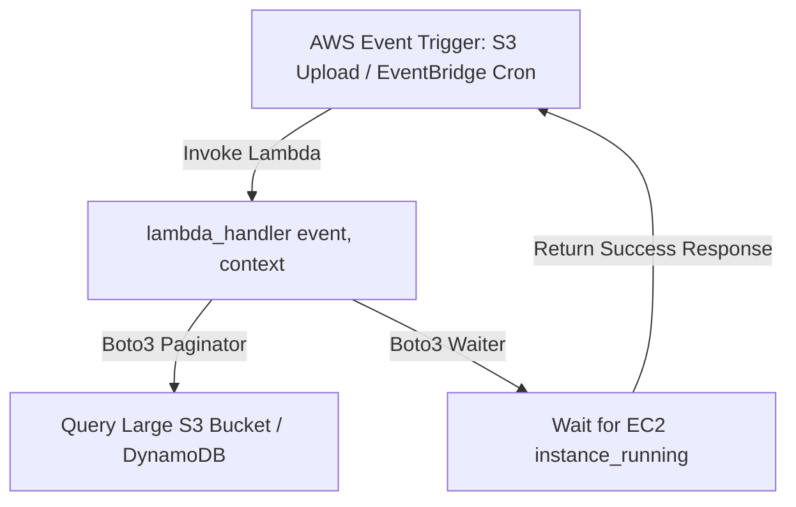

# 🐍 19.Cloud_Automation_Boto3_AWS_Advanced: Boto3 Nâng Cao: Paginators, Waiters, DynamoDB & AWS Lambda - Giáo Trình Python DevOps Chuyên Sâu Cực Chi Tiết

> 💡 **Bản chất 1 câu**: Xử lý nâng cao với Boto3: AWS Paginators, Waiters, Error handling (`ClientError`), DynamoDB operations, CloudWatch Logs query và AWS Lambda Python Handlers.  
> 🎯 **Trọng tâm thực chiến DevOps**: Nắm vững `get_paginator()`, `get_waiter()`, xử lý `ClientError.response['Error']['Code']`, và viết AWS Lambda Python Handler (`event`, `context`).

---



---

## 2. 📚 Lý Thuyết Chuyên Sâu & Bản Chất Hệ Thống (Under The Hood Architecture)

### 2.1 Kiến Trúc AWS Lambda Python Handler & Boto3 Waiters (OBJ 19.1)



1. **Boto3 Paginators**: Tự động duyệt qua hàng nghìn kết quả tài nguyên bị phân trang (Truncated) mà không cần viết vòng lặp `ContinuationToken` thủ công.
2. **Boto3 Waiters**: Tự động poll kiểm tra trạng thái tài nguyên (như chờ EC2 từ `pending` sang `running`) với khoảng thời gian delay tối ưu.
3. **AWS Lambda Python Handler**: Cú pháp tiêu chuẩn `def lambda_handler(event, context):` chạy Serverless trên Cloud.


---

## 3. ⚡ Bảng Tra Cứu Khái Niệm & Hàm / Thư Viện Thực Hành (Reference Table)

| Công cụ / Hàm / Thư viện | Tham số / Module | Ý nghĩa chi tiết bản chất | Ứng dụng thực tế DevOps |
| :--- | :--- | :--- | :--- |
| **`get_paginator`** | `Boto3 Method` | Tự động duyệt qua danh sách tài nguyên bị phân trang | `paginator = client.get_paginator('list_objects_v2')` |
| **`get_waiter`** | `Boto3 Method` | Chờ đến khi tài nguyên đạt trạng thái mong muốn | `waiter = client.get_waiter('instance_running')` |
| **`ClientError`** | `Botocore Exception` | Bắt lỗi API chi tiết từ AWS | `except ClientError as e: code = e.response['Error']['Code']` |
| **`lambda_handler`** | `AWS Lambda` | Hàm điểm đầu vào mặc định của AWS Lambda Python | `def lambda_handler(event, context):` |


---

## 4. 🛠 Thao Tác Thực Chiến & Kịch Bản DevOps Automation (Real-World Production Scripts)

### 🛠 Các đoạn Script Python thực hành chuyên sâu gõ là ăn ngay:
```python
import boto3
from botocore.exceptions import ClientError

s3_client = boto3.client('s3')

# 1. Sử dụng Paginator duyệt toàn bộ S3 Objects:
def list_all_objects(bucket_name: str):
    paginator = s3_client.get_paginator('list_objects_v2')
    page_iterator = paginator.paginate(Bucket=bucket_name)
    
    total_files = 0
    for page in page_iterator:
        if 'Contents' in page:
            for obj in page['Contents']:
                total_files += 1
                print(f"File: {obj['Key']} | Size: {obj['Size']} bytes")
    print(f"Total Files in {bucket_name}: {total_files}")

# 2. Cấu trúc AWS Lambda Handler chuẩn:
def lambda_handler(event, context):
    print(f"Received Event: {event}")
    return {
        'statusCode': 200,
        'body': 'Lambda executed successfully!'
    }

```

### 🚀 Kịch bản tự động hóa thực tế khi đi làm (Production DevOps Incident Playbook):
Viết AWS Lambda Function kết hợp Boto3 Paginator tự động quét và xóa tất cả các EBS Volume Snapshots cũ hơn 90 ngày để tối ưu chi phí lưu trữ AWS.

---

## 5. 🚀 Bộ Câu Hỏi Phỏng Vấn DevOps Python Thực Tế (Middle-Senior Interview Q&A)

> **Q: Tại sao nên sử dụng Boto3 Paginator khi làm việc với các tập dữ liệu lớn trên AWS?**  
> **A**: Vì các API AWS (như `list_objects_v2` hay `describe_instances`) giới hạn tối đa 1,000 kết quả trả về trong 1 request. Paginator giúp tự động lặp qua tất cả các trang kết quả mà không bị bỏ sót.

> **Q: Boto3 Waiter giải quyết vấn đề gì khi tự động hóa hạ tầng?**  
> **A**: Giúp tránh việc phải tự viết vòng lặp `while True: sleep(5)` thủ công để chờ tài nguyên AWS đổi trạng thái (như chờ EC2 khởi động xong hay chờ RDS Database được tạo xong).


---

## 6. 📝 Cheat Sheet Ghi Nhớ Nhanh (Summary)

- [x] Paginator: Tự động duyệt qua hàng nghìn tài nguyên AWS
- [x] Waiter: Tự động chờ tài nguyên đạt trạng thái mong muốn
- [x] ClientError: Bắt lỗi chi tiết từ mã lỗi AWS
- [x] AWS Lambda: lambda_handler(event, context)

