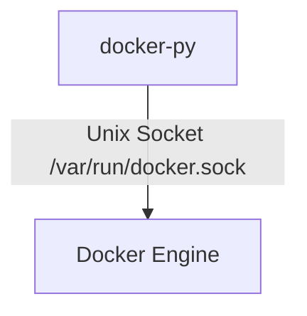
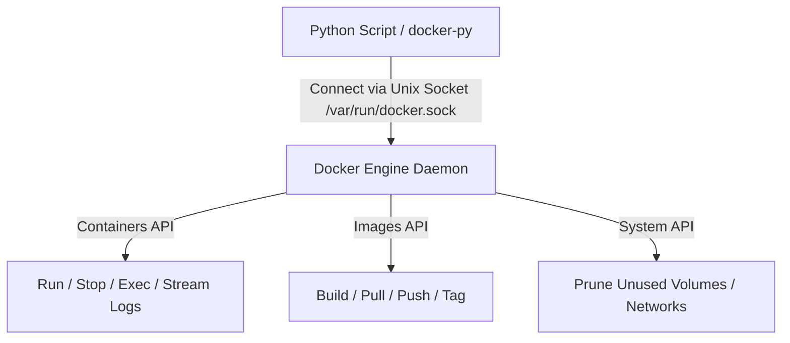

# 🐍 20.Container_Automation_Docker_SDK: Tự Động Hóa Docker Container Với Python Docker SDK - Giáo Trình Python DevOps Chuyên Sâu Cực Chi Tiết

> 💡 **Bản chất 1 câu**: Tự động hóa Docker Containers & Images bằng `docker` Python SDK: `docker.from_env()`, quản lý Containers (run, stop, logs, exec), Images (build, pull, push, tag), Volumes, Networks và Prune.  
> 🎯 **Trọng tâm thực chiến DevOps**: Nắm vững `client.containers.run()`, stream container logs realtime, thực thi lệnh `exec_run()`, build Dockerfile tự động và dọn dẹp tài nguyên rác.

---



---

## 2. 📚 Lý Thuyết Chuyên Sâu & Bản Chất Hệ Thống (Under The Hood Architecture)

### 2.1 Kiến Trúc Python Docker SDK Tương Tác Docker Daemon (OBJ 20.1)



1. **`docker.from_env()`**: Tự động kết nối tới Docker Daemon local qua đường hầm Unix Socket `/var/run/docker.sock` hoặc môi trường `DOCKER_HOST`.
2. **`container.exec_run(cmd)`**: Chạy lệnh shell trực tiếp bên trong một Container đang HOẠT ĐỘNG (tương đương `docker exec`).
3. **`container.logs(stream=True)`**: Stream luồng log của Container thời gian thực.


---

## 3. ⚡ Bảng Tra Cứu Khái Niệm & Hàm / Thư Viện Thực Hành (Reference Table)

| Công cụ / Hàm / Thư viện | Tham số / Module | Ý nghĩa chi tiết bản chất | Ứng dụng thực tế DevOps |
| :--- | :--- | :--- | :--- |
| **`docker.from_env`** | `Docker SDK` | Khởi tạo Docker Client kết nối Docker Daemon local | `client = docker.from_env()` |
| **`containers.run`** | `Docker SDK` | Tạo và khởi chạy Container mới (docker run) | `client.containers.run('nginx', detach=True)` |
| **`exec_run`** | `Container Method` | Thực thi lệnh shell bên trong Container đang chạy | `res = container.exec_run('nginx -t')` |
| **`images.build`** | `Docker SDK` | Build Docker Image từ Dockerfile tự động | `client.images.build(path='.', tag='myapp:v1')` |


---

## 4. 🛠 Thao Tác Thực Chiến & Kịch Bản DevOps Automation (Real-World Production Scripts)

### 🛠 Các đoạn Script Python thực hành chuyên sâu gõ là ăn ngay:
```python
import docker

client = docker.from_env()

# 1. Chạy Container Nginx ẩn (Detach mode):
print("Starting Nginx container...")
container = client.containers.run(
    "nginx:alpine",
    name="my-test-web",
    ports={'80/tcp': 8080},
    detach=True
)
print(f"[OK] Container Started: {container.short_id}")

# 2. Thực thi lệnh bên trong Container (docker exec):
exec_res = container.exec_run("nginx -v")
print(f"Exec Output: {exec_res.output.decode('utf-8').strip()}")

# 3. Dừng và dọn dẹp Container:
container.stop()
container.remove()
print("[OK] Container Stopped and Removed!")

```

### 🚀 Kịch bản tự động hóa thực tế khi đi làm (Production DevOps Incident Playbook):
Script Python tự động quét tất cả các Container đang chạy trên Server, kiểm tra mức độ ngốn RAM của từng Container và dọn dẹp (Prune) các Images/Volumes rác không sử dụng.

---

## 5. 🚀 Bộ Câu Hỏi Phỏng Vấn DevOps Python Thực Tế (Middle-Senior Interview Q&A)

> **Q: Python Docker SDK kết nối và giao tiếp với Docker Engine bằng phương thức nào?**  
> **A**: Kết nối trực tiếp tới Docker Daemon thông qua Unix Domain Socket local tại đường dẫn `/var/run/docker.sock` (hoặc qua TCP Socket nếu cấu hình remote `DOCKER_HOST`).

> **Q: Sự khác nhau giữa `containers.run()` và `containers.create()` trong Docker SDK là gì?**  
> **A**: `containers.create()` chỉ tạo Container ở trạng thái đã chuẩn bị nhưng CHƯA CHẠY. `containers.run()` tạo Container và LẬP TỨC KHỞI CHẠY nó (tương đương `docker run`).


---

## 6. 📝 Cheat Sheet Ghi Nhớ Nhanh (Summary)

- [x] docker.from_env(): Khởi tạo kết nối Docker Client
- [x] containers.run: Chạy Container mới (detach=True)
- [x] exec_run: Chạy lệnh trực tiếp bên trong Container đang chạy
- [x] images.build: Build Dockerfile tự động

