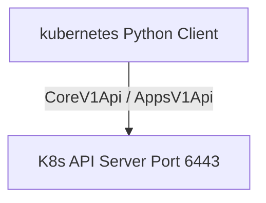
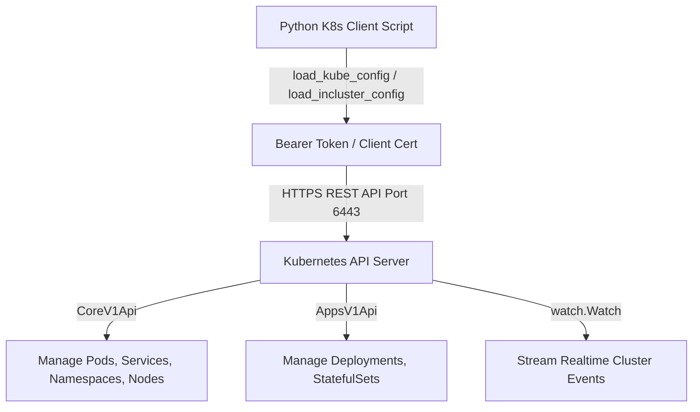

# 🐍 21.Kubernetes_Automation_Python_Client: Tự Động Hóa Kubernetes Với Python Client SDK - Giáo Trình Python DevOps Chuyên Sâu Cực Chi Tiết

> 💡 **Bản chất 1 câu**: Tự động hóa Kubernetes Cluster chuyên sâu: `kubernetes` Python Client SDK, `config.load_kube_config()` vs `config.load_incluster_config()`, `CoreV1Api` (Pods, Services, Namespaces), `AppsV1Api` (Deployments), Watch Events & Log Streaming.  
> 🎯 **Trọng tâm thực chiến DevOps**: Nắm vững `CoreV1Api`, `AppsV1Api`, `watch.Watch()` lắng nghe sự kiện Cluster realtime, xử lý Kubeconfig vs In-Cluster ServiceAccount Auth.

---



---

## 2. 📚 Lý Thuyết Chuyên Sâu & Bản Chất Hệ Thống (Under The Hood Architecture)

### 2.1 Kiến Trúc Tương Tác Kubernetes API Server Với Python Client (OBJ 21.1)



1. **`CoreV1Api()`**: Thao tác với các tài nguyên cốt lõi (Core Resources: Pods, Services, Namespaces, ConfigMaps, Secrets, Nodes).
2. **`AppsV1Api()`**: Thao tác với các tài nguyên ứng dụng (Apps Resources: Deployments, StatefulSets, DaemonSets, ReplicaSets).
3. **`watch.Watch()`**: Lắng nghe sự kiện (Events) thay đổi trạng thái của Pods/Deployments thời gian thực (Realtime Event Streaming).


---

## 3. ⚡ Bảng Tra Cứu Khái Niệm & Hàm / Thư Viện Thực Hành (Reference Table)

| Công cụ / Hàm / Thư viện | Tham số / Module | Ý nghĩa chi tiết bản chất | Ứng dụng thực tế DevOps |
| :--- | :--- | :--- | :--- |
| **`load_kube_config`** | `K8s Client` | Nạp cấu hình xác thực K8s từ file ~/.kube/config | `config.load_kube_config()` |
| **`load_incluster_config`** | `K8s Client` | Nạp xác thực ServiceAccount khi script chạy trong Pod | `config.load_incluster_config()` |
| **`CoreV1Api`** | `K8s Client` | API client quản lý Pods, Services, Namespaces, Nodes | `v1 = client.CoreV1Api()` |
| **`AppsV1Api`** | `K8s Client` | API client quản lý Deployments và ReplicaSets | `apps = client.AppsV1Api()` |


---

## 4. 🛠 Thao Tác Thực Chiến & Kịch Bản DevOps Automation (Real-World Production Scripts)

### 🛠 Các đoạn Script Python thực hành chuyên sâu gõ là ăn ngay:
```python
from kubernetes import client, config, watch

# Nạp Kubeconfig local:
config.load_kube_config()

v1 = client.CoreV1Api()
apps_v1 = client.AppsV1Api()

# 1. Liệt kê tất cả các Pods trong Namespace 'default':
print("--- Pods Overview ---")
pods = v1.list_namespaced_pod(namespace="default")
for pod in pods.items:
    print(f"Pod: {pod.metadata.name} | Status: {pod.status.phase} | IP: {pod.status.pod_ip}")

# 2. Scale số lượng Replicas của Deployment:
def scale_deployment(name: str, namespace: str, replicas: int):
    body = {"spec": {"replicas": replicas}}
    apps_v1.patch_namespaced_deployment_scale(name=name, namespace=namespace, body=body)
    print(f"[OK] Scaled Deployment '{name}' to {replicas} replicas!")

# scale_deployment("web-app", "default", 5)

```

### 🚀 Kịch bản tự động hóa thực tế khi đi làm (Production DevOps Incident Playbook):
Viết một Kubernetes Controller bằng Python lắng nghe sự kiện `watch.Watch()`, tự động phát hiện Pod bị rơi vào trạng thái `CrashLoopBackOff` và gửi báo cáo khẩn về Slack.

---

## 5. 🚀 Bộ Câu Hỏi Phỏng Vấn DevOps Python Thực Tế (Middle-Senior Interview Q&A)

> **Q: Khi nào bắt buộc phải dùng `load_incluster_config()` trong Python Kubernetes Client?**  
> **A**: Khi script Python được đóng gói thành Container và chạy trực tiếp như một Pod bên trong Kubernetes Cluster, tự động sử dụng ServiceAccount Token được mount sẵn tại `/var/run/secrets/kubernetes.io/serviceaccount`.

> **Q: Sự khác biệt về vai trò giữa `CoreV1Api` và `AppsV1Api` là gì?**  
> **A**: `CoreV1Api` dùng để quản lý các tài nguyên cơ bản như Pods, Services, Nodes, ConfigMaps. `AppsV1Api` dùng để quản lý các Controller cao cấp hơn như Deployments, StatefulSets, DaemonSets.


---

## 6. 📝 Cheat Sheet Ghi Nhớ Nhanh (Summary)

- [x] load_kube_config: Chạy từ máy local
- [x] load_incluster_config: Chạy từ bên trong K8s Pod
- [x] CoreV1Api: Manage Pods, Services, Nodes
- [x] AppsV1Api: Manage Deployments, StatefulSets
- [x] watch.Watch: Stream realtime cluster events

