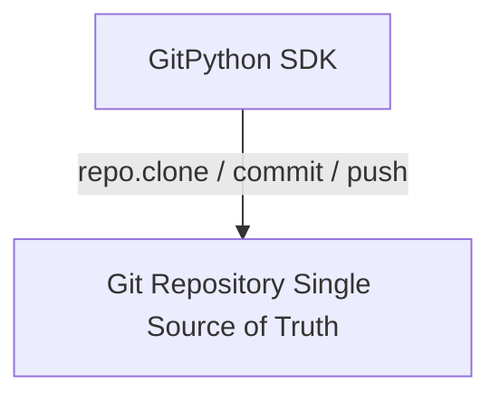
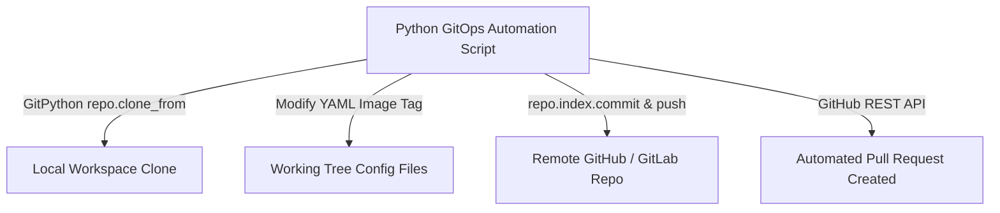

# 🐍 22.Git_Automation_and_GitOps: Tự Động Hóa GitOps, GitPython & Versioning Automation - Giáo Trình Python DevOps Chuyên Sâu Cực Chi Tiết

> 💡 **Bản chất 1 câu**: Tự động hóa Git & GitOps Workflow chuyên sâu: `GitPython` SDK (`git.Repo()`, clone, branch, commit, push, diff), Semantic Versioning (`semver`), auto-generate Release Notes, và GitHub/GitLab API.  
> 🎯 **Trọng tâm thực chiến DevOps**: Nắm vững `git.Repo()`, tự động tạo feature branches, commit changes, push remote, kiểm tra git diff, và tích hợp GitOps tự động cập nhật image tags.

---



---

## 2. 📚 Lý Thuyết Chuyên Sâu & Bản Chất Hệ Thống (Under The Hood Architecture)

### 2.1 Kiến Trúc GitOps Automation Với GitPython (OBJ 22.1)



1. **GitOps Single Source of Truth**: Mọi thay đổi cấu hình hạ tầng đều được ghi lại dưới dạng Git Commits.
2. **`GitPython` SDK**: Thư viện Python thao tác trực tiếp với cỗ máy Git nguyên thủy trên đĩa cứng.


---

## 3. ⚡ Bảng Tra Cứu Khái Niệm & Hàm / Thư Viện Thực Hành (Reference Table)

| Công cụ / Hàm / Thư viện | Tham số / Module | Ý nghĩa chi tiết bản chất | Ứng dụng thực tế DevOps |
| :--- | :--- | :--- | :--- |
| **`git.Repo`** | `GitPython` | Khởi tạo đối tượng thao tác với Git Repository | `repo = git.Repo('/path/to/repo')` |
| **`repo.git.checkout`** | `GitPython` | Chuyển đổi hoặc tạo mới nhánh Git Branch | `repo.git.checkout('-b', 'feature-v2')` |
| **`repo.index.commit`** | `GitPython` | Tạo commit mới lưu vết vào lịch sử Git | `repo.index.commit('auto: update version')` |
| **`semver`** | `Library` | Phân tích và nâng cấp phiên bản Semantic Versioning | `ver = semver.VersionInfo.parse('1.2.0')` |


---

## 4. 🛠 Thao Tác Thực Chiến & Kịch Bản DevOps Automation (Real-World Production Scripts)

### 🛠 Các đoạn Script Python thực hành chuyên sâu gõ là ăn ngay:
```python
import git
import os

repo_dir = "/tmp/my_infra_repo"
repo_url = "https://github.com/my-org/k8s-manifests.git"

# Clone hoặc nạp repo:
if not os.path.exists(repo_dir):
    repo = git.Repo.clone_from(repo_url, repo_dir)
else:
    repo = git.Repo(repo_dir)

# 1. Tạo branch mới:
new_branch = "auto/update-image-v2"
repo.git.checkout('-b', new_branch)

# 2. Thao tác sửa file config...
# 3. Commit và Push:
repo.git.add(update=True)
repo.index.commit("chore(k8s): auto-update nginx deployment image to 1.25.3")
print(f"[OK] Created Git Commit on branch '{new_branch}' successfully!")

```

### 🚀 Kịch bản tự động hóa thực tế khi đi làm (Production DevOps Incident Playbook):
Script Python tự động quét tất cả các kho mã nguồn Git trong Organization để phát hiện các file chứa passwords/keys bị commit trót dại và tự động mở Issue báo động.

---

## 5. 🚀 Bộ Câu Hỏi Phỏng Vấn DevOps Python Thực Tế (Middle-Senior Interview Q&A)

> **Q: Triết lý cốt lõi của phương pháp GitOps trong tự động hóa hạ tầng là gì?**  
> **A**: GitOps coi **Git Repository là nguồn sự thật duy nhất (Single Source of Truth)**. Mọi sự thay đổi hạ tầng đều phải được thực hiện thông qua Git Commits/Pull Requests và tự động hóa đồng bộ xuống hạ tầng.

> **Q: Thư viện `GitPython` tương tác với Git bằng cơ chế nào?**  
> **A**: `GitPython` gọi trực tiếp binary lệnh `git` nguyên thủy trên hệ điều hành thông qua các subprocess wrapper mã hóa an toàn.


---

## 6. 📝 Cheat Sheet Ghi Nhớ Nhanh (Summary)

- [x] GitPython: git.Repo('/path')
- [x] GitOps: Git là Single Source of Truth
- [x] semver: Quản lý phiên bản Major.Minor.Patch
- [x] Auto-generate Release Notes

